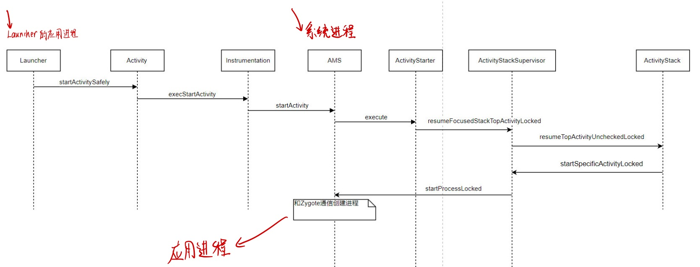
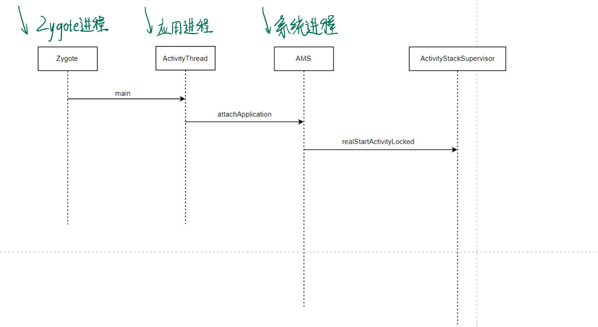
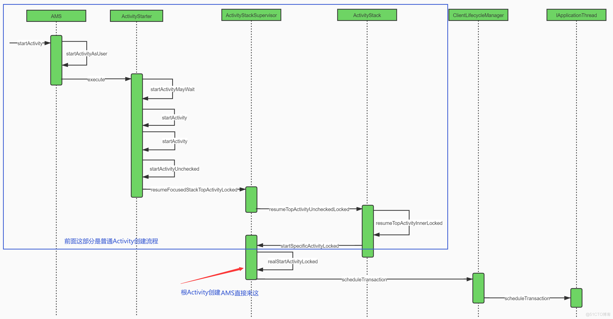
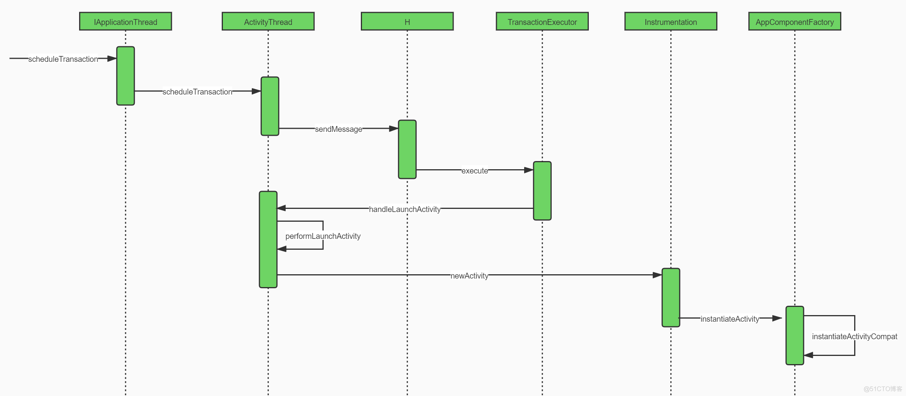
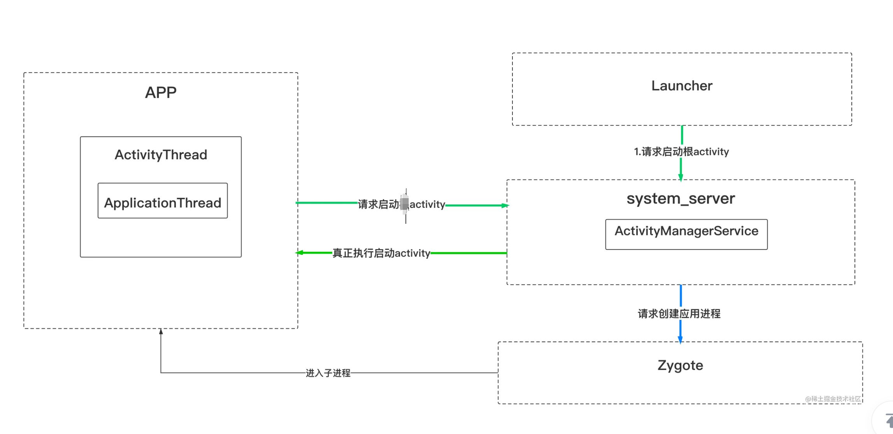
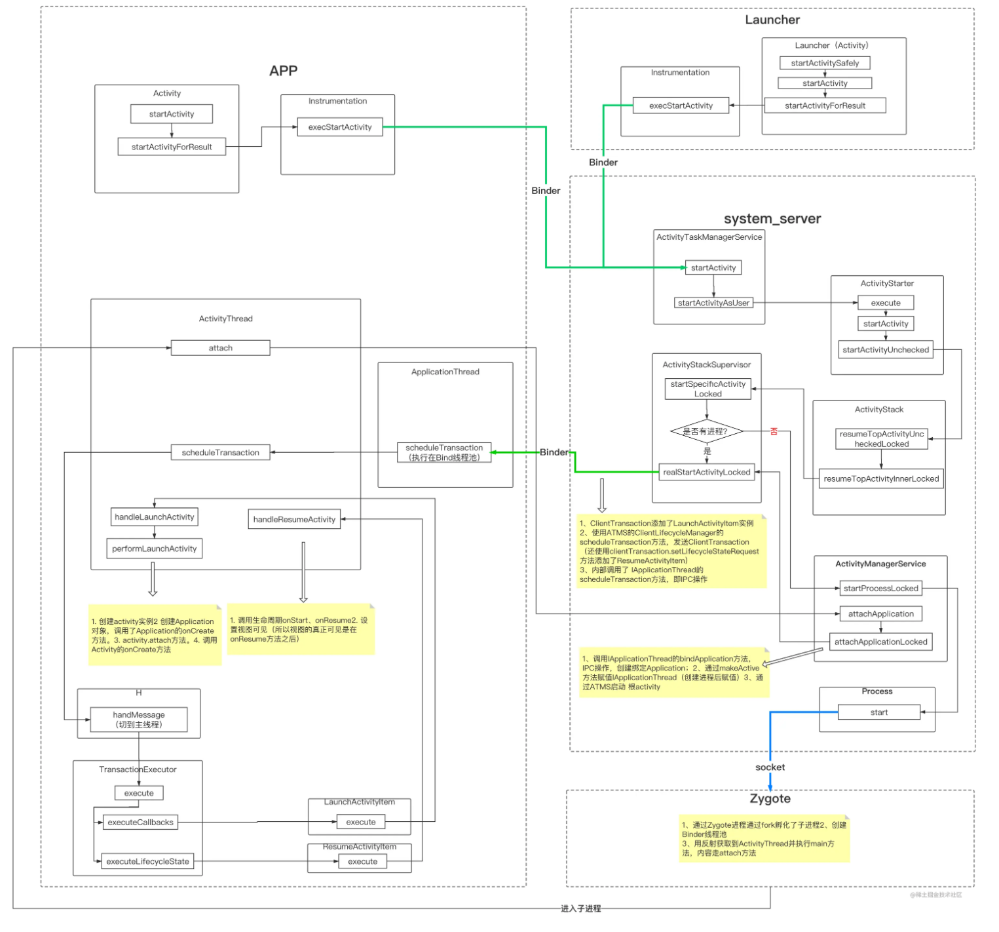
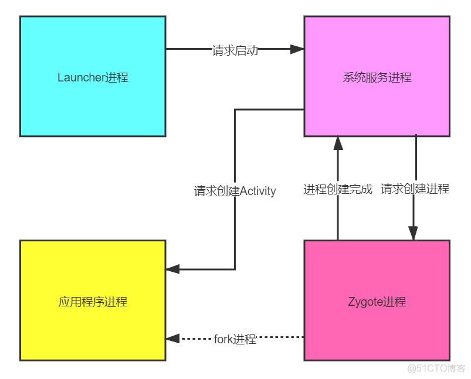
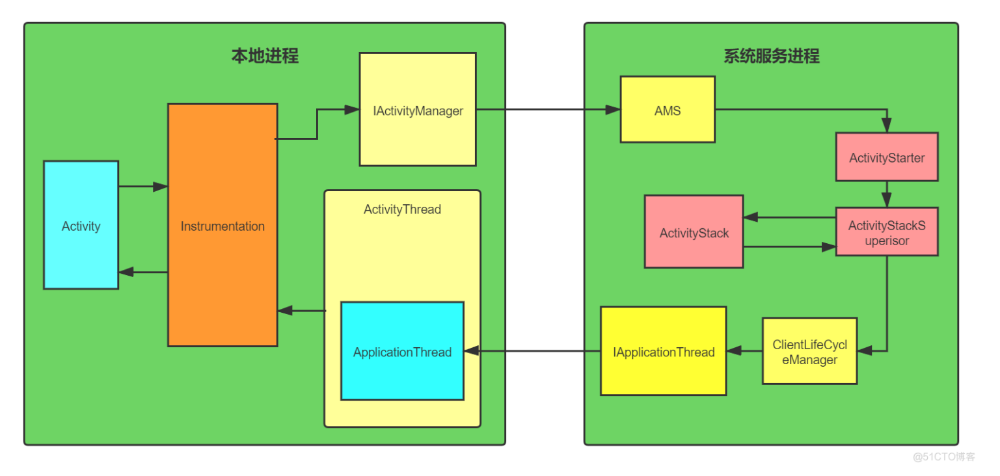

[基于api28，讲得不错，还有图，这篇是普通Activity的，根的那部分也不错](https://blog.51cto.com/u_15127640/2754132)

[可以作为第一篇补充，这篇是第一个Activity的流程](https://cloud.tencent.com/developer/article/1917958)

[基于Android10，比较零碎，几张图总结的不错。](https://juejin.cn/post/6847902222294990862#heading-0)

1、2篇不错，可以把握大方向，第3篇总结的表格可以看看


流程分析从点击图标（进程尚未创建）——> 创建第一个Activity，这个过程肯定是涵盖普通的创建Activity的，会更全面

# Activity启动流程·上




## 1：Launcher

桌面也是一个应用，一个为Launcher的应用，点击图标其实是这个应用的startActivity。

[找到一个Launcher开发的资源](https://github.com/Launcher3-dev/Launcher3-mx)

点击图标调用的是这个方法:

```java
@Override
    public boolean startActivitySafely(View v, Intent intent, ItemInfo item) {

        boolean success = super.startActivitySafely(v, intent, item);
       
    }
```

由于Launcher class继承的是Activity class(就是日常开发所使用的那个类，现在只是在桌面的Activity中调用)。结果就来到了Activity的`startActivity`，所以就来到我们正常用intent来开启activity的那个路径了。

## 2：Activity那边

Activity调用`Instrumentation`完成启动Activity的工作。

```java
public void startActivityForResult(@RequiresPermission Intent intent, int requestCode,
            @Nullable Bundle options) {
      
            Instrumentation.ActivityResult ar =
                mInstrumentation.execStartActivity(
                    this, mMainThread.getApplicationThread(), mToken, this,
                    intent, requestCode, options);
}
```


## 3：Instrumentation

Instrumentation把任务委托给AMS（ActivivityManagerService），任务由**Launcher进程**转移到系**统进程**。

```java
public ActivityResult execStartActivity(
            Context who, IBinder contextThread, IBinder token, Activity target,
            Intent intent, int requestCode, Bundle options) {
    
        IApplicationThread whoThread = (IApplicationThread) contextThread;
  
            int result = ActivityManager.getService()// 1
                .startActivity(whoThread, who.getBasePackageName(), intent,
                        intent.resolveTypeIfNeeded(who.getContentResolver()),
                        token, target != null ? target.mEmbeddedID : null,
                        requestCode, 0, null, options);

        return null;
    }
```

**IApplicationThread就是应用进程这边定义的接口，这边把实例传到系统进程那边，然后让系统进程做完自己的事情之后，再调用回来，这样就能回到应用进程。**（学完Binder机制之后，看一下这句话错在哪）

```java
/**
 * System private API for communicating with the application.  This is given to
 * the activity manager by an application  when it starts up, for the activity
 * manager to tell the application about things it needs to do.
 *
 * {@hide}
 */
oneway interface IApplicationThread {
    // 稍后用到
    void scheduleTransaction(in ClientTransaction transaction);
  
}
```

> 再Android10之后任务不是委派给ActivityManagerService而是给ActivityTaskManagerService。只是把系统进程的接口实现换个地方而已吧。

## 4：ActivityManagerService

在上面注释1处得到一个IActivityManager接口的实现，这个实现类是ActivityManagerService。

```java
// IActivityManager.java
/**
 * System private API for talking with the activity task manager that handles how activities are
 * managed on screen.
 *
**/
interface IActivityTaskManager {
    int startActivity(in IApplicationThread caller, in String callingPackage,
            in String callingFeatureId, in Intent intent, in String resolvedType,
            in IBinder resultTo, in String resultWho, int requestCode,
            int flags, in ProfilerInfo profilerInfo, in Bundle options);
}


// ActivityManagerService
public class ActivityManagerService extends IActivityManager.Stub {
    @Override
    public final int startActivity(IApplicationThread caller, String callingPackage,
            Intent intent, String resolvedType, IBinder resultTo, String resultWho, int requestCode,
            int startFlags, ProfilerInfo profilerInfo, Bundle bOptions) {
        ...
    }
}

```

IAM是系统那边的，然后实现是AMS，我们调用AMS的方法，就转到系统进程那边去了。（学完Binder机制再看这句话？）

**开启系统进程之旅**

## 5：ActivityStarter

调用ActivityStackSupervisor的resumeFocusedStackTopActivityLocked方法。ActivityStackSuperior又调用ActivityStack，然后又回到ActivityStackSupevisor的startSpecificActivityLocked方法。

## 6：ActivityStackSupevisor

```java
// ActivityStackSupevisor.java
void startSpecificActivityLocked(ActivityRecord r,
            boolean andResume, boolean checkConfig) {
     	
    // 如果进程存在且有进程中有线程存在 就是启动一个同应用的Activity（普通Activity就在此执行）
        if (app != null && app.thread != null) {
           
          realStartActivityLocked(r, app, andResume, checkConfig);
          return;  
        }
    // 应用进程尚未创建，要先启动进程，走这个
        mService.startProcessLocked(r.processName, r.info.applicationInfo, true, 0,
                "activity", r.intent.getComponent(), false, false, true);
    }
```

由于我们分析的是第一个Activity创建，这个时候应用进程尚未启动，所以走第二条线路。

## 7：回到AMS

接下来，就是**AMS和Zygote进程**的通信（系统进程和Zygote进程），Zygote进程创建好**应用进程**后，会利用反射，来到`ActivityThread.main()`方法。

在这个过程我们只需要知道其内部：

- Zygote通过fork创建了一个进程
- 在新建的进程中创建Binder线程池（此进程就支持了Binder IPC）
- 最终是通过反射获取到了ActivityThread类并执行了main方法

# Activity启动流程·中



## 1：ActivityThread

```java
// ActivityThread.java

class ActivityThread  extends ClientTransactionHandler {
    
    // ApplicationThread是ActivityThread的静态内部类
    final ApplicationThread mAppThread = new ApplicationThread();
    
    // 1 从Zygote来到这里
    public static void main(String[] args) {
        ...
            // 创建主线程Looper
        Looper.prepareMainLooper();
	   ...
           // 创建ActivityThread还有ApplicationThread
        ActivityThread thread = new ActivityThread();
        thread.attach(false, startSeq);// ——>2
	...
        // 主线程Looper开启死循环
        Looper.loop();
	...
    }
    
    // 2 
    private void attach(boolean system, long startSeq) {
       
           // 重要，进入系统进程，去执行AMS
            final IActivityManager mgr = ActivityManager.getService();
            mgr.attachApplication(mAppThread, startSeq);// ——> 进入AMS
          
            //-------- 这一段不太重要，但可以留意一下，主要就是手机内存不够就释放一些应用
            BinderInternal.addGcWatcher(new Runnable() {
                @Override public void run() {
                    if (!mSomeActivitiesChanged) {
                        return;
                    }
                    Runtime runtime = Runtime.getRuntime();
                    long dalvikMax = runtime.maxMemory();
                    long dalvikUsed = runtime.totalMemory() - runtime.freeMemory();
                    if (dalvikUsed > ((3*dalvikMax)/4)) {
                        if (DEBUG_MEMORY_TRIM) Slog.d(TAG, "Dalvik max=" + (dalvikMax/1024)
                                + " total=" + (runtime.totalMemory()/1024)
                                + " used=" + (dalvikUsed/1024));
                        mSomeActivitiesChanged = false;
                        try {
                            mgr.releaseSomeActivities(mAppThread);
                        } catch (RemoteException e) {
                            throw e.rethrowFromSystemServer();
                        }
                    }
                }
            });
        // --------
        } 
}
```

从**应用进程**去到**系统进程**


## 2：ActivityManagerService

```java
    // ActivityManagerService.java

    private boolean attachApplicationLocked(@NonNull IApplicationThread thread,
            int pid, int callingUid, long startSeq) {
            ...
            ProcessRecord app;
                // 进去创建Application
            thread.bindApplication(processName, appInfo, providerList,
                        instr2.mClass,
                        profilerInfo, instr2.mArguments,
                        instr2.mWatcher,
                        instr2.mUiAutomationConnection, testMode,
                        mBinderTransactionTrackingEnabled, enableTrackAllocation,
                        isRestrictedBackupMode || !normalMode, app.isPersistent(),
                        new Configuration(app.getWindowProcessController().getConfiguration()),
                        app.compat, getCommonServicesLocked(app.isolated),
                        mCoreSettingsObserver.getCoreSettingsLocked(),
                        buildSerial, autofillOptions, contentCaptureOptions,
                        app.mDisabledCompatChanges);
             ...
                 // 启动第一个Activity
             mStackSupervisor.attachApplicationLocked(app)
             ...
    }
```

### 2.1 ApplicationThread.bindApplication（略）

这个方法调用的是IApplicationThread的实现，**在应用进程执行**。

在里面给Handler发送了信息，然后在handler的handlerMessage中去处理，处理什么就不看了。

### 2.2 StackSupervisor.attachApplicationLocked

里面调用了`realStartActivityLocked`，所以这里就去到**上篇第六点的那个正常入口**了。


# Activity启动流程·下






这个部分是普通启动Activity和第一个启动的Activity都会走的。

> 普通启动的话，走完上篇的2、3、4、5、6，直接来到下篇

## 1：ActivityStackSupervisor

```java
final boolean realStartActivityLocked(ActivityRecord r, ProcessRecord app,
   boolean andResume, boolean checkConfig) throws RemoteException {
			 // Create activity launch transaction.
                final ClientTransaction clientTransaction = ClientTransaction.obtain(app.thread,
                        r.appToken);
                clientTransaction.addCallback(LaunchActivityItem.obtain())// 1

                // Set desired final state.
                final ActivityLifecycleItem lifecycleItem;
                if (andResume) {
                    lifecycleItem = ResumeActivityItem.obtain(mService.isNextTransitionForward());// 2
                } else {
                    lifecycleItem = PauseActivityItem.obtain();
                }
                clientTransaction.setLifecycleStateRequest(lifecycleItem);

                // Schedule transaction.
                mService.getLifecycleManager().scheduleTransaction(clientTransaction);
  }
```

```java
// ClientLifecycleManager.java
void scheduleTransaction(ClientTransaction transaction) throws RemoteException {
        transaction.schedule();
    }
```

往ClientTransaction中添加了**LaunchActivity任务**以及**ResumeActivity任务**，并且调用其schedule方法。

## 2：ClientTransaction

```java
private IApplicationThread mClient;

public void schedule() throws RemoteException {
        mClient.scheduleTransaction(this);
    }
```

显而易见，调用又回到**应用进程的ApplicationThread**

## 3：ApplicationThread

scheduleTransaction是ActivityThread的父类的方法

```java
// ApplicationThread.java	  
@Override
 public void scheduleTransaction(ClientTransaction transaction) throws RemoteException {
       ActivityThread.this.scheduleTransaction(transaction);
 }

// ClientTransactionHandler.java
void scheduleTransaction(ClientTransaction transaction) {
        transaction.preExecute(this);
        sendMessage(ActivityThread.H.EXECUTE_TRANSACTION, transaction);
    }
```

这个sendMessage给Handler发送了一条**EXECUTE_TRANSACTION**信息。

## 4：Handler

这个Handler是ActivityThread中定义的内部类。

```java
// An executor that performs multi-step transactions.
// 这个字段定义在ActivityThread中
private final TransactionExecutor mTransactionExecutor = new TransactionExecutor(this);

case EXECUTE_TRANSACTION:
  final ClientTransaction transaction = (ClientTransaction) msg.obj;
 	mTransactionExecutor.execute(transaction);
    break;
```

## 5：TransactionExecutor

```java
    public void execute(ClientTransaction transaction) {
        if (DEBUG_RESOLVER) Slog.d(TAG, tId(transaction) + "Start resolving transaction");

        final IBinder token = transaction.getActivityToken();
        ...
        // 执行第一步中添加的LaunchActivityItem    
        executeCallbacks(transaction);
	   // ResumeActivityItem
        executeLifecycleState(transaction);
        ...
    }
```

继续进入executeCallbacks。

```java
public void executeCallbacks(ClientTransaction transaction) {
        final List<ClientTransactionItem> callbacks = transaction.getCallbacks();
        final int size = callbacks.size();
        for (int i = 0; i < size; ++i) {
            final ClientTransactionItem item = callbacks.get(i);
            item.execute(mTransactionHandler, token, mPendingActions);
         
        }
    }
```

所以我们要看ClientTransactionItem的具体实现——LaunchActivityItem的execute方法。

## 6：LaunchActivityItem

```java
@Override
    public void execute(ClientTransactionHandler client, IBinder token,
            PendingTransactionActions pendingActions) {
        client.handleLaunchActivity(r, pendingActions, null /* customIntent */);
    }
```

这个client就是ActivityThread。看第四步，一步一步传进来的。所以最终调用到ActivityThread的handlerLaunchActivity.

## 7：ActivityThread

```java
// ActivityThread.java

public Activity handleLaunchActivity(ActivityClientRecord r,
        PendingTransactionActions pendingActions, Intent customIntent) {
    ...
        // 跳转到performLaunchActivity
        final Activity a = performLaunchActivity(r, customIntent);
    ...
}

//使用Instrumentation去创建activity回调生命周期
private Activity performLaunchActivity(ActivityClientRecord r, Intent customIntent) {
    	//获取ActivityInfo，用户存储代码、AndroidManifes信息。
    	ActivityInfo aInfo = r.activityInfo;
        if (r.packageInfo == null) {
            //获取apk描述类
            r.packageInfo = getPackageInfo(aInfo.applicationInfo, r.compatInfo,
                    Context.CONTEXT_INCLUDE_CODE);
        }
    
    	// 获取activity的包名类型信息
    	ComponentName component = r.intent.getComponent();
        if (component == null) {
            component = r.intent.resolveActivity(
                mInitialApplication.getPackageManager());
            r.intent.setComponent(component);
        }
    ...
        // 1创建context上下文
        ContextImpl appContext = createBaseContextForActivity(r);
   		// 2创建activity
        Activity activity = null;
        try {
            java.lang.ClassLoader cl = appContext.getClassLoader();
            // 通过Instrumentation来创建Activity
            activity = mInstrumentation.newActivity(
                    cl, component.getClassName(), r.intent);
            StrictMode.incrementExpectedActivityCount(activity.getClass());
            r.intent.setExtrasClassLoader(cl);
            r.intent.prepareToEnterProcess();
            if (r.state != null) {
                r.state.setClassLoader(cl);
            }
        }
    ...
        try {
            // 3根据包名创建Application，如果已经创建则不会重复创建
            // 创建Application()实例，返回的是自己定义的例如MyApplication的实例，不是系统的那个类的实例。（还没搞懂，里面有判断是否创建）
            Application app = r.packageInfo.makeApplication(false, mInstrumentation);
            ...
            Window window = null;
            if (r.mPendingRemoveWindow != null && r.mPreserveWindow) {
                window = r.mPendingRemoveWindow;
                r.mPendingRemoveWindow = null;
                r.mPendingRemoveWindowManager = null;
            }
            appContext.setOuterContext(activity);
            //4 attach方法为activity关联上下文环境，里面为Activity创建ContextImpl, PhoneWindow
            activity.attach(appContext, this, getInstrumentation(), r.token,
                    r.ident, app, r.intent, r.activityInfo, title, r.parent,
                    r.embeddedID, r.lastNonConfigurationInstances, config,
                    r.referrer, r.voiceInteractor, window, r.configCallback);
            }
	...
        // 5通过Instrumentation回调Activity的onCreate方法
        ctivity.mCalled = false;
        if (r.isPersistable()) {
            mInstrumentation.callActivityOnCreate(activity, r.state, r.persistentState);
        } else {
            mInstrumentation.callActivityOnCreate(activity, r.state);
        }
}
```

performLaunchActivity方法中主要做了以下几件事：

1. 创建要启动activity的上下文环境
2. 通过Instrumentation的newActivity方法，以反射形式创建activity实例
3. 如果Application不存在的话会创建Application并调用Application的onCreate方法
4. 初始化Activity，创建ContextImpl, Window对象（PhoneWindow）并实现Activity和Window相关联
5. 通过Instrumentation调用Activity的onCreate方法

注：

上面看到LaunchActivityItem，是用来启动Activity的，也就是走到Activity的onCreate，那么是不是有 "XXXActivityItem"呢? 有的：

- LaunchActivityItem 远程App端的onCreate生命周期事务
- ResumeActivityItem 远程App端的onResume生命周期事务
- PauseActivityItem 远程App端的onPause生命周期事务
- StopActivityItem 远程App端的onStop生命周期事务
- DestroyActivityItem 远程App端onDestroy生命周期事务

> Activity其他生命周期的执行也是由ActivityThread的Handler处理相应的Item，然后回调自身的handlerXXXActivity来执行的。

# 总结

## 包含根Activity整体图




## 包含根Activity细节图




## 创建根Activity过程四进程关系




## 普通activity整体图




## 类的职责表

涉及的类梳理如下：


| 类名                                   | 作用                                                         |
| -------------------------------------- | ------------------------------------------------------------ |
| ActivityThread                         | 应用的入口类，系统通过调用main函数，开启消息循环队列。ActivityThread所在线程被称为应用的主线程（UI线程） |
| ApplicationThread                      | 是ActivityThread的内部类，继承IApplicationThread.Stub，是一个IBinder，是ActiivtyThread和AMS通信的桥梁，AMS则通过代理调用此App进程的本地方法，运行在Binder线程池 |
| H                                      | 继承Handler，在ActivityThread中初始化，即主线程Handler，用于主线程所有消息的处理。本片中主要用于把消息从Binder线程池切换到主线程 |
| Intrumentation                         | 具有跟踪application及activity生命周期的功能，用于监控app和系统的交互 |
| ActivityManagerService                 | Android中最核心的服务之一，负责系统中四大组件的启动、切换、调度及应用进程的管理和调度等工作，其职责与操作系统中的进程管理和调度模块相类似，因此它在Android中非常重要，它本身也是一个Binder的实现类。 |
| ActivityTaskManagerService             | 管理activity及其容器（task, stacks, displays）的系统服务（Android10中新增，分担了AMS的部分职责） |
| ActivityStarter                        | 用于解释如何启动活动。该类收集所有逻辑，用于确定Intent和flag应如何转换为活动以及相关的任务和堆栈 |
| ActivityStack                          | 用来管理系统所有的Activity，内部维护了Activity的所有状态和Activity相关的列表等数据 |
| ActivityStackSupervisor                | 负责所有Activity栈的管理。AMS的stack管理主要有三个类，ActivityStackSupervisor，ActivityStack和TaskRecord |
| ClientLifecycleManager                 | 客户端生命周期执行请求管理                                   |
| ClientTransaction                      | 是包含一系列的 待客户端处理的事务 的容器，客户端接收后取出事务并执行 |
| LaunchActivityItem、ResumeActivityItem | 继承ClientTransactionItem，客户端要执行的事务信息，启动activity |


