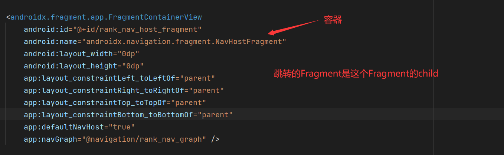
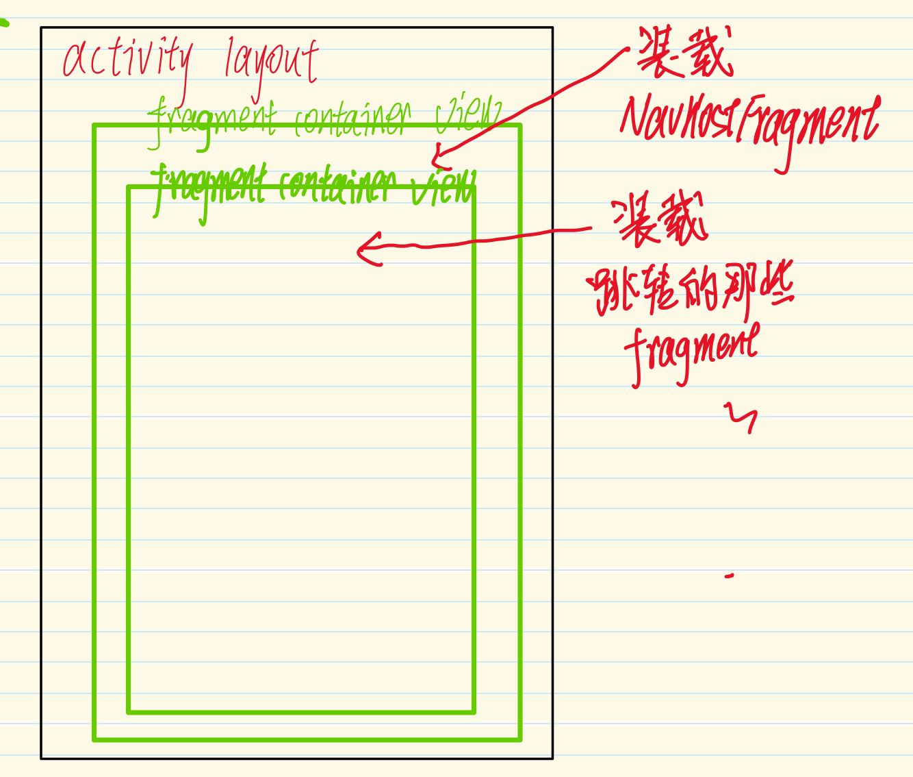
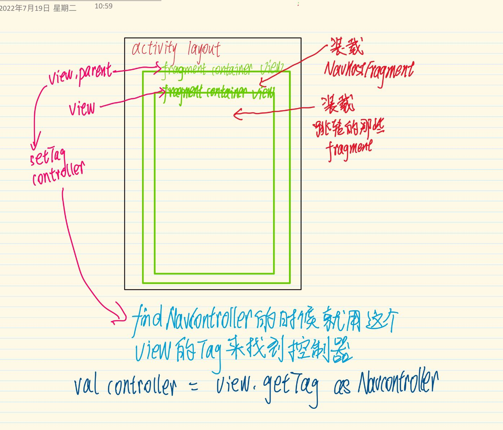
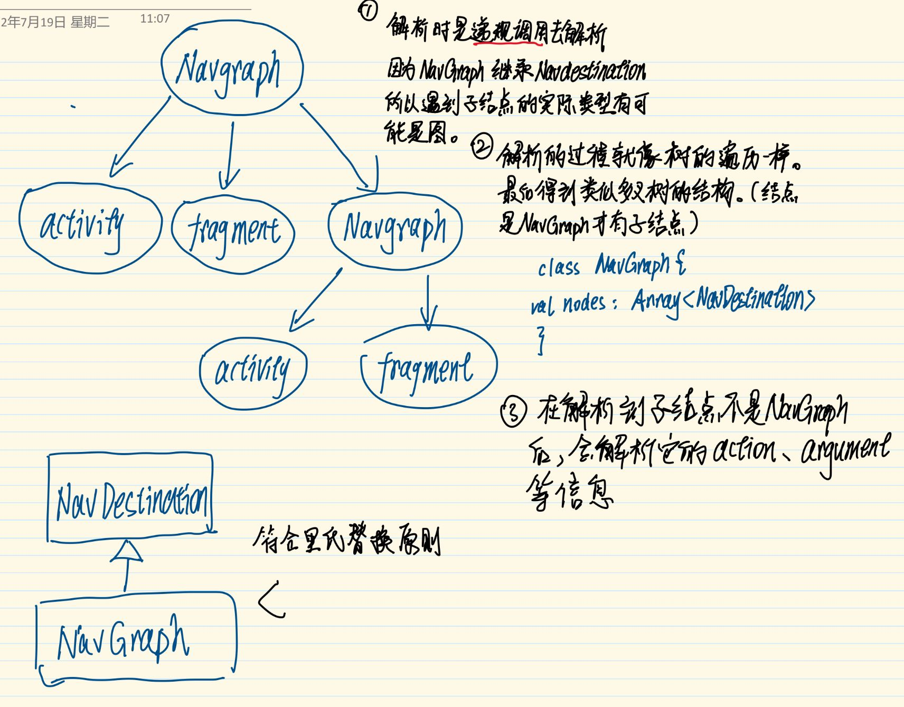
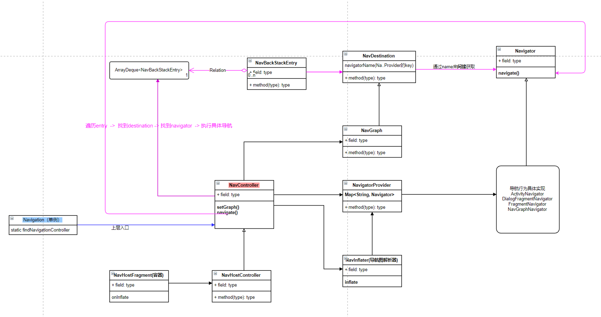

# Android Navigation

## 一：Fragment的学习

### 1: 在生命周期中回调

监听Fragment的生命周期有两种方案：

1. Lifecycle观察者模式。
2. override生命周期回调函数。

#### 1 Lifecycle观察者模式

先来解释第一种方法：

因为Fragment实现了LifecycleOwner接口，所以可以像下面这样监听生命周期：

```kotlin
this.lifecycle.addObserver(object : LifecycleEventObserver {
    override fun onStateChanged(source: LifecycleOwner, event: Lifecycle.Event) {
        when (event) {
            Lifecycle.Event.ON_CREATE -> {
                LogUtil.d("MyLifeCycleA: ON_CREATE")
            }
            Lifecycle.Event.ON_START -> {
                LogUtil.d("MyLifeCycleA: ON_START")
            }
            Lifecycle.Event.ON_RESUME -> {
                LogUtil.d("MyLifeCycleA: ON_RESUME")
            }
            Lifecycle.Event.ON_PAUSE -> {
                LogUtil.d("MyLifeCycleA: ON_PAUSE")
            }
            Lifecycle.Event.ON_STOP -> {
                LogUtil.d("MyLifeCycleA: ON_STOP")
            }
            Lifecycle.Event.ON_DESTROY -> {
                LogUtil.d("MyLifeCycleA: ON_DESTROY")
            }
            Lifecycle.Event.ON_ANY -> {
                LogUtil.d("MyLifeCycleA: ON_ANY")
            }
        }
    }
})
```

举个例子，我在Activity中先放一个FragmentA，然后用fragmentmanager replace成FragmentB，生命周期回调如下：

```
经过fm.beginTransaction()
	.replace(R.id.fragment_container_view, fragmentA)
	.commit()
FragmentA: ---onStateChanged---MyLifeCycleA: ON_CREATE
FragmentA: ---onStateChanged---MyLifeCycleA: ON_START
FragmentA: ---onStateChanged---MyLifeCycleA: ON_RESUME

经过fm.beginTransaction()
    	.replace(R.id.fragment_container_view, fragmentB)
    	.commit()
                
FragmentA: ---onStateChanged---MyLifeCycleA: ON_PAUSE
FragmentA: ---onStateChanged---MyLifeCycleA: ON_STOP
FragmentB: ---onStateChanged---MyLifeCycleB: ON_CREATE
FragmentB: ---onStateChanged---MyLifeCycleB: ON_START
FragmentA: ---onStateChanged---MyLifeCycleA: ON_DESTROY
FragmentB: ---onStateChanged---MyLifeCycleB: ON_RESUME

点击返回键
FragmentB: ---onStateChanged---MyLifeCycleB: ON_PAUSE
FragmentB: ---onStateChanged---MyLifeCycleB: ON_STOP
FragmentB: ---onStateChanged---MyLifeCycleB: ON_DESTROY
```


**Fragment中还有关于View的Lifecycle，可使用this.viewLifecycleOwner.lifecycle访问**

#### 2 override生命周期回调函数

#####  常规回调

再来解释第二种方法：


两个Fragment都重写了上面所有的回调方法，打印日志如下：

```
经过fm.beginTransaction()
	.replace(R.id.fragment_container_view, fragmentA)
	.commit()
	
FragmentA: ---onCreate---
FragmentA: ---onCreateView---
FragmentA: ---onViewCreated---
FragmentA: ---onViewStateRestored---
FragmentA: ---onStart---
FragmentA: ---onResume---

经过fm.beginTransaction()
    	.replace(R.id.fragment_container_view, fragmentB)
    	.commit()
    	
FragmentA: ---onPause---
FragmentA: ---onStop---
FragmentB: ---onCreate---
FragmentB: ---onCreateView---
FragmentB: ---onViewCreated---
FragmentB: ---onViewStateRestored---
FragmentB: ---onStart---
FragmentA: ---onDestroyView---
FragmentA: ---onDestroy---(若replace_fragmentB时有addToBackstack则不会回调fragmentA的onDestroy)
FragmentB: ---onResume---    

点击返回键
FragmentB: ---onPause---
FragmentB: ---onStop---
FragmentB: ---onDestroyView---
FragmentB: ---onDestroy---
```

onSaveInstanceState没有调用。

##### onStop时机

> onStop是activity**不可见**回调的，onPause表示acitivity**不在前台**时回调，fragment也是一样，在不可见时才回调onStop。


##### onAttach和onDetach:

onAttach和onDetach分别在onCreate和onDestroy之前调用，因为Fragment的生命周期由FragmentManager控制，而onAttach和onDetach的意思分别是FM控制fragment附加或脱离Activity，而生命周期都是在附加(之后)和脱离(之前)Activity这个之间进行的。所以onAttach和onDetach分别在onCreate和onDestroy之前调用。

```
还是上面那个例子

分别在AB的onCreate之前加上onAttach，在onDestroy之后加上onDetach
```

其实就是放个大概的过程出来了解一下，开发中完全没有必要去重写那么多方法。

[了解更多FM和Fragment的关系](https://developer.android.com/guide/fragments/lifecycle#fragmentmanager)

##### onInflate

当使用如下所示方式直接先指定一个Fragment作为初始fragment的时候，onInflate会被调用（在onAttach之前就被调用）

```xml
<androidx.fragment.app.FragmentContainerView
    android:id="@+id/fragment_container_view"
    android:layout_width="match_parent"
    app:layout_constraintTop_toTopOf="parent"
    app:layout_constraintBottom_toTopOf="@id/button1"
    android:name="com.example.composeproject.navigationlearn.FragmentA"
    android:layout_height="0dp"/>
```


#### 附：这两者的关系

```
FragmentA: ---onAttach---
FragmentA: ---onCreate---
FragmentA: ---onStateChanged---MyLifeCycleA: ON_CREATE
FragmentA: ---onCreateView---
FragmentA: ---onViewCreated---
FragmentA: ---onViewStateRestored---
FragmentA: ---onStart---
FragmentA: ---onStateChanged---MyLifeCycleA: ON_START
FragmentA: ---onResume--
FragmentA: ---onStateChanged---MyLifeCycleA: ON_RESUME
// ----------
FragmentA: ---onStateChanged---MyLifeCycleA: ON_PAUSE
FragmentA: ---onPause---
FragmentA: ---onStateChanged---MyLifeCycleA: ON_STOP
FragmentA: ---onStop---
FragmentA: ---onDestroyView---
FragmentA: ---onStateChanged---MyLifeCycleA: ON_DESTROY
FragmentA: ---onDestroy---
FragmentA: ---onDetach---
```

在状态上升的时候，lifecycle回调在函数回调之后，状态下降时，lifecycle回调在函数回调之前。[activity版分析](https://www.cnblogs.com/--here--gold--you--want/p/15995861.html)

upward

[downward](https://developer.android.com/guide/fragments/lifecycle#downward)

## 二：经典的跳转方式

利用FragmentManager(管理者)提交FragmentTransaction(事务)的方式来跳转。

[官方文档学习FM](https://developer.android.com/guide/fragments/fragmentmanager)

[官方文档学习Fragment事务](https://developer.android.com/guide/fragments/transactions)

### 获取FragmentManager


### addToBackStack

在commit一个事务的时候有没有添加到返回栈之中影响的是：**这个事务有没有单独的成为一个可回滚的事件**

若没有addToBackStack，那么从**初始状态或上一次addToBackStack**到目前为止的**所有操作**都属于同一个事件。

举个例子：

一个空白的activity，先后添加A B两个fragment，但是方式不同：


> 如果事务2时也是**不添加返回栈**，那么fragmenA会走onDestroy，像示例那样**添加了返回栈**，就不走onDestroy，只走到onDestroyView。

上图中，第二次点击返回键的时候，弹出返回栈中的事务，这个时候是初始事务（也可以看作**没有事务**），这个点击事件就由Activity接收，就退出activity了。

> 如果实在要操作Fragment事务的话，建议都addToBackStack

### add方式添加Fragment

**以下事务皆添加到返回栈**

```
添加A
FragmentA: ---onAttach---
FragmentA: ---onCreate---
FragmentA: ---onCreateView---
FragmentA: ---onViewCreated---
FragmentA: ---onViewStateRestored---
FragmentA: ---onStart---
FragmentA: ---onResume---

添加B
FragmentB: ---onAttach---
FragmentB: ---onCreate---
FragmentB: ---onCreateView---
FragmentB: ---onViewCreated---
FragmentB: ---onViewStateRestored---
FragmentB: ---onStart---
FragmentB: ---onResume---

点击返回键
FragmentB: ---onPause---
FragmentB: ---onStop---
FragmentB: ---onDestroyView---
FragmentB: ---onDestroy---
FragmentB: ---onDetach---

点击返回键
FragmentA: ---onPause---
FragmentA: ---onStop---
FragmentA: ---onDestroyView---
FragmentA: ---onDestroy---
FragmentA: ---onDetach---
```

可以看到，使用add的方式，fragmentA并没有走**生命周期的下降流程**。

### 其他的

还有remove，attach等等这些方式我都没有试，其实就是fragment的生命周期回调的函数有差别而已。


## 三：Navigation框架学习

### 学习思路

在使用Navigation时，往往要在Activity的layout文件设置FragmentContainerView作为我们导航的部分。



所以在看源码时可以从这个类的生命周期入手。

### NavHostFragment

#### onAttach


那么主要的Fragment是什么意思呢？意思如下：

> The primary navigation fragment's **child FragmentManager** will be called first to **process** delegated **navigation actions** such as FragmentManager.popBackStack() if no ID or transaction name is provided to pop to

也就是说由NavHostFragment的children来接收导航行为。

#### onCreate

这个阶段做了两件事

1. 初始化NavController
2. 给NC设置导航图

在设置导航图的时候，包含解析导航图，把**导航图解析成一个树形结构**。解析过程后文将。

#### onCreateView

```kotlin
public override fun onCreateView(
    inflater: LayoutInflater,
    container: ViewGroup?,
    savedInstanceState: Bundle?
): View? {
    val containerView = FragmentContainerView(inflater.context)
    // When added via XML, this has no effect (since this FragmentContainerView is given the ID
    // automatically), but this ensures that the View exists as part of this Fragment's View
    // hierarchy in cases where the NavHostFragment is added programmatically as is required
    // for child fragment transactions
    containerView.id = containerId
    return containerView
}
```

可以看到，NavHostFragment(NHF)的layout就是一个`FragmentContainerView`，那么这个试图结构就类似于：



#### onViewCreated

这个方法把NavController设置为第一个fcv的tag

```kotlin
super.onViewCreated(view, savedInstanceState)
check(view is ViewGroup) { "created host view $view is not a ViewGroup" }
Navigation.setViewNavController(view, navHostController)
// When added programmatically, we need to set the NavController on the parent - i.e.,
// the View that has the ID matching this NavHostFragment.
if (view.getParent() != null) {
    viewParent = view.getParent() as View
    if (viewParent!!.id == id) {
        Navigation.setViewNavController(viewParent!!, navHostController)
    }
}
```



当动态添加NHF的时候，添加到View.parent，否则view


### 导航图的解析

具体的过程都在NavInflate类中。

一些笔记



### 框架类图

最后放一张整个库的大致类图：



1. 上层对库的调用入口是Navigation， 这是一个单例
2. 跳转的工作和按返回键的逻辑，都由NavController去分派调度，NavHostFragment只是一个载体/容器
3. NavController类似于一个“中心”，解析、跳转等具体逻辑都不是由它完成，却是由它来调度
4. 不同的目的地有不同的跳转实现，Navigator是抽象类，具体的实现官方有四个
5. 解析导航图xml由NaviInflater来完成

### 总结

整个框架是对单一职责原则、里氏替换原则、面向对象设计的极致应用，在FragmentManager和FragmentTransavtion的基础上（不完全），抽象出了这个导航框架。


参考：

[整体观比较强](https://blog.csdn.net/mq2553299/article/details/80445952)

[源码分析上 掘金](https://juejin.cn/post/7048262381171900452)

[源码分析下 掘金](https://juejin.cn/post/7092401794793357325)

[这图画的不错](https://juejin.cn/post/6985354505621602335)


