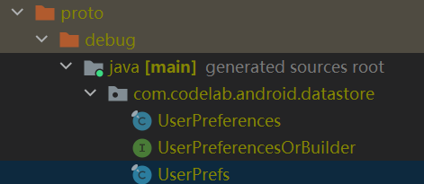

# 一：官方例子分析

首先来分析官方codelab中的例子：

```protobuf
// user_prefs.proto
syntax = "proto3";

option java_package = "com.codelab.android.datastore";
option java_multiple_files = true;

message UserPreferences {
  // filter for showing / hiding completed tasks
  bool show_completed = 1;

  // defines tasks sorting order: no order, by deadline, by priority, by deadline and priority
  enum SortOrder {
    UNSPECIFIED = 0;
    NONE = 1;
    BY_DEADLINE = 2;
    BY_PRIORITY = 3;
    BY_DEADLINE_AND_PRIORITY = 4;
  }

  // user selected tasks sorting order
  SortOrder sort_order = 2;
}
```

1  syntax指明当前使用的语法版本，proto3比proto2新。

2  java_package指定生成的类所在的包名，例如：



中的com.codelab.android.datastore.

3  java_multiple_files指定“是否已外部类包裹内部类的方式去生成类”，如果为true，就和例子中一样，会有一个以**文件名**生成的类`UserPrefs`以及定义的message`UserPreferences`。如果为false，就会以文件名只生成一个类`UserPrefs`，然后定义的message`UserPreferences`就为它的静态内部类。**一般设为true，更清晰**

4  message是用来定义结构体，bool，enum这些定义field的类型，message里面可以定义其他message

5  0, 1, 2...这些是标志位，用来在转换成二进制之后标记字段，在同一个**{}块**中需要独一无二。一般字段不超过16个的话就取**1——15**，因为它们的二进制位可以用一个字节表示，大于等于16都需要2个字节以上了。理论上来说随便取，效率高点就取1——15。（不能取0，enum中特殊）。[详细解释](https://developers.google.com/protocol-buffers/docs/proto3#assigning_field_numbers)

# 二：关于字段的修饰规则：

[字段修饰](https://developers.google.com/protocol-buffers/docs/proto3#specifying_field_rules)

一开始我难以明白**默认的singular代表什么**以及为什么optional和它的区别是可以知道当前的值是否已被显示指定。看了这个回答后恍然大悟：[回答](https://softwareengineering.stackexchange.com/questions/350443/why-protobuf-3-made-all-fields-on-the-messages-optional)。


