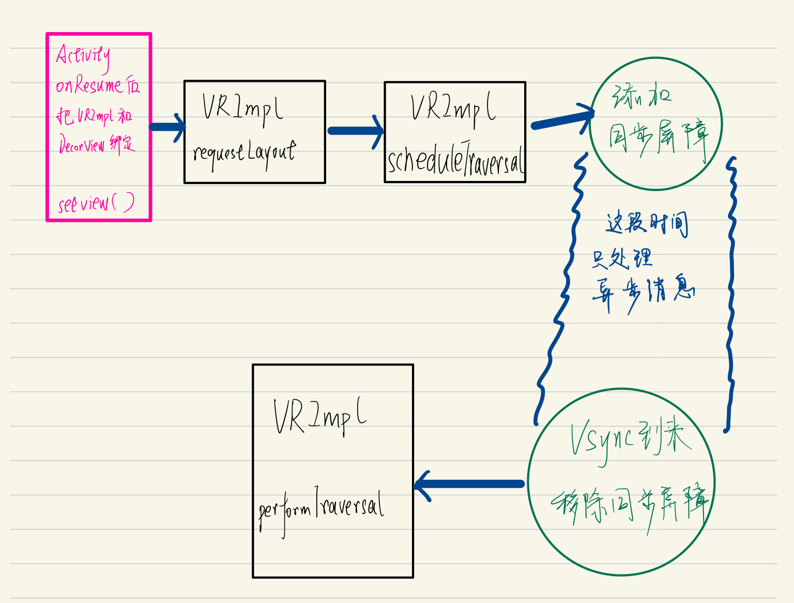
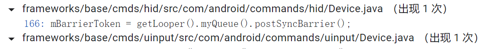

# Message

Message这个类是对消息的封装，里面封装了处理者handler的指针等等信息。

## 1：池化思想

今天发现Message其实是有回收利用机制的，利用池化思想（Java线程池也用到了这种思想），重复利用对象，避免创建对象的性能开销。

```java
	Message next;
	
    private static Message sPool;
```

利用链表存储已经回收可以用来分配的Message，sPool就是链表的头。

- 回收的方法，是把最新回收的放在链表头部，并指向原来的头。

  ```java
  next = sPool;
  sPool = this;
  sPoolSize++;
  ```

- 分配的方法，把池的头拿出来分配。

  ```java
   Message m = sPool;
   sPool = m.next;
   m.next = null;
  ```

## 2：分类

在Handler中，Message分为3种：同步消息、异步消息、同步屏障消息，他们三者都是Message，只是属性有些区别。

- 同步和异步的区别是标志位不同
- 同步屏障的区别是target为null，其他两个类型的target不可能为null

> 异步消息可以使用，但同步屏障已被@hide注释，无法使用。

### 设置异步消息

平常使用的Msg都是同步消息，其实还有异步消息。异步消息有两种设置方法。

1. 一个异步的Handler发出的消息都是异步消息。判断异步Handler的字段：

   ```java
   final boolean mAsynchronous;// 在创建Handler时设置
   ```

2. 给消息的Flag字段设置：

   ```java
   // Message.java
   public void setAsynchronous(boolean async) {
           if (async) {
               flags |= FLAG_ASYNCHRONOUS;
           } else {
               flags &= ~FLAG_ASYNCHRONOUS;
           }
   }
   ```

### 设置同步屏障

```java
 // MessageQueue.java
// @hide
 public int postSyncBarrier() {
        return postSyncBarrier(SystemClock.uptimeMillis());
    }

    private int postSyncBarrier(long when) {
        // Enqueue a new sync barrier token.
        // We don't need to wake the queue because the purpose of a barrier is to stall it.
        synchronized (this) {
            final int token = mNextBarrierToken++;
            final Message msg = Message.obtain();
            msg.markInUse();
            msg.when = when;
            msg.arg1 = token;// 看，同步屏障消息target不设置，为null

            Message prev = null;
            Message p = mMessages;
            if (when != 0) {
                while (p != null && p.when <= when) {// 维护MessageQueue的顺序（根据when从大到小）
                    prev = p;
                    p = p.next;
                }
            }
            if (prev != null) { // invariant: p == prev.next
                msg.next = p;
                prev.next = msg;
            } else {
                msg.next = p;
                mMessages = msg;
            }
            return token;// 需要用这个token再移除同步屏障
        }
    }
```

可以看到它很简单，从这个方法我们可以知道如下：

- 屏障消息和普通消息的区别在于**屏障没有tartget**，普通消息有target是因为它需要将消息分发给对应的target，而屏障不需要被分发，它就是**用来挡住普通消息来保证异步消息优先处理的**。
- **屏障和普通消息一样可以根据时间来插入到消息队列中的适当位置，并且只会挡住它后面的同步消息的分发**
- postSyncBarrier()返回一个int类型的数值，通过这个数值可以撤销屏障即removeSyncBarrier()。

#### 同步屏障的作用

```java
Message next() {
        int pendingIdleHandlerCount = -1; // -1 only during first iteration
        int nextPollTimeoutMillis = 0;
        for (;;) {
          

            nativePollOnce(ptr, nextPollTimeoutMillis);// ！！！！！！懂的都懂

            synchronized (this) {
                // Try to retrieve the next message.  Return if found.
                final long now = SystemClock.uptimeMillis();
                Message prevMsg = null;
                Message msg = mMessages;
                if (msg != null && msg.target == null) {
                    // 发现一个同步屏障，先处理同步屏障后面的异步消息！！！
                    // 这个循环找同步屏障后面的一个异步消息，遍历完也没有的话msg就指向null了
                    do {
                        prevMsg = msg;
                        msg = msg.next;
                    } while (msg != null && !msg.isAsynchronous());
                }
                if (msg != null) {
                    // 如果有同步屏障，这里能进来，msg一定是异步消息！！
                    if (now < msg.when) {
                        // Next message is not ready.  Set a timeout to wake up when it is ready.
                        nextPollTimeoutMillis = (int) Math.min(msg.when - now, Integer.MAX_VALUE);
                    } else {
                        // Got a message.
                        mBlocked = false;
                        if (prevMsg != null) {
                            prevMsg.next = msg.next;
                        } else {
                            mMessages = msg.next;
                        }
                        msg.next = null;
                        if (DEBUG) Log.v(TAG, "Returning message: " + msg);
                        msg.markInUse();
                        return msg;
                    }
                } else {
                    // No more messages.
                    nextPollTimeoutMillis = -1;// -1导致循环开始的阻塞
                }
            }
            // While calling an idle handler, a new message could have been delivered
            // so go back and look again for a pending message without waiting.
            nextPollTimeoutMillis = 0;// 0不会导致阻塞
        }
    }
```

#### 同步屏障的添加时机

因为同步屏障自己没有办法添加，所以来看看系统有没有添加同步屏障的操作，如果有，又是什么时候发生的。

##### 1

在VIewRootImpl的requestLayout中，调度scheduleTraversals，来调度三大流程，这时候放一个同步屏障。然后在下一帧到来的时候，在执行三大流程之前，移除同步屏障。

> requestLayout的一个调用处是ViewRootImpl的setView，setView这个方法是在Activity的handleResumeActy的onResume之后把VRImpl和DecorView绑定时调用，可以看作主流程。



##### 2

这是另外两处地方。就这总结的三处地方，么有其他地方了。下面这个类也不知道干啥的。（看了下，发现挺底层的，在应用层忽略不计吧）



# MessageQueue

> 这里谈论的是处理同步消息的流程。异步消息参考[segment](https://segmentfault.com/a/1190000039659685)，但上面也有总结。


消息队列在Android中指的是**MessageQueue**, MessageQueue主要包含两个操作：**插入和读取**。**读取操作本身会伴随着删除操作**，**插入和读取**对应的方法分别为**enqueueMessage和next**，其中

- **enqueueMessage**的作用是**往消息队列中插入一条消息**，
- 而**next的作用是从消息队列中取出一条消息并将其从消息队列中移除**。

尽管MessageQueue叫消息队列，但是**它的内部实现并不是用的队列**，实际上它是通过**一个单链表的数据结构来维护消息列表，单链表在插入和删除上比较有优势**。
MessageQueue是消息机制的Java层和C++层的连接纽带，大部分核心方法都交给native层来处理，其中MessageQueue类中涉及的native方法如下：

```java
private native static long nativeInit();
private native static void nativeDestroy(long ptr);
private native void nativePollOnce(long ptr, int timeoutMillis);  
private native static void nativeWake(long ptr);
private native static boolean nativeIsPolling(long ptr);
private native static void nativeSetFileDescriptorEvents(long ptr, int fd, int events);
```

## 1：enqueueMessage

```java
if (p == null || when == 0 || when < p.when) {// 当前消息小于第一个消息的延迟时间，就插在开头
    msg.next = p;
    mMessages = msg;
    needWake = mBlocked;
} else {
    Message prev;
    for (;;) {
        prev = p;
        p = p.next;
        if (p == null || when < p.when) {// 找到合适的插入位置
            break;
        }
    }
    msg.next = p; //
    prev.next = msg;// 
}
```


## 2：next

这个方法被looper调用来取信息。

从链表头开始遍历拿，第一个message是延迟时间最短的，如果它都还不能执行，就调用

```java
nativePollOnce(ptr, nextPollTimeoutMillis);
```

阻塞一段时间。然后再从阻塞处唤醒继续执行。阻塞用到了Linux层的epoll_wait命令，会释放当前持有cpu的资源，等唤醒时再往下继续执行。

关于`nativePollOnce`:

准确的讲，主线程确实堵塞了，Looper实现了**可阻塞的死循环**。当没有消息的时候，主线程既不能退出，又不能无阻塞死循环执行，最后的办法只能是让他有消息的时候处理消息，没消息的时候进入阻塞状态。

利用Linux的epoll+pipe机制，使得主线程在阻塞的时候，让出CPU资源，同时等待新消息。当我们对系统进行操作（包括各种滑动和点击）的时候，系统就会给主线程发送消息，这个时候就会唤醒主线程（执行onCreate，onResume等方法），当处理完这个消息，就会再次进入阻塞状态。这样系统就能做到随时响应用户的操作。

真正的ANR绝不是Looper轮询消息导致的，而是处理消息过程中的问题。**事件只会阻塞Looper，而Looper不会阻塞事件**，当某个事件在主线程执行了耗时操作，影响了Looper轮询后面的消息，才会发生ANR。

# Handler

## 1：内存泄漏问题

当使用内部类（包括匿名类）来创建Handler的时候，Handler对象会隐式地持有外部类（可能是Activity）的引用。


1：

而Handler通常会伴随着一个耗时的后台线程一起出现，这个后台线程在任务执行完毕后发送消息去更新UI。然而，如果用户在网络请求过程中关闭了Activity，正常情况下，Activity不再被使用，它就有可能在GC检查时被回收掉，但由于这时线程尚未执行完，而该线程持有Handler的引用（不然它怎么发消息给Handler？），这个Handler又持有Activity的引用，就导致该Activity无法被回收（即内存泄露），直到网络请求结束。

2：

另外，handler消息机制会有一条MessageQueue -> Message -> Handler -> Activity的链，导致你的Activity被持有引用而无法被回收。只有Message被handler处理完成之后才会被回收。

```java
    // Message.java
    @UnsupportedAppUsage
    void recycleUnchecked() {
        // Mark the message as in use while it remains in the recycled object pool.
        // Clear out all other details.
        flags = FLAG_IN_USE;
        what = 0;
        arg1 = 0;
        arg2 = 0;
        obj = null;
        replyTo = null;
        sendingUid = UID_NONE;
        workSourceUid = UID_NONE;
        when = 0;
        target = null;// Message断开对handler的引用
        callback = null;
        data = null;

        synchronized (sPoolSync) {
            if (sPoolSize < MAX_POOL_SIZE) {
                next = sPool;
                sPool = this;
                sPoolSize++;
            }
        }
    }
```


持有外部引用查看：

```java
public class OuterClass {
    int i = 1;

    class InnerClass {
        public void func() {
        }
    }
}
```

InnerClass编译后：

```java
class OuterClass$InnerClass {
    OuterClass$InnerClass(OuterClass var1) {// 持有外部类引用
        this.this$0 = var1;
    }

    public void func() {
    }
}
```

如果非要用Handler访问外部类的对象的话，就不用内部类，并用传参数的方式，用WeakReference指向。

```java
static class MyHandler extends Handler {
    WeakReference<Activity > mActivityReference;
    MyHandler(Activity activity) {
        mActivityReference= new WeakReference<Activity>(activity);
    }
    @Override
    public void handleMessage(Message msg) {
        final Activity activity = mActivityReference.get();
      
    }
}

```

感觉这一节只是补充面试知识，我如果要切线程，我用协程就可以了，handler除了在开发中用的应该场景不多了。


[Android开发艺术探索](https://www.kancloud.cn/alex_wsc/android_art/1828637)


# 屏幕刷新机制

## 1：Choreographer工作流程

> Choreographer和Native层交互，保证在屏幕的一帧开始刷新时（即Vsync信号到来），开始调度CPU、GPU进行渲染工作，表现在Android上就是对View的三大流程跑一遍。（执行performTraversal()）

```java
    //ViewRootImpl.java
    void scheduleTraversals() {
        if (!mTraversalScheduled) {
            //此字段保证同时间多次更改只会刷新一次，例如TextView连续两次setText(),也只会走一次绘制流程
            mTraversalScheduled = true;
            //添加同步屏障，屏蔽同步消息，保证VSync到来立即执行绘制。
            //这个时候开始，绑定主线程的Handler不能接收到同步消息，只能处理异步消息
            mTraversalBarrier = mHandler.getLooper().getQueue().postSyncBarrier();
            //mTraversalRunnable是TraversalRunnable实例，最终走到run()，也即doTraversal();
            mChoreographer.postCallback(
                    Choreographer.CALLBACK_TRAVERSAL, mTraversalRunnable, null);
            if (!mUnbufferedInputDispatch) {
                scheduleConsumeBatchedInput();
            }
            notifyRendererOfFramePending();
            pokeDrawLockIfNeeded();
        }
    }

    final class TraversalRunnable implements Runnable {
        @Override
        public void run() {
            doTraversal();
        }
    }
    final TraversalRunnable mTraversalRunnable = new TraversalRunnable();

    void doTraversal() {// 最终回调！！！！！
        if (mTraversalScheduled) {
            mTraversalScheduled = false;
            //移除同步屏障
            mHandler.getLooper().getQueue().removeSyncBarrier(mTraversalBarrier);
            ...
            //开始三大绘制流程
            performTraversals();
            ...
        }
    }
```

进入mChoreographer.postCallback，然后一路前进

```java
private void postCallbackDelayedInternal(int callbackType,
        Object action, Object token, long delayMillis) {
   

    synchronized (mLock) {
        final long now = SystemClock.uptimeMillis();
        final long dueTime = now + delayMillis;
        mCallbackQueues[callbackType].addCallbackLocked(dueTime, action, token);

        if (dueTime <= now) {
            scheduleFrameLocked(now);// 进入这行，因为delayMillis为0
        } else {
            Message msg = mHandler.obtainMessage(MSG_DO_SCHEDULE_CALLBACK, action);
            msg.arg1 = callbackType;
            msg.setAsynchronous(true);
            mHandler.sendMessageAtTime(msg, dueTime);
        }
    }
}
```

然后进去看看

```java
private void scheduleFrameLocked(long now) {
    if (!mFrameScheduled) {
        mFrameScheduled = true;
        if (USE_VSYNC) {// Android 4.1之后就是这里

            // If running on the Looper thread, then schedule the vsync immediately,
            // otherwise post a message to schedule the vsync from the UI thread
            // as soon as possible.
            if (isRunningOnLooperThreadLocked()) {// 线程正确就进入
                scheduleVsyncLocked();
            } else {// 线程不正确就handler转到正确线程再进入上面那行
                Message msg = mHandler.obtainMessage(MSG_DO_SCHEDULE_VSYNC);
                msg.setAsynchronous(true);
                mHandler.sendMessageAtFrontOfQueue(msg);
            }
        } else {// < 4.1
            final long nextFrameTime = Math.max(
                    mLastFrameTimeNanos / TimeUtils.NANOS_PER_MS + sFrameDelay, now);
            if (DEBUG_FRAMES) {
                Log.d(TAG, "Scheduling next frame in " + (nextFrameTime - now) + " ms.");
            }
            Message msg = mHandler.obtainMessage(MSG_DO_FRAME);// 最终到Choreographer.doFrame()
            msg.setAsynchronous(true);
            mHandler.sendMessageAtTime(msg, nextFrameTime);
        }
    }
}
```

进入scheduleVsyncLocked();

```java
private void scheduleVsyncLocked() {
           mDisplayEventReceiver.scheduleVsync();// 安排在下一帧开始时发送Vsync信号
    // 信号到来时调用FrameDisplayEventReceiver的onSync方法然后调用Choreographer.doFrame()
    }

// Schedules a single vertical sync pulse to be delivered when the next display frame begins.
public void scheduleVsync() {
      nativeScheduleVsync(mReceiverPtr);// 进入本地方法
}

// Called from native code.这个方法就沟通了底层代码和上层代码！！！！！
    @SuppressWarnings("unused")
private void dispatchVsync(long timestampNanos, int builtInDisplayId, int frame) {
        onVsync(timestampNanos, builtInDisplayId, frame);
}

// 当接收到垂直同步脉冲时调用。接收者应该渲染一个帧，然后调用 scheduleVsync 来安排下一个垂直同步脉冲。
@Override
public void onVsync(long timestampNanos, int builtInDisplayId, int frame) {
	// ......
}
```

所以流程如下：


最后在doFrame里回调`ViewRootImpl.doTraversal`。

.PNG)

[参考资料，详细](https://cloud.tencent.com/developer/article/1685247)


