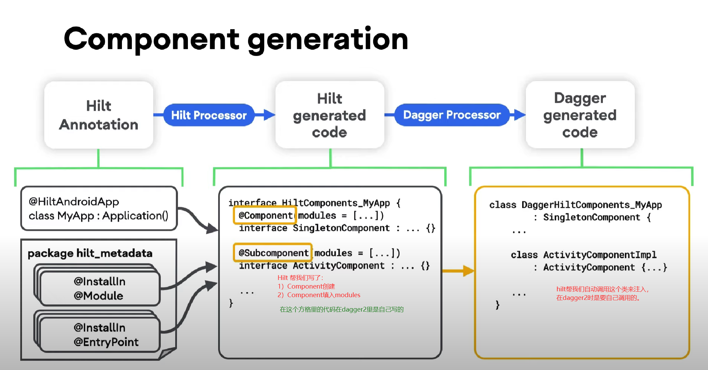
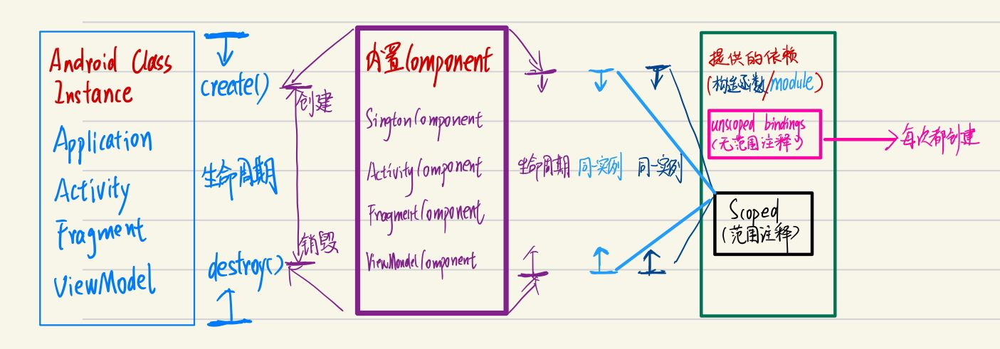
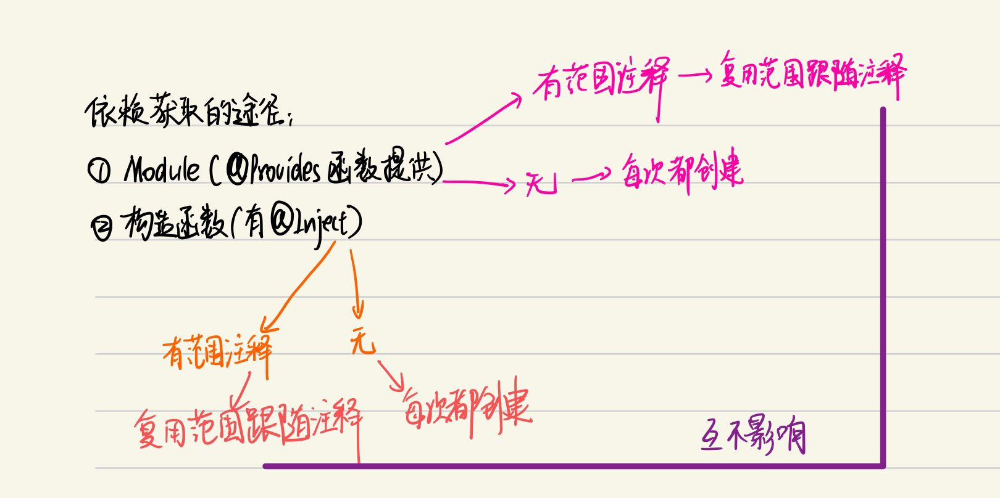
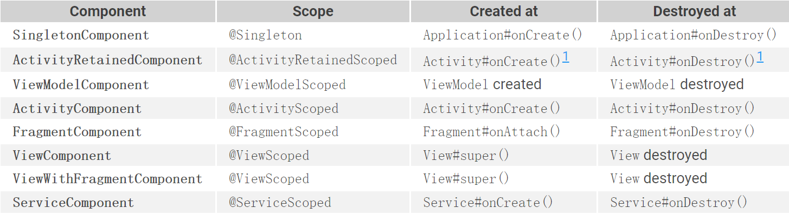
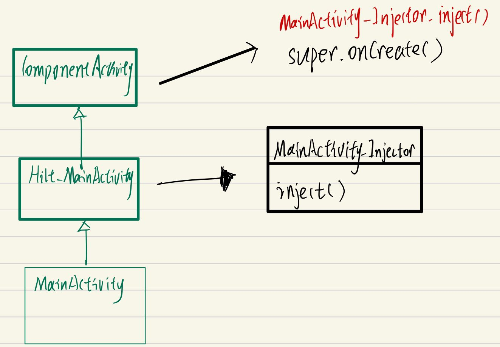
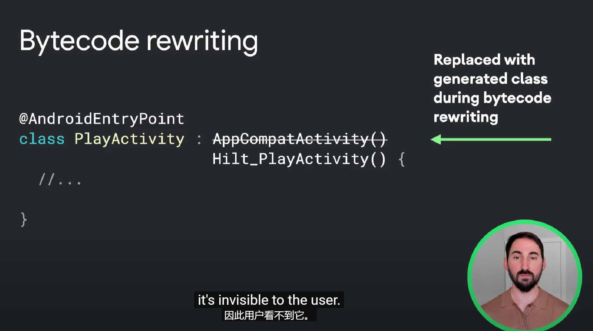
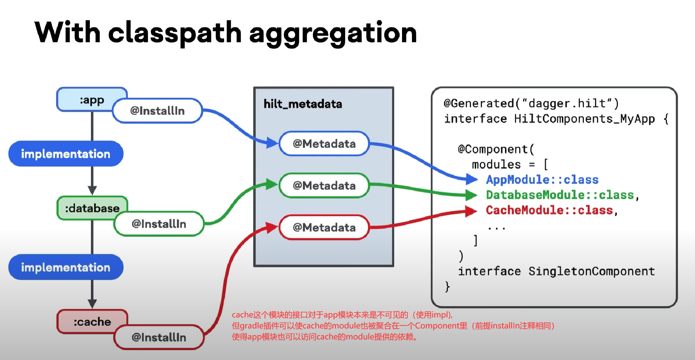
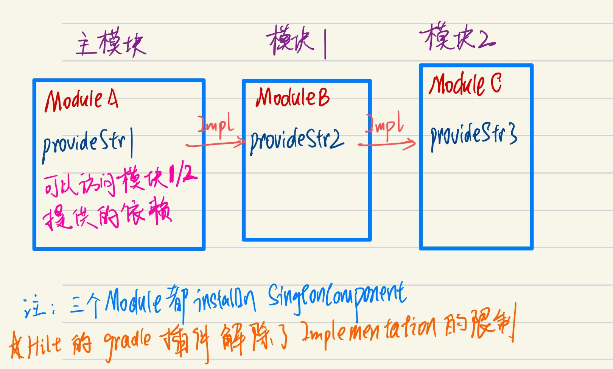

# Hilt原理

### 1：如何学习

[Philipp的视频](https://www.youtube.com/watch?v=bbMsuI2p1DQ&t=87s&ab_channel=PhilippLackner) [文档](https://dagger.dev/hilt/)

看这个视频在学习一下组件的生命周期和多模块基本就可以掌握99%了。


依赖注入是一种设计模式，解耦合，方便替换依赖具体实现。


### 2：Hilt的设计思想

Hilt通过代码生成的方式来生成Dagger的设置代码来工作，这去除了用Dagger时需要写的大部分样板代码并使开发者只需要专注于**如何创建对象以及在哪里注入对象**。HIlt会生成Dagger components（dagger 需要手动编写）以及自动为你注入Android classes的代码（dagger需要手动写注入）。

Hilt根据transitive classpath生成一系列的Android Dagger components。这需要用Hilt annotations标记你的module以便Hilt知道这个module属于哪个component。

对于gradle用户，hilt通过把注入代码置于一个生成的类，然后让源代码的类继承于这个类（通过修改字节码）来使自动注入在Android framework classes上得以实现。

Hilt通过注解处理器，去除编写Components以及modules和Components的绑定的代码。

Hilt通过Gradle 修改字节码的插件，去除了手写注入的代码。


### 3：Hilt简化dagger2语法背后




### 4：Hilt components

[Hilt Component](https://dagger.dev/hilt/components)



这一节的内容主要是对官网文档的描述所做的验证，官网的文档说的很好了，此不赘述。

首先定义一个Component是@SingletonComponent的Module，意味着这个Module里面的绑定是整个app范围都可以访问的。

```kotlin
class B {
}

@ActivityScoped// 这里等下会切换来验证
class A @Inject constructor(
    @Named("B") val b: B
)

@Module
@InstallIn(SingletonComponent::class)
object AppModule {

    @Provides
    @Singleton// 1
    @Named("B")
    fun provideString1(app: Application): B{
        return B()
    }
}
```

注意了，在注释1处：

- 不加@Singleton，每次需要@Named("B")的注入的时候，都会调用这个函数，这里意味着会创建新实例。
- 加@Singleton，代表在这个@SingletonComponent所管理的范围内，每次获取@Named("B")的依赖，会返回同一个实例。（之前获取过保存起来了）

然后定义两个Activity，都注入A这个对象。目前A有范围绑定，而且是ActivityScoped。这意味着，在**一个Activity的范围内**，通过**构造函数注入的**A实例，都是同一个对象，切换Activity之后，才会是另外一个对象。

```
// MainActivity1
com.jeckonly.hiltdemo.A@5d5ead9
com.jeckonly.hiltdemo.B@6794c9e
// MainActivity2
com.jeckonly.hiltdemo.A@a7a9306
com.jeckonly.hiltdemo.B@6794c9e
```

注意到，B是同一个对象，B是在AppModule那里获取的，如上文所述，会获取到同一个对象。

那如果把A的注释改成：

```kotlin
@Singleton// 
class A @Inject constructor(
    @Named("B") val b: B
)
```

那么通过构造函数获取到的A在这个App内都是同一个对象，

```
// MainActivity1
com.jeckonly.hiltdemo.A@5d5ead9
com.jeckonly.hiltdemo.B@6794c9e
// MainActivity2
com.jeckonly.hiltdemo.A@5d5ead9
com.jeckonly.hiltdemo.B@6794c9e
```


其实，Hilt依赖获取的来源有两个：



上面那张图有两个点需要特意说明

- 范围注释
- 互不影响

构造函数的范围注释可以随便，而在Module里面的范围注释要么没有，要么就跟随InstallIn的Component一一对应：



比如@InstallIn(SingletonComponent)的@Provide函数的范围注释只能是@Singleton

> 经验证，比如在InstallIn(ActivityComponent)的module里面写了@Singleton的provide，假如这个依赖没有地方调用的话，编译时不会报错，假如有用这个依赖，才会报范围不匹配的错误。

互不影响的意思：

我设置A的实例来源有两个：

```kotlin
// 来源1：构造函数
@Singleton
class A @Inject constructor(
    @Named("B") val b: B
)

// 来源2：Module
@Module
@InstallIn(SingletonComponent::class)
object AppModule {

    @Provides
    @Singleton
    @Named("B")
    fun provideString1(app: Application): B{
        return B()
    }

    @Provides
    @Singleton
    @Named("A")
    fun provideA(app: Application, @Named("B") b: B): A{
        return A(b)
    }
}
```

在MainActivity中进行如下注入和打印：

```kotlin
    @Inject
    lateinit var a: A

    @Inject
    @Named("A")
    lateinit var a1: A

    override fun onCreate(savedInstanceState: Bundle?) {
        super.onCreate(savedInstanceState)
        Log.d("Jeck", "${a}")
        Log.d("Jeck", "${a.b}")

        Log.d("Jeck", "${a1}")
        Log.d("Jeck", "${a1.b}")
    }
```

打印如下：

```
2022-07-31 21:31:35.986 9990-9990/com.jeckonly.hiltdemo D/Jeck: com.jeckonly.hiltdemo.A@5d5ead9
2022-07-31 21:31:35.986 9990-9990/com.jeckonly.hiltdemo D/Jeck: com.jeckonly.hiltdemo.B@6794c9e
2022-07-31 21:31:35.986 9990-9990/com.jeckonly.hiltdemo D/Jeck: com.jeckonly.hiltdemo.A@731f37f
2022-07-31 21:31:35.986 9990-9990/com.jeckonly.hiltdemo D/Jeck: com.jeckonly.hiltdemo.B@6794c9e
```

可以看到，两个A不是同一个实例。

然后切换Activity，再次打印：

```
2022-07-31 21:31:41.207 9990-9990/com.jeckonly.hiltdemo D/Jeck: com.jeckonly.hiltdemo.A@5d5ead9
2022-07-31 21:31:41.207 9990-9990/com.jeckonly.hiltdemo D/Jeck: com.jeckonly.hiltdemo.B@6794c9e
2022-07-31 21:31:41.207 9990-9990/com.jeckonly.hiltdemo D/Jeck: com.jeckonly.hiltdemo.A@731f37f
2022-07-31 21:31:41.207 9990-9990/com.jeckonly.hiltdemo D/Jeck: com.jeckonly.hiltdemo.B@6794c9e
```

**这次，通过同一个途径获取的实例是同一个**——两个a实例相同，两个a1实例相同。

那把A构造函数的范围注释改成@ActivityScope呢？

```
// activity1
2022-07-31 21:45:57.417 10178-10178/com.jeckonly.hiltdemo D/Jeck: com.jeckonly.hiltdemo.A@5d5ead9
2022-07-31 21:45:57.417 10178-10178/com.jeckonly.hiltdemo D/Jeck: com.jeckonly.hiltdemo.B@6794c9e
2022-07-31 21:45:57.417 10178-10178/com.jeckonly.hiltdemo D/Jeck: com.jeckonly.hiltdemo.A@731f37f
2022-07-31 21:45:57.417 10178-10178/com.jeckonly.hiltdemo D/Jeck: com.jeckonly.hiltdemo.B@6794c9e
// activity2
2022-07-31 21:46:01.810 10178-10178/com.jeckonly.hiltdemo D/Jeck: com.jeckonly.hiltdemo.A@ba09dc7
2022-07-31 21:46:01.810 10178-10178/com.jeckonly.hiltdemo D/Jeck: com.jeckonly.hiltdemo.B@6794c9e
2022-07-31 21:46:01.810 10178-10178/com.jeckonly.hiltdemo D/Jeck: com.jeckonly.hiltdemo.A@731f37f
2022-07-31 21:46:01.810 10178-10178/com.jeckonly.hiltdemo D/Jeck: com.jeckonly.hiltdemo.B@6794c9e
```

这次，两个a实例不相同，在新activity中新创建了，两个a1实例相同。

说明：

两个来源的获取互不影响，且各自由各自的范围注释管理。

### 附1：字段注入

#### 1：Activity的注入时机

**结论：在`super.onCreate()`调用完成之后。**

类图：



源码：

Hilt为我们生成一个类，继承ComponentActivity，**我们的activity继承它**。

```java
public abstract class Hilt_MainActivity extends ComponentActivity implements GeneratedComponentManagerHolder {

  private boolean injected = false;

  Hilt_MainActivity() {
    super();
    _initHiltInternal();// 初始化完成之后，添加监听器
  }

  Hilt_MainActivity(int contentLayoutId) {
    super(contentLayoutId);
    _initHiltInternal();
  }

  private void _initHiltInternal() {
    addOnContextAvailableListener(new OnContextAvailableListener() {
      @Override
      public void onContextAvailable(Context context) {
        inject();// 监听器回调是注入！
      }
    });
  }

  

  protected void inject() {
    if (!injected) {
      injected = true;
      ((MainActivity_GeneratedInjector) this.generatedComponent()).injectMainActivity(UnsafeCasts.<MainActivity>unsafeCast(this));
    }
  }
}

```

那这个回调在什么时候调用呢？

```java
// ComponentActivity

@Override
    protected void onCreate(@Nullable Bundle savedInstanceState) {
        // Restore the Saved State first so that it is available to
        // OnContextAvailableListener instances
        mSavedStateRegistryController.performRestore(savedInstanceState);
        mContextAwareHelper.dispatchOnContextAvailable(this);
        super.onCreate(savedInstanceState);// 在这个调用之前
        ReportFragment.injectIfNeededIn(this);
        if (mContentLayoutId != 0) {
            setContentView(mContentLayoutId);
        }
    }
```

因为Activity的`onCreate`必定会调用`super.onCreate`，所以注入一定会做，但如果在`super.onCreate`之前就访问那些字段的话，就会报未初始化的错误了。

```java
// MainActivity
// Wrong style
	@Inject
    @Named("string1")
    lateinit var s1: String

    @Inject
    @Named("A")
    lateinit var a: A

    override fun onCreate(savedInstanceState: Bundle?) {
        println(s1)// wrong!!
        super.onCreate(savedInstanceState)
        setContent {
        }
    }
```


那我们的类是如何继承Hilt_xxxActivity的呢？原因是Gradle插件修改了字节码！




### 附2：Gradle插件作用

#### 作用1：修改字节码

如上文字段注入所述，生成中介类实现**自动注入**

#### 作用2：类路径聚合




示例：

