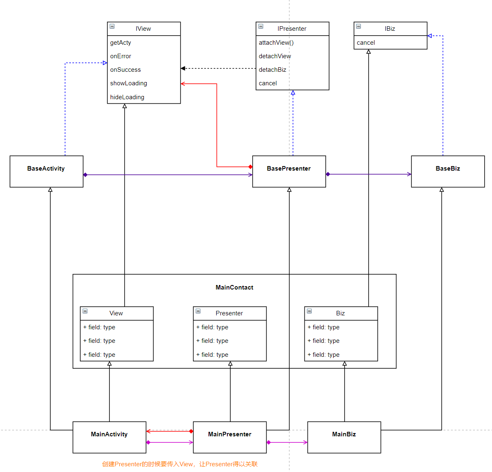

# MVP Architecture



- MainContact起一个管理的作用，让三个部分（view， presenter， 业务）有什么功能（函数）更清晰。

- View和Presenter互相耦合，在Presenter的接口中（IPresenter），一般会添加绑定View和解绑View的函数，不然的话，如果没有及时设置Presenter持有的那个View引用为失效状态（null），Activity和Fragment（被Presenter实际上持有）在棺材板里躺着就会突然被调用。在kotlin中可以这样来判断：

  ```java
  // Presenter
  iView?.updateInitRv(t)
  ```

  


### 1：

由于没有采用 **观察者模式** ，因此在mvp中更新界面（和数据有关的展示）需要View层（Fragment/Activity）调用Presenter的方法去加载或更新数据，然后Presenter再调用View层的相关方法去更新数据。View和Presenter是互相引用的。

```java
// View
mSmartSavingHomePresenter.laodDatas()

// Presenter
mSmartSavingHomeBiz.loadModels(iView?.getCurrentModel()?:"",object : MyConsumer<ArrayList<SmartModelBean>>() {
            override fun onSuccess(t: ArrayList<SmartModelBean>) {
                iView?.updateModels(t)
            }

            override fun onFaild(errorMsg: String?, errorCode: String?) {
                iView?.hideLoading()
            }

            override fun onSubscribe(d: Disposable) {
                addDisposable(d)
                iView?.showLoading()
            }

            override fun onComplete() {
                iView?.hideLoading()
            }
java})

```

在上面的例子中，presenter加载数据之后（调用业务层），调用view层的方法更新界面。


### 2：

MVP中没有使用DataBinding或LiveData/StateFlow结合观察者模式，来达到MVVM中**安全地在Activity/Fragment生命周期内数据驱动UI**。

所以MVP架构中Activity/Fragment（View层）会添加绑定和解绑Presenter的方法来使其达到**安全地在生命周期内工作的效果**。

```java
 /**
     * 添加presenter
     *
     * 在onDestroy会统一取消绑定
     *
     * @param presenters
     */
    protected open fun addPresenter(vararg presenters:BasePresenter<out IView>?) {
        presenters?.forEach {
            mPresenterList?.add(it)
            // 绑定
            it?.attachView(this)
            it?.recorderBiz()
        }
    }
    
    
    mPresenterList?.forEach {
            it?.apply {
                cancel()
                detachBiz()
                detachView()
            }
        }
```


