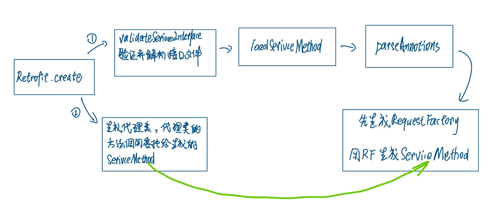

# Retrofit原理

[toc]

## 一：Java的Proxy类

[廖雪峰的文章](https://www.liaoxuefeng.com/wiki/1252599548343744/1264804593397984#0) 廖雪峰这篇写的不错

下面放一个例子：

接口

```java
public interface AppService {
    /**
     * 这个方法要被具体实现类 和 代理类 都实现
     * @param msg
     */
    void sendMessageToServer(String msg);
}
```

具体实现：

```java
public class OkhttpPerform implements AppService {
    @Override
    public void sendMessageToServer(String msg) {
        System.out.println("使用Okhttp进行网络请求，发送：" + msg);
    }
}
```

代理类和handler(handler起一个分派方法调用的作用)

```java
var appServiceProxy = (AppService) Proxy.newProxyInstance(
        AppService.class.getClassLoader(),
        new Class[]{AppService.class},
        // 以一个匿名内部类的形式，也可以以一个独立的类形式
        new InvocationHandler() {

            AppService perform = new OkhttpPerform();
            @Override
            public Object invoke(Object o, Method method, Object[] args) throws Throwable {
                // o是java为我们生成的代理对象，也就是appSerivceProxy，在调用appServiceProxy的方法时会帮我们传进去
                // method是被调用的接口的方法
                // args是参数

                if (method.getDeclaringClass() == Object.class) {
                    
                    return method.invoke(this, args);// this指InvocationHandler，也就是我们想Object中的方法就给匿名内部类执行
                }
                return method.invoke(perform, args);
            }
        }
);

appServiceProxy.sendMessageToServer("一条信息");
```

打印如下：

```
使用Okhttp进行网络请求，发送：一条信息
```


java为我们生成的类大概：

```java
public class AppServiceDynamicProxy implements AppService {
    InvocationHandler handler;
    public AppServiceDynamicProxy(InvocationHandler handler) {
        this.handler = handler;
    }
    public void sendMessageToServer(String msg) {
        handler.invoke(
           this,// !
           AppService.class.getMethod("sendMessageToServer", String.class),
           new Object[] { msg });
    }
    
    // 其实还有hashcode、toString等继承Object的方法也委托给handler
}
```


## 二：Retrofit解析接口文件的流程

Retrofit解析接口文件大量应用了反射原理还有注释解析，先来到入口

```java
	@Singleton
    @Provides
    @Named("AppServices")
    fun provideAppServices(@Named("Retrofit") retrofit: Retrofit): AppServices {
        return retrofit.create(AppServices::class.java)
    }
```

### create

点create进去。


所以主要看validateXXXX方法里如何解析然后生成ServiceMethod对象，因为代理类只是把执行委托给实际的ServiceMethod对象而已。

### validate


在这个方法里，最后遍历每一个Method对象， Method ——> SeviceMethod。所以着重看loadXXXMethod

### loadServiceMethod


### parse

继续进入parseXXtions看如何生成ServiceMethod的。

```java
static <T> ServiceMethod<T> parseAnnotations(Retrofit retrofit, Method method) {
    RequestFactory requestFactory = RequestFactory.parseAnnotations(retrofit, method);

    Type returnType = method.getGenericReturnType();
    if (Utils.hasUnresolvableType(returnType)) {
      throw methodError(
          method,
          "Method return type must not include a type variable or wildcard: %s",
          returnType);
    }
    if (returnType == void.class) {
      throw methodError(method, "Service methods cannot return void.");
    }

    return HttpServiceMethod.parseAnnotations(retrofit, method, requestFactory);
  }
```

这里有两个重要的对象，

1. RequestFactory
2. ServiceMethod

先来看看RequestFactory

```java
final class RequestFactory {
  static RequestFactory parseAnnotations(Retrofit retrofit, Method method) {
    return new Builder(retrofit, method).build();
  }

  private final Method method;
  private final HttpUrl baseUrl;
  final String httpMethod;
  private final @Nullable String relativeUrl;
  private final @Nullable Headers headers;
  private final @Nullable MediaType contentType;
  private final boolean hasBody;
  private final boolean isFormEncoded;
  private final boolean isMultipart;
  private final ParameterHandler<?>[] parameterHandlers;
  final boolean isKotlinSuspendFunction;

  RequestFactory(Builder builder) {
    method = builder.method;
    baseUrl = builder.retrofit.baseUrl;
    httpMethod = builder.httpMethod;
    relativeUrl = builder.relativeUrl;
    headers = builder.headers;
    contentType = builder.contentType;
    hasBody = builder.hasBody;
    isFormEncoded = builder.isFormEncoded;
    isMultipart = builder.isMultipart;
    parameterHandlers = builder.parameterHandlers;
    isKotlinSuspendFunction = builder.isKotlinSuspendFunction;
  }
}
```


**RequestFactory封装了url，headers等信息，这些信息来自解析方法注释，参数注释，创建retrofit实例时配置的信息等**

再来看ServiceMethod

它的成员类图如下：


里面的具体就不看了，注释中有这么一段话：

> Adapts an invocation of an interface method into an HTTP call

**也就是说：ServiceMethod把接口方法转换成具体的http调用**

总结一下：

- RequestFactory封装信息
- ServiceMethod处理调用逻辑

这里提一嘴：应用了单一职责原则，nb的Google工程师没有把信息和调用逻辑都放在一个类中，而是松耦合，划清职责。

### 总结

大致的流程图：



整体


## 三：为什么Proxy

因为Retrofit要根据我们的接口文件动态地来实现一个进行**实际网络请求的类**，它如何操作在编译器是不能确定的，生成相关的类之后，代理类就像门面模式中的门面（facade）一样，隐藏了实现的内部细节，我们都通过这个proxy来进行相关操作。


