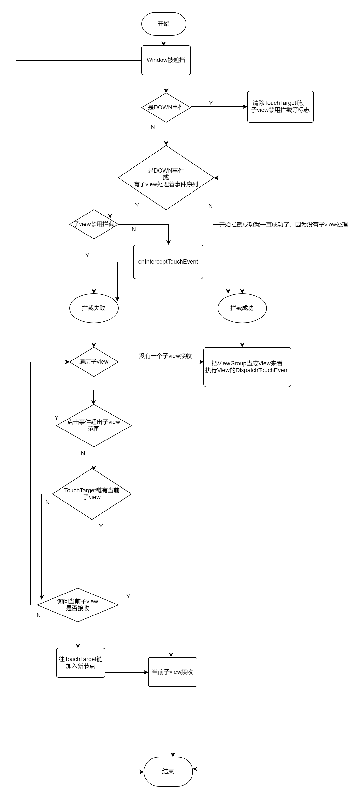

# View原理

Api 30，部分代码为了方便查看有的直接进行了内联处理，即如果调用的方法体很短，直接写进了调用处。

## 一：DecorView的加载

### 1：installDecor过程

installDecor现在是PhoneWindow的一个方法。在installDecor里有两个重要的方法调用：

1. generateDecor
2. generateLayout

#### generateDecor

在这个方法里：

```java
PhoneWindow.java

protected DecorView generateDecor(int featureId) {
    ...
    return new DecorView(context, featureId, this, getAttributes());
}
```

在里面new 了一个DecorView，并直接返回，进去看看创建DecorView的过程：

```java
DecorView.java

DecorView(Context context, int featureId, PhoneWindow phoneWindow,
        WindowManager.LayoutParams params) {
    ...

    mWindow = phoneWindow;

    ...
}
```

知识点：DecorView里引用的Window对象实例是PhoneWindow，这个PhoneWindow是由Activity创建的，经过很多步传到这里来。

#### generateLayout

```java
protected ViewGroup generateLayout(DecorView decor) {
    TypedArray a = getWindowStyle();

    if (a.getBoolean(R.styleable.Window_windowNoTitle, false)) {
        requestFeature(FEATURE_NO_TITLE);
    } else if (a.getBoolean(R.styleable.Window_windowActionBar, false)) {
        requestFeature(FEATURE_ACTION_BAR);
    }

    if (a.getBoolean(R.styleable.Window_windowActionBarOverlay, false)) {
        requestFeature(FEATURE_ACTION_BAR_OVERLAY);
    }

    if (a.getBoolean(R.styleable.Window_windowFullscreen, false)) {
        setFlags(FLAG_FULLSCREEN, FLAG_FULLSCREEN & (~getForcedWindowFlags()));
    }

    if (a.hasValue(R.styleable.Window_windowFixedWidthMajor)) {
        if (mFixedWidthMajor == null) mFixedWidthMajor = new TypedValue();
        a.getValue(R.styleable.Window_windowFixedWidthMajor,
                mFixedWidthMajor);
    }
    
    //...省略若干requestFeature和setFlag和getValue判断和调用，这些都是根据a这个数组里有什么值来设置window各种不同的样式		的。为了简洁起见，这里省略。

    // Inflate the window decor.下面的代码就是加载DecorView的跟布局了
    // 下面这段代码根据不同的feature，决定DecorView的布局文件是哪一个

    int layoutResource;
    int features = getLocalFeatures();
    if ((features & ((1 << FEATURE_LEFT_ICON) | (1 << FEATURE_RIGHT_ICON))) != 0) {
        if (mIsFloating) {
            layoutResource = res.resourceId;
        } else {
            layoutResource = R.layout.screen_title_icons;
        }
    } else if ((features & ((1 << FEATURE_PROGRESS) | (1 << FEATURE_INDETERMINATE_PROGRESS))) != 0
            && (features & (1 << FEATURE_ACTION_BAR)) == 0) {
        layoutResource = R.layout.screen_progress;
    } else if ((features & (1 << FEATURE_CUSTOM_TITLE)) != 0) {
            layoutResource = res.resourceId;
        } else {
            layoutResource = R.layout.screen_custom_title;
        }
    } else if ((features & (1 << FEATURE_NO_TITLE)) == 0) {
            layoutResource = res.resourceId;
        } else if ((features & (1 << FEATURE_ACTION_BAR)) != 0) {
            layoutResource = a.getResourceId(
                    R.styleable.Window_windowActionBarFullscreenDecorLayout,
                    R.layout.screen_action_bar);
        } else {
            layoutResource = R.layout.screen_title;
        }
    } else if ((features & (1 << FEATURE_ACTION_MODE_OVERLAY)) != 0) {
        layoutResource = R.layout.screen_simple_overlay_action_mode;
    } else {
        layoutResource = R.layout.screen_simple;
    }
	// 根据选出的布局文件，来加载资源，并设置为DecorView的根布局

    mDecor.startChanging();
    
    final View root = inflater.inflate(layoutResource, null);
    
	addView(root, 0, new ViewGroup.LayoutParams(MATCH_PARENT, MATCH_PARENT));
    
    ViewGroup contentParent = (ViewGroup)findViewById(ID_ANDROID_CONTENT);// 这个id要注意，等下讲

    mDecor.finishChanging();

    return contentParent;
}
```

在各种各样的布局文件中，下面选几个出来做例子：

```xml
screen_simple.xml

<LinearLayout xmlns:android="http://schemas.android.com/apk/res/android"
    android:layout_width="match_parent"
    android:layout_height="match_parent"
    android:fitsSystemWindows="true"
    android:orientation="vertical">
    <ViewStub android:id="@+id/action_mode_bar_stub"
              android:inflatedId="@+id/action_mode_bar"
              android:layout="@layout/action_mode_bar"
              android:layout_width="match_parent"
              android:layout_height="wrap_content"
              android:theme="?attr/actionBarTheme" />
    <FrameLayout
         android:id="@android:id/content"
         android:layout_width="match_parent"
         android:layout_height="match_parent"
         android:foregroundInsidePadding="false"
         android:foregroundGravity="fill_horizontal|top"
         android:foreground="?android:attr/windowContentOverlay" />
</LinearLayout>

```

```xml
screen_title.xml

<LinearLayout xmlns:android="http://schemas.android.com/apk/res/android"
    android:orientation="vertical"
    android:fitsSystemWindows="true">
    <!-- Popout bar for action modes -->
    <ViewStub android:id="@+id/action_mode_bar_stub"
              android:inflatedId="@+id/action_mode_bar"
              android:layout="@layout/action_mode_bar"
              android:layout_width="match_parent"
              android:layout_height="wrap_content"
              android:theme="?attr/actionBarTheme" />
    <FrameLayout
        android:layout_width="match_parent" 
        android:layout_height="?android:attr/windowTitleSize"
        style="?android:attr/windowTitleBackgroundStyle">
        <TextView android:id="@android:id/title" 
            style="?android:attr/windowTitleStyle"
            android:background="@null"
            android:fadingEdge="horizontal"
            android:gravity="center_vertical"
            android:layout_width="match_parent"
            android:layout_height="match_parent" />
    </FrameLayout>
    <FrameLayout android:id="@android:id/content"
        android:layout_width="match_parent" 
        android:layout_height="0dip"
        android:layout_weight="1"
        android:foregroundGravity="fill_horizontal|top"
        android:foreground="?android:attr/windowContentOverlay" />
</LinearLayout>
```

```xml
screen_title_icons.xml

<LinearLayout xmlns:android="http://schemas.android.com/apk/res/android"
    android:fitsSystemWindows="true"
    android:orientation="vertical"
    android:layout_width="match_parent"
    android:layout_height="match_parent">
    <!-- Popout bar for action modes -->
    <ViewStub android:id="@+id/action_mode_bar_stub"
              android:inflatedId="@+id/action_mode_bar"
              android:layout="@layout/action_mode_bar"
              android:layout_width="match_parent"
              android:layout_height="wrap_content"
              android:theme="?attr/actionBarTheme"/>
    <RelativeLayout android:id="@android:id/title_container"
        style="?android:attr/windowTitleBackgroundStyle"
        android:layout_width="match_parent"
        android:layout_height="?android:attr/windowTitleSize">
        <!-- The title background has 9px left padding. -->
        <ImageView android:id="@android:id/left_icon"
            android:visibility="gone"
            android:layout_marginEnd="9dip"
            android:layout_width="16dip"
            android:layout_height="16dip"
            android:scaleType="fitCenter"
            android:layout_alignParentStart="true"
            android:layout_centerVertical="true" />
        <ProgressBar android:id="@+id/progress_circular"
            style="?android:attr/progressBarStyleSmallTitle"
            android:visibility="gone"
            android:max="10000"
            android:layout_centerVertical="true"
            android:layout_alignParentEnd="true"
            android:layout_marginStart="6dip"
            android:layout_width="wrap_content"
            android:layout_height="wrap_content" />
        <!-- There are 6dip between this and the circular progress on the right, we
             also make 6dip (with the -3dip margin_left) to the icon on the left or
             the screen left edge if no icon. This also places our left edge 3dip to
             the left of the title text left edge. -->
        <ProgressBar android:id="@+id/progress_horizontal"
            style="?android:attr/progressBarStyleHorizontal"
            android:layout_width="match_parent"
            android:layout_height="wrap_content"
            android:layout_marginStart="-3dip"
            android:layout_toStartOf="@android:id/progress_circular"
            android:layout_toEndOf="@android:id/left_icon"
            android:layout_centerVertical="true"
            android:visibility="gone"
            android:max="10000" />
        <LinearLayout
            android:layout_width="match_parent"
            android:layout_height="match_parent"
            android:orientation="horizontal"
            android:layout_toStartOf="@id/progress_circular"
            android:layout_toEndOf="@android:id/left_icon"
            >
            <TextView android:id="@android:id/title"
                style="?android:attr/windowTitleStyle"
                android:layout_width="0dip"
                android:layout_height="match_parent"
                android:layout_weight="1"
                android:background="@null"
                android:fadingEdge="horizontal"
                android:scrollHorizontally="true"
                android:gravity="center_vertical"
                android:layout_marginEnd="2dip"
                />
            <!-- 2dip between the icon and the title text, if icon is present. -->
            <ImageView android:id="@android:id/right_icon"
                android:visibility="gone"
                android:layout_width="16dip"
                android:layout_height="16dip"
                android:layout_weight="0"
                android:layout_gravity="center_vertical"
                android:scaleType="fitCenter"
                />
            </LinearLayout>
    </RelativeLayout>
    <FrameLayout android:id="@android:id/content"
        android:layout_width="match_parent"
        android:layout_height="0dip"
        android:layout_weight="1"
        android:foregroundGravity="fill_horizontal|top"
        android:foreground="?android:attr/windowContentOverlay" />
</LinearLayout>
```

可以看到DecorView的根布局有各种各样的候选人，但这些布局都大同小异，他们都有一个相同的以content作为id的FrameLayout。

**这个FrameLayout其实就是放我们自己写的那个activity的布局文件的。**

#### 一些Transition设置

```java
mEnterTransition = getTransition(mEnterTransition, null,
                        R.styleable.Window_windowEnterTransition);
mReturnTransition = getTransition(mReturnTransition, USE_DEFAULT_TRANSITION,
                        R.styleable.Window_windowReturnTransition);
mExitTransition = getTransition(mExitTransition, null,
                        R.styleable.Window_windowExitTransition);
mReenterTransition = getTransition(mReenterTransition, USE_DEFAULT_TRANSITION,
                        R.styleable.Window_windowReenterTransition);
```

在installDecor这个方法的最后，还为DecorView的进出设置了一些转场动画。


## 二：事件分发机制

### 1：Activity对事件的分发

```java
Activity.java

public boolean dispatchTouchEvent(MotionEvent ev) {
    if (ev.getAction() == MotionEvent.ACTION_DOWN) {
        onUserInteraction();// 每当检测到ACTION_DOWN事件时调用
    }
    if (getWindow().superDispatchTouchEvent(ev)) {// 通过PhoneWindow，把事件分发给最外层的View
        return true;
    }
    return onTouchEvent(ev);// 没有一个View处理事件，activity自己处理
}
```

1. onUserInteraction是一个空函数，我们可以override这个函数，以实现——“Called whenever a key, touch, or trackball event is dispatched to the activity. Implement this method if you wish to know that the user has interacted with the device in some way while your activity is running”，每当将键、触摸或轨迹球事件分派到activity时调用。如果您想知道用户在您的activity运行时以某种方式与设备进行了交互，请实现此方法。

2. Activity的默认实现onTouchEvent如下所示：

   ```java
   Activity.java
   
   public boolean onTouchEvent(MotionEvent event) {
           if (mWindow.shouldCloseOnTouch(this, event)) {// 一般不走这个流程
               finish();
               return true;
           }
   
           return false;
       }
   ```

   所以Activity的**默认实现**即相当于**不处理事件**。

### 2：PhoneWindow对事件的分发

```java
PhoneWindow.java

@Override
public boolean superDispatchTouchEvent(MotionEvent event) {
    return mDecor.superDispatchTouchEvent(event);
}
```

PhoneWindow直接调用了DecorView的superDispatchTouchEvent方法，然后：

```java
DecorView.java
    
public boolean superDispatchTouchEvent(MotionEvent event) {
    return super.dispatchTouchEvent(event);
}
```

DecorView的super是一个ViewGroup，在这里进入了View体系的事件分发。

### 3：View体系的事件分发

记住，ViewGroup是View的子类，也就是说一个ViewGroup可以被当成一个View来看待。

#### 1：ViewGroup的事件分发

##### TouchTarget类

先来了解TouchTarget这个类：

```java
class TouchTarget {
       
	public View child;

	public TouchTarget next;
}
```

如果一个事件序列，被一个新child view接收，那么就会创建一个TouchTarget，child字段指向接收事件序列的child view，next字段指向当前view group上一个接收点击序列的child view的Touch Target。

也就是说，**一个ViewGroup维护着一个TouchTarget的链表，这个链表从头到尾对应着接收child view的时间由近到远**。

不过，这个TouchTarget链的生命周期为，第一个手指按下到所有手指离开屏幕。

​		1）当前屏幕没有手指按下，现在按下，创建一个TouchTarget，指向被按的child view

​		2）第一个按下的手指没有松开，又按下第二根手指，按到另外一个child view，那么又创建一个TouchTarget，指向被按的child view，并把这个TouchTarget的next指向原来那个TouchTarget

​		3）两个手指都离开屏幕后，清除TouchTarget链。

举个例子，一个ConstrainLayout有两个Button，先按下button1，后在button1按住不松手的情况下点击button2，那么当前view group的touch target如下所示：


##### dispatchTransformedTouchEvent方法

这个方法可以简化成如下形式：

```java
ViewGroup.java

private boolean dispatchTransformedTouchEvent(MotionEvent event, boolean cancel,View child){
  if (child == null) {
        handled = super.dispatchTouchEvent(event);// view group自身判断
    } else {
        handled = child.dispatchTouchEvent(event);// child view判断
    }
    return handled;
}
```

##### dispatchTouchEvent方法

ViewGroup的事件分发是在这个方法中完成的，先来把处理过的代码贴上：

```java
ViewGroup.java
    
@Override
    public boolean dispatchTouchEvent(MotionEvent ev) {
    
        boolean handled = false;
        // 1）对事件进行初步过滤
        // 过滤“不安全”的操作，比如说Window被遮挡，就丢弃这个点击事件
        if (onFilterTouchEventForSecurity(ev)) {
            final int action = ev.getAction();
            final int actionMasked = action & MotionEvent.ACTION_MASK;

            // Handle an initial down.
            if (actionMasked == MotionEvent.ACTION_DOWN) {
                // 开始新的触摸手势时丢弃所有先前的状态。由于应用程序切换、ANR 或其他一些状态更改，framework可能已经放弃了前一个手势的向上或取消事件。
                cancelAndClearTouchTargets(ev);
                resetTouchState();
            }

            // 2）开始检查拦截
            final boolean intercepted;
            if (actionMasked == MotionEvent.ACTION_DOWN
                    || mFirstTouchTarget != null) {
                final boolean disallowIntercept = (mGroupFlags & FLAG_DISALLOW_INTERCEPT) != 0;// 当事件为ACTION_DOWN时肯定为false，因为在resetTouchState清空了标志位
                if (!disallowIntercept) {
                    intercepted = onInterceptTouchEvent(ev);
                    ev.setAction(action); // restore action in case it was changed
                } else {
                    intercepted = false;
                }
            } else {
                // There are no touch targets and this action is not an initial down
                // so this view group continues to intercept touches.
                // 当ViewGroup拦截事件的时候，mFirstTouchTarget设为null，在这个事件序列中就直接进到else分支
                intercepted = true;
            }

            TouchTarget newTouchTarget = null;

            // 如果view group决定拦截，那么不会进入if
            if (!canceled && !intercepted) {
            
                // 事件是DOWN事件才进入if
                if (actionMasked == MotionEvent.ACTION_DOWN
                        || (split && actionMasked == MotionEvent.ACTION_POINTER_DOWN)) {
                    final int childrenCount = mChildrenCount;// child view的数量

                    // 这个view group有child view才进入
                    if (childrenCount != 0) {

                        // 当前事件的x, y坐标
                        final float x = ev.getX(actionIndex);
                        final float y = ev.getY(actionIndex);

                        // Find a child that can receive the event.
                        // Scan children from front to back.

                        // 根据特定顺序，构建一个child view列表，可进入看
                        final ArrayList<View> preorderedList = buildTouchDispatchChildList();
                        final boolean customOrder = preorderedList == null
                                && isChildrenDrawingOrderEnabled();
                        final View[] children = mChildren;

                        // 开始遍历所有child view
                        for (int i = childrenCount - 1; i >= 0; i--) {
                            // 由preorderedList, children, childIndex三者共同作用选出一个child view
                            final int childIndex = getAndVerifyPreorderedIndex(
                                    childrenCount, i, customOrder);
                            final View child = getAndVerifyPreorderedView(
                                    preorderedList, children, childIndex);

                            // 如果当前child view不能接收这个事件（事件x, y不在child View范围之内）,就跳过当前child view
                            if (!child.canReceivePointerEvents()
                                    || !isTransformedTouchPointInView(x, y, child, null)) {
                                continue;
                            }

                            // 如果当前这个view group的touch target链表有一个touch target的值为当前循环到的child view，						   // 就返回那个Touch Target，否则null
                            newTouchTarget = getTouchTarget(child);

                            // 有一个child view在接收着一个点击序列
                            if (newTouchTarget != null) {
                                // child已经在其范围内接受触摸。除了它正在处理的pointer之外，还给它一个新的pointer。
                                // 一个view的touch target可以有多个pointer，应该和多指触控那些有关
                                newTouchTarget.pointerIdBits |= idBitsToAssign;
                                // 确认接收者之后直接退出循环
                                break;
                            }

                            if (dispatchTransformedTouchEvent(ev, child)) {// 这个方法返回true表示child接收这个事件列
                                // Child wants to receive touch within its bounds.
                        
                                // 构建一个新的TouchTarget，把当前child设置为这个touchTarget的值，并把当前touchTarget置
                                // 为mFirstTouchTarget，然后mFirstTouchTarget在指向原来的mFirstTouchTarget，
                                // 这样就导致了新的touchTarget在链表的头部，越旧的在越后面
                                newTouchTarget = addTouchTarget(child, idBitsToAssign);
                                break;
                            }
                        }
                    }

                    // 当前事件序列没有接收者，但之前有过一个child view接收过点击事件，就进去
                    if (newTouchTarget == null && mFirstTouchTarget != null) {
                        // Did not find a child to receive the event.
                        // Assign the pointer to the least recently added target.
                        // 没有找到接收事件的child，把当前指针输入分配给最近最少使用的child————LRU
                        newTouchTarget = mFirstTouchTarget;
                        while (newTouchTarget.next != null) {
                            newTouchTarget = newTouchTarget.next;
                        }
                        newTouchTarget.pointerIdBits |= idBitsToAssign;
                    }
                }
            }

            // Dispatch to touch targets.
            if (mFirstTouchTarget == null) {
                // No touch targets so treat this as an ordinary view.
                // 与上一次调用这个方法相比，参数中的child为null，表示没有子view接收
                handled = dispatchTransformedTouchEvent(ev, null);
            } else {
                // Dispatch to touch targets, excluding the new touch target if we already
                // dispatched to it.  Cancel touch targets if necessary.
                // 这段省略
                }
            }
        }
        return handled;
    }
```

流程图：



1. 如果是一个DOWN事件，会清除之前的状态和禁用拦截标志位，然后看看有没有子view禁用拦截，如果禁用了拦截，就遍历子view看哪一个子view想接收；没有禁用拦截就看看ViewGroup有没有拦截的意思，有的话，那之后的事件序列就给它处理了，没有的话，还是遍历子view
2. 遍历子view，如果子view执行dispatchTouchEvent返回true，那么这个事件序列就给它处理，否则遍历到下一个。
3. 如果没有一个子view处理，就把ViewGroup当成一个view来看，执行View的dispatchTouchEvent。

这里放一张以前画的图：


事件分发其实只存在ViewGroup之中，如果轮到View的dispatchTouchEvent的话，其实就只是判断**是否接收**而已。

#### 2：View对事件的接收判断

简化版代码：

```java
 public boolean dispatchTouchEvent(MotionEvent event) {
        boolean result = false;

        ListenerInfo li = mListenerInfo;
        if (li != null && li.mOnTouchListener != null
                && li.mOnTouchListener.onTouch(this, event)) {
            result = true;
        }

        if (!result && onTouchEvent(event)) {
            result = true;
        }
        
        return result;
    }
```

可以看到，

1. 如果有onTouchListener，就先看看onTouchListener，假如它返回true，就跳过onTouchEvent了，返回false再判断onTouchEvent
2. dispatchTouchEvent决定这个view是否接收，不接收的话轮到下一个child view来判断亦或交给上一层。


到这里，事件分发就完结了。


