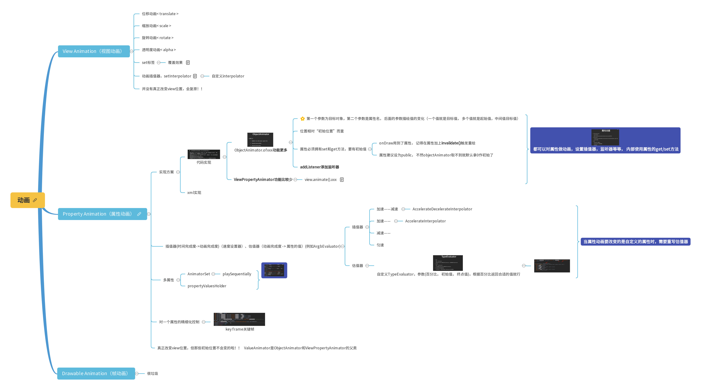

# View手册

## 一：状态栏

### 1：内容显示在状态栏后面

```kotlin
if (Build.VERSION.SDK_INT >= Build.VERSION_CODES.R) {
    window.setDecorFitsSystemWindows(false)
}else {
    window.decorView.systemUiVisibility = View.SYSTEM_UI_FLAG_LAYOUT_FULLSCREEN
}
```

[文档链接](https://developer.android.com/training/system-ui/status#behind)

新方法：

```kotlin
WindowCompat.setDecorFitsSystemWindows(window, false)
```


## 二：属性动画




### 一、属性动画概览

顾名思义，通过控制对象的属性，来实现动画效果。官方定义：定义一个随着时间 （注：停个顿）更改任何对象属性的动画，无论其是否绘制到屏幕上。

可以控制对象什么属性呢？什么属性都可以，理论是通过set和get某个属性来达到动画效果。例如常用下面一些属性来实现View对象的一些动画效果。

- **位移**:`translationX`、`translationY`、`translationZ`
- **透明度**:`alpha`,透明度全透明到不透明:`0f`->`1f`
- **旋转**:`rotation`,旋转一圈:`0f`->`360f`
- **缩放**：水平缩放`scaleX`,垂直缩放`scaleY`

简单的效果图：


### 二、基本使用

简单介绍View对象几个属性动画的使用。

#### 1、位移属性动画

效果图：


先看一下布局代码的实现：

```text
<?xml version="1.0" encoding="utf-8"?>
<RelativeLayout xmlns:android="http://schemas.android.com/apk/res/android"
    android:layout_width="match_parent"
    android:layout_height="match_parent"
    android:background="@color/colorPrimary">

    <LinearLayout
        android:id="@+id/llAddAccount"
        android:layout_width="wrap_content"
        android:layout_height="35dp"
        android:layout_alignParentRight="true"
        android:layout_marginTop="100dp"
        android:layout_marginRight="-70dp"//将现有视图藏在屏幕的右边
        android:background="@drawable/bg_10_10_fff">

        <ImageView
            android:id="@+id/ivMakeNote"
            android:layout_width="35dp"
            android:layout_height="30dp"
            android:layout_gravity="center_vertical"
            android:paddingLeft="2dp"
            android:paddingTop="2dp"
            android:paddingBottom="2dp"
            android:src="@mipmap/ic_account_add" />

        <TextView
            android:id="@+id/tvAddAccount"
            android:layout_width="wrap_content"
            android:layout_height="match_parent"
            android:gravity="center_vertical"
            android:paddingRight="12dp"
            android:text="添加账户"
            android:textColor="@color/colorPrimary"
            android:textSize="14sp" />
    </LinearLayout>
</RelativeLayout>
```

上面只是简单实现了布局，下面看看属性动画代码的实现：

```text
llAddAccount.setOnClickListener {
    val objectAnimation =ObjectAnimator.ofFloat(llAddAccount, "translationX", 0f, -70f)
    objectAnimation.start()
}
```

到这里，我们才真正看到属性动画的影子。通过`ObjectAnimator`的工厂方法`ofFloat`我们得到一个`ObjectAnimator`对象，并通过该对象的`start()`方法，开启动画效果。

`ofFloat()`方法的**第一个参数**为要实现动画效果的View，例如这里整体效果的`LinearLayout`；**第二个参数**为属性名，也就是前面所说的：`translationX`,`translationY`,`alpha`,`rotation`,`scaleX`,`scaleY`等，这里要实现的是水平平移效果，所以我们采用了`translationX`;**第三参数**为可变长参数，第一个值为动画开始的位置，第二个值为结束值得位置，如果数组大于3位数，那么前者将是后者的起始位置。

**注意事项**：如果可变长参数只有一个值，那么`ObjectAnimator`的工厂方法会将值作为动画结束值，此时属性必须拥有初始化值和`getXXX`方法。

`translationX`和`translationY`这里涉及到的**位移**都是相对自身位置而言。例如 `View`在点A(x,y)要移动到点B(x1,y1),那么`ofFloat（）`方法的可变长参数，第一个值应该`0f`,第二个值应该`x1-x`。

**XML布局实现：**

在res/animator文件夹下，创建animator_translation.xml文件，内容如下：

```text
<objectAnimator xmlns:android="http://schemas.android.com/apk/res/android"
    android:propertyName="translationX"
    android:valueFrom="0dp"
    android:valueTo="-70dp"
    android:valueType="floatType"
/>
```

在代码上调用：

```text
llAddAccount.setOnClickListener {
    val objectAnimation =AnimatorInflater.loadAnimator(this,R.animator.animator_translation)
    objectAnimation.setTarget(llAddAccount)
    objectAnimation.start()
}
```

#### 2、透明属性动画

透明度属性动画比较简单，即控制View的可见度实现视觉差动画效果。这里展示效果是从不透明到透明，再到不透明。


代码如下：

```text
tvText.setOnClickListener {
    val objectAnimation =ObjectAnimator.ofFloat(tvText, "alpha", 1f,0f,1f)
    objectAnimation.duration=3000
    objectAnimation.start()
}
```

`ofFloat()`方法将属性名换成了透明度`alpha`，并且可变长参数增加到了3个。给`ObjectAnimator`对象的`duration`属性设置了动画展示时间3秒，默认情况下300毫秒。

#### 3、缩放属性动画

缩放可以通过控制`scaleX`和`scaleY`分别在X轴和Y轴上进行缩放，如下图在X轴中进行两次两倍缩放。


代码如下：

```text
tvText.setOnClickListener {
    val objectAnimation =ObjectAnimator.ofFloat(tvText, "scaleX", 1f,2f)
        objectAnimation.duration=3000
        objectAnimation.repeatCount=2
        objectAnimation.repeatMode=ValueAnimator.REVERSE
        objectAnimation.start()
}
```

`ofFloat()`方法传入参数属性为`scaleX`和`scaleY`时，动态参数表示缩放的倍数。设置`ObjectAnimator`对象的`repeatCount`属性来控制动画执行的次数，设置为`ValueAnimator.INFINITE`表示无限循环播放动画；通过`repeatMode`属性设置动画重复执行的效果，取值为：`ValueAnimator.RESTART`和`ValueAnimator.REVERSE`。

`ValueAnimator.RESTART`效果：(即每次都重头开始)


`ValueAnimator.REVERSE`效果：(即和上一次效果反着来)


#### 4、旋转属性动画

旋转动画也比较简单，将一个View进行顺时针或逆时针旋转。


代码如下：

```text
tvText.setOnClickListener {
    val objectAnimation =
        ObjectAnimator.ofFloat(tvText, "rotation", 0f,180f,0f)
    objectAnimation.duration=3000
    objectAnimation.start()
}
```

`ofFloat()`方法的可变长参数，如果后者的值大于前者，那么顺时针旋转，小于前者，则逆时针旋转。

### 三、AnimatorSet

如果想要一个动画结束后播放另外一个动画，或者同时播放，可以通过`AnimatorSet`来编排。

```text
val aAnimator=ObjectAnimator.ofInt(1)
val bAnimator=ObjectAnimator.ofInt(1)
val cAnimator=ObjectAnimator.ofInt(1)
val dAnimator=ObjectAnimator.ofInt(1)

AnimatorSet().apply {
    play(aAnimator).before(bAnimator)//a 在b之前播放
    play(bAnimator).with(cAnimator)//b和c同时播放动画效果
    play(dAnimator).after(cAnimator)//d 在c播放结束之后播放
    start()
}
```

或者

```text
AnimatorSet().apply {
    playSequentially(aAnimator,bAnimator,cAnimator,dAnimator) //顺序播放
    start()
}

AnimatorSet().apply {
    playTogether(animator,bAnimator,cAnimator,dAnimator) //同时播放
    start()
}
```

另有：

```text
AnimatorSet ().apply {
    play(aAnimator).after(1000) //1秒后播放a动画
    start()
}
```

### 四、ViewPropertyAnimator

如果只是针对View对象的特定属性同时播放动画，我们也可以采用`ViewPropertyAnimator`。

例如：

```text
tvText.animate().translationX(100f).translationY(100f).start()
```

支持属性：

- translationX、translationY、translationZ
- x、y、z
- alpha
- scaleX、scaleY

注意到`ViewPropertyAnimator`对象具有`property(Float)`和`propertyBy(Float)`方法，其中`property(Float)`是指属性变化多少(可以理解一次有效)，而`propertyBy(Float)`每次变化多少（可以理解多次有效）。

举例说明：

**translationX**

```text
tvText.setOnClickListener {
    val animator = tvText.animate()
    animator.duration=1000
    animator.translationX(100f)//点击一次会向右偏移，再点击没效果
    animator.start()
}
```


**translationXBy**

```text
tvText.setOnClickListener {
    val animator = tvText.animate()
    animator.duration=1000
    animator.translationXBy(100f)//每次点击都会向右偏移
    animator.start()
}
```


### 五、ValueAnimator与ObjectAnimator

`ValueAnimator`作为`ObjectAnimator`的父类，主要动态计算目标对象属性的值，然后设置给对象属性，达到动画效果，而`ObjectAnimator`则在`ValueAnimator`的基础上极大地**简化**对目标对象的属性值的计算和添加效果，融合了 ValueAnimator 的计时引擎和值计算以及为目标对象的命名属性添加动画效果这一功能。

举个栗子，通过`ValueAnimator`的工厂方法`ofFloat`、`ofInt`、`ofArgb`、`ofObject`来实现动画效果：


代码如下：

```text
//ValueAnimator实现
    tvText.setOnClickListener {
        val valueAnimator = ValueAnimator.ofFloat(0f, 180f)
        valueAnimator.addUpdateListener {
               tvText.rotationY = it.animatedValue as Float //手动赋值
        }
        valueAnimator.start()
    }
    //ObjectAnimator实现
     ObjectAnimator.ofFloat(tvText, "rotationY", 0f, 180f).apply { start() }
```

从上面代码可以看出，使用`ValueAnimator`实现动画，需要**手动赋值**给目标对象`tvText`的`rotationY`，而`ObjectAnimator`则是**自动赋值**，不需要手动赋值就可以达到效果。

动画过程可以通过`AnimatorUpdateListener`和`AnimatorListener`来监听。

```text
ObjectAnimator.ofFloat(tvText, "translationX", 0f, 780f, 0f).apply {
            duration=3000//完成动画所需要时间
            repeatCount=ValueAnimator.INFINITE  //重复次数：无限循环
            repeatMode=ValueAnimator.RESTART    //重复模式：重头开始
            addUpdateListener { //监听值变化
                tvText.translationX= it.animatedValue as Float
            }
            addListener(object:Animator.AnimatorListener{
                override fun onAnimationRepeat(animation: Animator?) {
                    //动画重复
                }

                override fun onAnimationEnd(animation: Animator?) {
                    //动画结束
                }

                override fun onAnimationCancel(animation: Animator?) {
                    //动画取消
                }

                override fun onAnimationStart(animation: Animator?) {
                    //动画开始
                }
            })
        }
```

动画可调用`start()`方法开始，也可调用`cancel()`方法取消。

那么，要正确使属性动画实现动画效果，那么目标对象应该注意什么？

- 属性必须具有 `set<PropertyName>()` 形式的 `setter` 函数（采用驼峰式大小写形式），例如，如果属性名称为 `text`，则需要使用 `setText()` 方法。
- 如果`ObjectAnimator`的一个工厂方法中仅为 `values...` 参数指定了一个值，那么该参数需要提供初始值和`getPropertyName()`方法。
- 属性的初始值和结束值之间必须保持类型相同。
- 可能需要在`UpdateListener`对象中调用`invalidate()` 方法，来刷新属性作用后的效果。

### 六、XML实现（可忽略）

本文一开始介绍位移属性动画时，有提到通过XML文件来实现动画效果，在这里进一步细讲。

在res/animator文件夹下，创建animator_translation.xml文件。XML文件有四个标签可用，要注意到propertyValuesHolder标签的Android 版本适配。

```text
<?xml version="1.0" encoding="utf-8"?>
<set>   =>AnimatorSet
    <animator/>  =>ValueAnimator
    <objectAnimator>    =>ObjectAnimator
        <propertyValuesHolder/> =>PropertyValuesHolder
    </objectAnimator>
</set>
```

`set`标签对应代码的`AnimatorSet`,只有一个属性可以设置：`android:ordering`，取值：同时播放`together`、顺序播放`sequentially`。

`animator`标签对应代码的`ValueAnimator`，可以设置如下属性：

- `android:duration`:动画时长
- `android:valueType`:属性类型,`intType`、`floatType`、`colorType`、`pathType`
- `android:valueFrom`:属性初始值
- `android:valueTo`:属性结束值
- `android:repeatCount`:重复次数
- `android:repeatMode`:重复模式
- `android:interpolator`:插值器，可看下一节默认插值器。
- `android:startOffset`:延迟，对应`startOffset()`延迟多少毫秒执行

示例：

```text
<animator
        android:duration="1000"
        android:valueType="floatType"
        android:valueFrom="0f"
        android:valueTo="100f"
        android:repeatCount="infinite"
        android:repeatMode="restart"
        android:interpolator="@android:interpolator/linear"
        android:startOffset="100"
        />
```

`objectAnimator`属性对应代码`ObjectAnimator`,由于继承自`ValueAnimator`，所以属性相对多了` android:propertyName。

### 七、估值器与插值器

看到这里，不知道小伙伴们有没有这个疑问，属性动画是如何计算属性的值的？

这份工作由类型估值器`TypeEvaluator`与时间插值器`TimeInterpolator`来完成的。

**插值器**：根据时间流逝的百分比计算出当前属性值改变的百分比。

**估值器**：根据当前属性改变的百分比来计算改变后的属性值。

从它两的已定义，也可以看出它们之间的协调关系，先由插值器根据时间流逝的百分比计算出目标对象的属性改变的百分比，再由估值器根据插值器计算出来的属性改变的百分比计算出目标对象属性对应类型的值。

从估值器和插值器可以看出属性动画的工作原理，下面看看官方对工作原理的解析：


更多的原理可以看看[链接](https://link.zhihu.com/?target=https%3A//developer.android.com/guide/topics/graphics/prop-animation%3Fhl%3Dzh-cn)

#### 估值器

SDK中默认带有的估值器有： `IntEvaluator`、`FloatEvaluator`、`ArgbEvaluator`，他们分别对应前面我们调用 `ValueAnimator`对象所有对应的`ofInt`、`ofFloat`、`ofArgb`函数的估值器，分别用在Int类型，Float，颜色值类型之间计算。而`ofObject`函数则对应我们自定义类型的属性计算。

当估值器的类型不满足需求，就需要自定义类型估值器。例如我们要实现下面效果：


这个效果可以通过AnimatorSet来实现，但我们这里采用自定义TypeEvaluator来实现TextView从屏幕左上角斜线滑到屏幕右下角。

1. 定义Point类，我们操作的对象。

```text
data class Point(var x: Float, var y: Float)
```

2. 定义`PointEvaluator`估值器，继承自`TypeEvaluator`,泛型参数为`Point`类型。通过实现`evaluate()`方法，可以实现很多复制的动画效果，我们这里实现上面简单算法。

```text
class PointEvaluator : TypeEvaluator<Point> {
    /**
     * 根据插值器计算出当前对象的属性的百分比fraction,估算去属性当前具体的值
     * @param fraction 属性改变的百分比
     * @param startValue 对象开始的位置，例如这里点坐标开始位置：屏幕左上角位置
     * @param endValue 对象结束的位置，例如这里点坐标结束的位置:屏幕右下角位置
     */
    override fun evaluate(fraction: Float, startValue: Point?, endValue: Point?): Point {
        if (startValue == null || endValue == null) {
            return Point(0f, 0f)
        }

        return Point(
            fraction * (endValue.x - startValue.x),
            fraction * (endValue.y - startValue.y)
        )
    }
}
```

3. 使用

```text
val animator= ValueAnimator.ofObject(
            PointEvaluator(), 
            Point(0f, 0f),//动画开始属性值
            Point(
                ScreenUtils.getScreenWidth(this).toFloat(),
                ScreenUtils.getScreenHeight(this).toFloat()
            )//动画结束值
        )

        animator.addUpdateListener {//手动更新TextView的x和y 属性
            val point = it.animatedValue as Point
            tvText.x = point.x
            tvText.y = point.y 
            logError("point:${point}")
        }
        animator.duration = 5000

        btnStart.setOnClickListener {
            animator.start()
        }
```

一个简单的自定义估值器就算完成了。数学学的好，任何复杂效果都不是问题。

#### 插值器

`TypeEvaluator`对象的`evaluate()`方法的`fraction`参数就是插值器计算得来，SDK中默认的时间插值器有：

- LinearInterpolator 线性（匀速）
- AccelerateInterpolator 持续加速
- DecelerateInterpolator 持续减速
- AccelerateDecelerateInterpolator 先加速后减速
- OvershootInterpolator 结束时回弹一下
- AnticipateInterpolator 开始回拉一下
- BounceInterpolator 结束时Q弹一下
- CycleInterpolator 来回循环

看看效果：

**LinearInterpolator**


**AccelerateInterpolator**


**DecelerateInterpolator**


**AccelerateDecelerateInterpolator**


**OvershootInterpolator**


**AnticipateInterpolator**


**BounceInterpolator**


**CycleInterpolator**


正常情况下，默认的插值器已经够用，要自定义，也是通过实现`TimeInterpolator`接口的`getInterpolation()`自定义的。

```text
/**
 * A time interpolator defines the rate of change of an animation. This allows animations
 * to have non-linear motion, such as acceleration and deceleration.
 */
public interface TimeInterpolator {

    /**
     * Maps a value representing the elapsed fraction of an animation to a value that represents
     * the interpolated fraction. This interpolated value is then multiplied by the change in
     * value of an animation to derive the animated value at the current elapsed animation time.
     *
     * @param input A value between 0 and 1.0 indicating our current point
     *        in the animation where 0 represents the start and 1.0 represents
     *        the end
     * @return The interpolation value. This value can be more than 1.0 for
     *         interpolators which overshoot their targets, or less than 0 for
     *         interpolators that undershoot their targets.
     */
    float getInterpolation(float input);
}
```

### 八、Keyframe

要控制动画速率的变化，就得去自定义插值器或估值器，对我这种数学渣渣来说，简直比上天一样难的。

所以渣渣们可以考虑用关键帧`Keyframe`对象来实现。`Keyframe`让我们可以指定**某个属性百分比**时对象的**属性值**。

```text
tvText.setOnClickListener {
        val start = Keyframe.ofFloat(0f, 0f)
        val middle = Keyframe.ofFloat(0.3f, 400f)
        val end = Keyframe.ofFloat(1f, 700f)
        val holder=PropertyValuesHolder.ofKeyframe("translationX",start,middle,end)
        ObjectAnimator.ofPropertyValuesHolder(tvText,holder).apply {
            duration=2000
            start()
        }
    }
```

上面代码分别定义了三个关键帧，分别在属性百分比为`0f`、`0.3f`、`1f`对应的`translationX`的值。

动画效果：


可以看到效果先快后慢。

`Keyframe`同样支持`ofFloat`、`ofInt`、`ofObject`。使用关键帧，至少需要有两个关键帧，不然坐等奔溃吧。`PropertyValuesHolder`对象是用来保存动画过程所操作的属性和对应的值。

### 九、总结

通过`ObjectAnimator`的工厂方法可以快速实现一个属性动画，但默认的属性动画不满足自己的需求是，可以通过`ValueAnimator`对象来定义自己的属性，注意属性的要求。可以通过`AnimatorSet`来实现属性组合播放效果。

动画的原理是通过时间插值器与类型估值器配置使用，**控制对象的属性**来实现动画效果。


