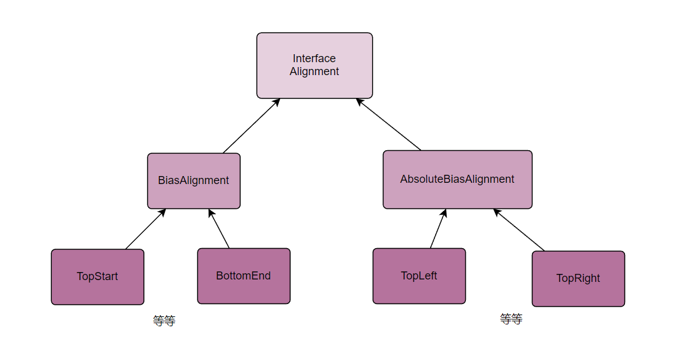
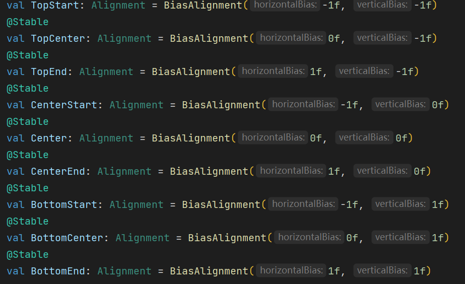

## 1：Policy分析

```kotlin
// Box的{}包含的子Composable称为元素
internal fun boxMeasurePolicy(alignment: Alignment, propagateMinConstraints: Boolean) =
    MeasurePolicy { measurables, constraints ->
        // 一个元素都没有，按min设置大小，一般为0，假如不设置defaultMinSize的话           
        if (measurables.isEmpty()) {
            return@MeasurePolicy layout(
                constraints.minWidth,
                constraints.minHeight
            ) {}
        }
		// 是否把Box的min约束也应用到它的元素上	
        val contentConstraints = if (propagateMinConstraints) {
            constraints
        } else {
            // propagateMinConstraints为false的话元素的min为0
            constraints.copy(minWidth = 0, minHeight = 0)
        }
		
        // 先特殊处理元素只有一个的情况，之所以要这样主要是处理“元素只有一个且元素应用了M.matchParentSize的情况”
        if (measurables.size == 1) {
            val measurable = measurables[0]
            val boxWidth: Int
            val boxHeight: Int
            val placeable: Placeable
            if (!measurable.matchesParentSize) {
                placeable = measurable.measure(contentConstraints)
                boxWidth = max(constraints.minWidth, placeable.width)
                boxHeight = max(constraints.minHeight, placeable.height)
            } else {
                boxWidth = constraints.minWidth// 默认为0
                boxHeight = constraints.minHeight
                placeable = measurable.measure(
                    Constraints.fixed(constraints.minWidth, constraints.minHeight)
                )
            }
            return@MeasurePolicy layout(boxWidth, boxHeight) {
                // 具体摆放函数
                placeInBox(placeable, measurable, layoutDirection, boxWidth, boxHeight, alignment)
            }
        }

        val placeables = arrayOfNulls<Placeable>(measurables.size)
        // First measure non match parent size children to get the size of the Box.
        var hasMatchParentSizeChildren = false
        var boxWidth = constraints.minWidth
        var boxHeight = constraints.minHeight
        measurables.fastForEachIndexed { index, measurable ->
            if (!measurable.matchesParentSize) {
                val placeable = measurable.measure(contentConstraints)
                placeables[index] = placeable
                boxWidth = max(boxWidth, placeable.width)
                boxHeight = max(boxHeight, placeable.height)
            } else {
                // 先设置标志位，等非matchParentSize元素都测量完再处理
                hasMatchParentSizeChildren = true
            }
        }

        // Now measure match parent size children, if any.
        if (hasMatchParentSizeChildren) {
            // The infinity check is needed for default intrinsic measurements.
            val matchParentSizeConstraints = Constraints(
                // ps 可以对Box的width或height指定dp为Infinity， 
                minWidth = if (boxWidth != Constraints.Infinity) boxWidth else 0,
                minHeight = if (boxHeight != Constraints.Infinity) boxHeight else 0,
                maxWidth = boxWidth,
                maxHeight = boxHeight
            )
            measurables.fastForEachIndexed { index, measurable ->
                if (measurable.matchesParentSize) {
                    placeables[index] = measurable.measure(matchParentSizeConstraints)
                }
            }
        }

        // Specify the size of the Box and position its children.
        layout(boxWidth, boxHeight) {
            placeables.forEachIndexed { index, placeable ->
                placeable as Placeable
                val measurable = measurables[index]
                placeInBox(placeable, measurable, layoutDirection, boxWidth, boxHeight, alignment)
            }
        }
    }
```

## 2：placeInBox分析

```kotlin
private fun Placeable.PlacementScope.placeInBox(
    placeable: Placeable,
    measurable: Measurable,
    layoutDirection: LayoutDirection,
    boxWidth: Int,
    boxHeight: Int,
    alignment: Alignment
) {
    // 如果元素设置了Modifier.align(Alignment)，那就以元素的为准
    val childAlignment = measurable.boxChildData?.alignment ?: alignment
    // 面向对象的思想，对齐相关的操作封装在“对齐对象”之中。
    val position = childAlignment.align(
        IntSize(placeable.width, placeable.height),// 表示元素的宽高
        IntSize(boxWidth, boxHeight),// Box的宽高
        layoutDirection// 布局方向是从左到右还是相反，该死的阿拉伯地区额
    )
    placeable.place(position)
}
```

## 3：align函数分析

首先要了解Alignment的继承关系：



AbsoluteBiasAlignment这个家族基本不用。

下面只谈BiasAlignment:

如何摆放的逻辑都放在BiasAlignment之中，它的子类只是传的参数不同。

```kotlin
data class BiasAlignment(
    val horizontalBias: Float,
    val verticalBias: Float
) : Alignment {
    override fun align(
        size: IntSize,
        space: IntSize,
        layoutDirection: LayoutDirection
    ): IntOffset {
        // Convert to Px first and only round at the end, to avoid rounding twice while calculating
        // the new positions
        val centerX = (space.width - size.width).toFloat() / 2f
        val centerY = (space.height - size.height).toFloat() / 2f
        val resolvedHorizontalBias = if (layoutDirection == LayoutDirection.Ltr) {
            horizontalBias
        } else {
            -1 * horizontalBias
        }

        val x = centerX * (1 + resolvedHorizontalBias)
        val y = centerY * (1 + verticalBias)
        return IntOffset(x.roundToInt(), y.roundToInt())
    }
}
```



根据传参数就可以实现摆到特定位置的效果。代码很简单，看一下画一下图就会豁然开朗。