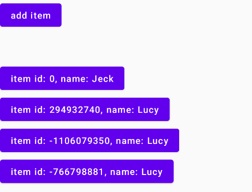

考虑下面这段代码：

```kotlin
@Composable
fun KeyTrick() {
    val list = remember {
        mutableStateListOf(KeyTest(id = 0, name = "Jeck"))
    }

    Column {
        Button(onClick = {
            list.add(0, KeyTest(Random.nextInt(), "Lucy"))
        }) {
            Text(text = "add item")
        }

        Spacer(modifier = Modifier.height(50.dp))

        for (item in list) {
                Item2(item)
        }
    }
}

@Composable
fun Item2(item: KeyTest) {
    Button(onClick = {

    }) {
        LogUtil.d("compose item.id: ${item.id}")// 如果打印了，说明Button发生了recompose
        Text(text = "item id: ${item.id}, name: ${item.name}")
    }
}

data class KeyTest(val id: Int, val name: String)
```

效果：每点击一次button，都添加一个列表项在开头，因为mutableStateListOf是可观察的，所以会通知重组。

image——点击了三次：


**但是观看打印log，发现每添加一个列表项的时候，原来的列表项都会recompose**，这个时候修改一个添加元素的位置， 把添加在列表开头改为添加在末尾：

imge——点击了三次：



**观看打印log，发现每添加一个列表项的时候，只有新加入的列表项会进行组合**。其实对于第一种情况我是不想要的，因为KeyTest是一个**Stable**的类（字段都是val，并且对于同一个instance，equal判断永远相等），我新加入元素在列表，无论在头或尾，**原来的可组合项的输入都没有改变**，都不应该进行重组。那第一种情况为什么会重组呢？

根据 [Google文档](https://developer.android.com/jetpack/compose/lifecycle#add-info-smart-recomposition)这一段可知，像for循环调用可组合项，Composer是根据调用的 **次序** 来判断Composable的 **身份**，那么第一种情况每一项会重组的原因就很清楚了：


新的添加的0，和原来的0比较，现在的1，和原来位置1的比较，它们都错位了，输入已经不同了，自然要重组。

那如何帮助Composer更智能地去判断呢？而不是根据列表项执行的次序来决定？那就是**key()函数的作用了**：帮助编译器确定可组合函数的 **身份**，同一身份的可组合函数才能进行输入是否相等的比较。

原来的代码进行如下修改：

```kotlin
key(item.id){
   Item2(item)
}
```

观察log，可以发现，**只有新添加的项才进行组合，原来的项没有进行重组**，但key()的作用仅仅是用来给可组合函数确定一个标识，并不是key（）中括号的内容不变，它就不进行重组，依然会判断key（）的block块中的Composable的输入是否有变化。举个例子：

把keyTest类的val改成var,

```
data class KeyTest(val id: Int, var name: String)
```

而其他代码不变。结果，**每添加一个列表项的时候，原来的列表项都会recompose**，和不添加key()的情况一样，那key()是失效了吗？不，key()没有失效，**现在的绿色依然会和原来的绿色比较**，只是因为KeyTest不再是 **Stable**的了，Composer会认为它们的输入用equal判断是不可靠的（本例中equal判断是相等），依然会进行重组。


注：在本例子中，可以对KeyTest添加@Stable注释强制编译器认为它是稳定的，但其实这并不满足@Stable注释的要求，因为name是var，最好不要这样做。