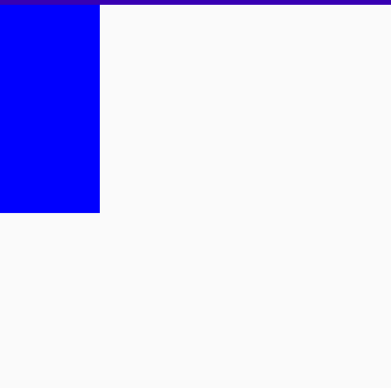

## 1：解析

官方注解：

仅当包装布局不受约束时才约束其大小：当传入的相应约束为0时才应用minWidth和minHeight约束。例如，该修饰符可用于定义组件的默认最小尺寸，同时仍允许在使用时使用较小的最小尺寸对其进行覆盖。

即：如果一个布局的最小约束为0（unconstrained），那么就用上这个Modifier传进去的 **相应** min 约束。如果不为0（有约束），那就不用上，这也是名字为default的意思，即不强制，只是把默认值改了。


## 2：例子

```kotlin
@Composable
fun Xxx() {
    Box(// Box1
        modifier = Mdf.size(400.dp).defaultMinSize(minHeight = 100.dp, minWidth = 100.dp).background(Color.Blue)
    ) 
}
```

1. 因为这个Box1已经有约束了（size 400）,所以default不起作用。size里面填10dp大小就是10dp，填1000dp就是1000dp。

2. 若是没有这个size Modifier，那么本来这个Box的最小约束为0，那大小应该为0了，看不到任何东西。

   ```kotlin
   modifier = Mdf.background(Color.Blue)
   ```

   一点蓝色也没有吧。:smirk:

   若是改变默认的最小约束就不一样了。

   ```kotlin
   modifier = Mdf.defaultMinSize(minHeight = 200.dp, minWidth = 100.dp).background(Color.Blue)
   ```

   