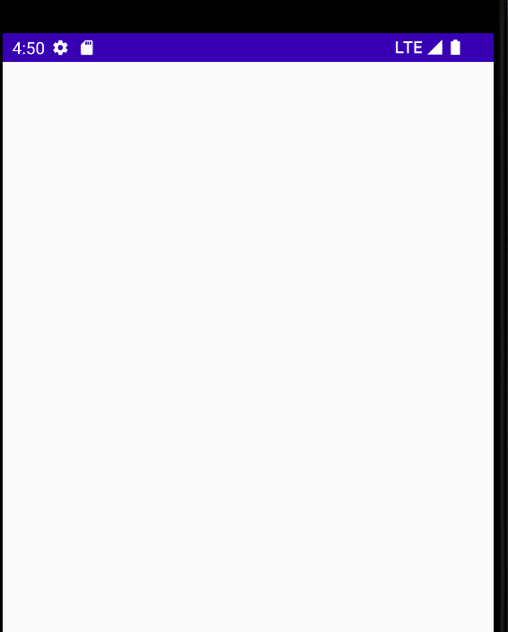

## 1：解析

这个Modifier只能在BoxScope中使用。

意思是：在测量所有其他内容元素之后，调整元素的大小以匹配 Box 的大小。使用此修饰符的元素不参与定义 Box 的大小。相反，在测量所有其他子项（不使用 matchParentSize() 修饰符的元素）以获得 Box 的大小之后，它会匹配 Box 的大小。

也就是说假如Box内有三个元素ABC，A应用了matchParentSize，那么Box会根据BC，把BC测量之后，定好自己大小了，然后把A的大小匹配到Box。

**应用了这个Modifier的元素不参与到决定Box大小的过程中来，它只是在Box得出大小之后去匹配它。**

那么如果只有一个元素，并且应用了这个Modifier，那么该如何呢？类似于View系统中父VIew是WrapContent，子View是matchParent了。这种情况在Box Composable的源码中有处理：

```kotlin
if (measurables.size == 1) {
            val measurable = measurables[0]
            val boxWidth: Int
            val boxHeight: Int
            val placeable: Placeable
            if (!measurable.matchesParentSize) {
                placeable = measurable.measure(contentConstraints)
                boxWidth = max(constraints.minWidth, placeable.width)
                boxHeight = max(constraints.minHeight, placeable.height)
            } else {
                // here
                boxWidth = constraints.minWidth
                boxHeight = constraints.minHeight
                placeable = measurable.measure(
                    Constraints.fixed(constraints.minWidth, constraints.minHeight)
                )
            }
            return@MeasurePolicy layout(boxWidth, boxHeight) {
                placeInBox(placeable, measurable, layoutDirection, boxWidth, boxHeight, alignment)
            }
        }
```

也就是说，Box的宽高会设为给到的约束的 **最小宽高**，然后把里面那个元素的约束的 **最小宽高和最大宽高**都设为Box的宽高，即 **固定大小**。

## 2：例子

```kotlin
Box(
        modifier = Modifier.background(Color.Black)
    ) {
        Box(modifier = Modifier
            .background(Color.Blue)
            .matchParentSize())// Box1
//        Box(modifier = Modifier.size(50.dp))// Box2
    }
```

如果保留注释，那么这一段代码在UI上的表现为空白，因为默认minsize都是0，那自然没有UI。



1. 如果把注释去掉，则会根据Box2——50dp去定好外围Box的大小是50dp，然后把第一个子Box以固定50dp去测量。
2. 也可以试着给外围的Box指定minSize，

```kotlin
 Box(
        modifier = Modifier.defaultMinSize(100.dp, 100.dp)
    ) {
        Box(modifier = Modifier
            .background(Color.Blue)
            .matchParentSize())
    }
```

这时候就以100dp去测量外围Box和Box1了。