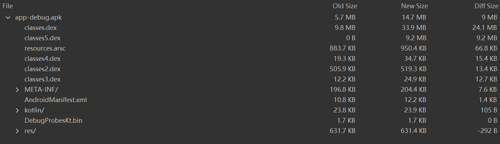
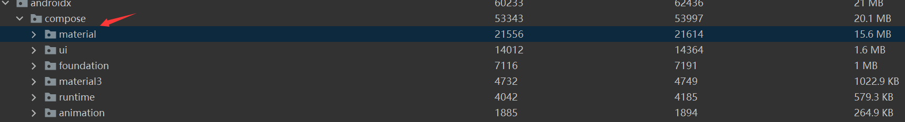

这个实验是将我实习时一个完全是View系统构建的传统项目，接入Compose之后来比较它的体积变化

## 0：如何分析应用体积变化

[文档](https://developer.android.com/studio/debug/apk-analyzer)，有一个视频可以了解。

[如何缩减应用大小](https://developer.android.com/topic/performance/reduce-apk-size)

## 一：接入前

## 二：接入ing

[接入步骤](https://developer.android.com/jetpack/compose/interop/adding)

按照官方教程一步步来之后，看看有什么问题。

build是成功了。来试一试把一个text view改成ComposeView。

干你nainai的，run不起来。一直报Could not find androidx.compose:compose-compiler:1.1.1.这个错。

看来是gradle配置相关的棘手问题。

**换个项目！**

拿自己平时的demo来试。

## 三：demo前后对比

顺利接入，也成功跑起来，并且把一个View换成ComposeView之后用setContent来把UI画出来也没有问题。

主要增加的是classes这个dex文件，进入之后发现主要的体积来源于：

这个依赖体积很大。

本来想试试去掉这个包的体积，但发现平常用的Button和Text这些Composable都是这个包下的。看来不可避免了。

9MB这个。。。

注：接下来还实验了把material依赖换成material3，大小差不多。