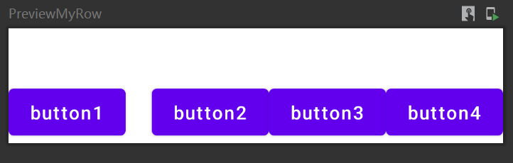

## 1：代码

```kotlin
@Composable
fun MyRow(modifier: Modifier = Modifier, content: @Composable () -> Unit) =
    Layout(content = content, modifier = modifier, measurePolicy = { measurables, constraints ->
        var boxHeight = 0
        var boxWidth = 0
        val placeables = arrayOfNulls<Placeable>(measurables.size)
        measurables.forEachIndexed { index, measurable ->
            measurable.measure(constraints).apply {
                placeables[index] = this
                boxWidth += this.width
                boxHeight = max(boxHeight, this.height)
            }
        }
        layout(width = boxWidth, height = boxHeight) {
            var usedWidth = 0
            placeables.forEachIndexed { index, placeable ->
                placeable!!.placeRelative(usedWidth, 0)
                usedWidth += placeable.width
            }
        }
    })


@Preview(showBackground = true, backgroundColor = 0xffffff)
@Composable
fun PreviewMyRow() {
    MyRow(
        modifier = Modifier.padding(top = 40.dp)
    ){
        Button(onClick = { }, modifier = Mdf.padding(end = 20.dp)) {
            Text(text = "button1")
        }
        Button(onClick = { }) {
            Text(text = "button2")
        }
        Button(onClick = { }) {
            Text(text = "button3")
        }
        Button(onClick = { }) {
            Text(text = "button4")
        }
    }

}
```

## 2：预览



参考Box的源码写的。

把modifier传给LayoutComposable就可以了，自己的MeasurePolicy里不用处理Modifier的逻辑，LayoutComposable会处理然后信息包含在Constraint里。