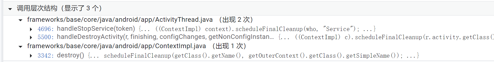

## 1：被引用的路径

在一个Avty中按照一下顺序执行方法

1. startService
2. bindService,flag为0
3. 退出Acty，自动解绑

回调如下：

```
2022-05-17 01:48:12.936 6071-6071/com.jeckonly.leakdemo D/Jeck: onCreate
2022-05-17 01:48:12.936 6071-6071/com.jeckonly.leakdemo D/Jeck: onStartCommand
2022-05-17 01:48:15.218 6071-6071/com.jeckonly.leakdemo D/Jeck: onBind
2022-05-17 01:48:15.230 6071-6071/com.jeckonly.leakdemo D/Jeck: onServiceConnected2, binder52201169
2022-05-17 01:48:18.258 6071-6071/com.jeckonly.leakdemo D/Jeck: onUnBind
```

发现因为ServiceConnection是一个匿名内部类**持有外部Acty引用**，SC无法释放导致Acty无法释放。

ServiceConnection的传递路径：

```java
// ContextImpl.java    

@Override
    public boolean bindService(Intent service, ServiceConnection conn,
            int flags) {
       
        return bindServiceCommon(service, conn, flags, mMainThread.getHandler(), getUser());//
    }


private boolean bindServiceCommon(Intent service, ServiceConnection conn, int flags, Handler
            handler, UserHandle user) {
       
        IServiceConnection sd;
       
        if (mPackageInfo != null) {
            sd = mPackageInfo.getServiceDispatcher(conn, getOuterContext(), handler, flags);//
        } 
    }

// LoadedApk.java
public final IServiceConnection getServiceDispatcher(ServiceConnection c,
            Context context, Handler handler, int flags) {
        synchronized (mServices) {
            LoadedApk.ServiceDispatcher sd = null;
            ArrayMap<ServiceConnection, LoadedApk.ServiceDispatcher> map = mServices.get(context);
            if (map != null) {
               
                sd = map.get(c);
            }
            if (sd == null) {
                sd = new ServiceDispatcher(c, context, handler, flags);// context为activity
              
                map.put(c, sd);// 这里ServiceConnection被引用!!!
            } else {
                sd.validate(context, handler);
            }
            return sd.getIServiceConnection();
        }
    }


```

因为当前进程Application和Acty的ContextImpl实例中的LoadedApk字段**引用的是同一个对象**。所以有这么一条引用链：

Application------>LoadedApk------>ArrayMap------>ServiceConnection------>Acty

后来发现，即使ServiceConnection不是匿名内部类，也会有：

Application------>LoadedApk------>ArrayMap------>Acty这样的引用。因为构建ServiceDispatcher把activity实例引用了。

## 2：解引用

那这个ServiceConnection怎么才能不被Arraymap引用呢？

### 1：unbind

```java
public final IServiceConnection forgetServiceDispatcher(Context context,
            ServiceConnection c) {
        synchronized (mServices) {
            ArrayMap<ServiceConnection, LoadedApk.ServiceDispatcher> map
                    = mServices.get(context);
            LoadedApk.ServiceDispatcher sd = null;
            if (map != null) {
                sd = map.get(c);
                if (sd != null) {
                    map.remove(c);// 移除
                    if (map.size() == 0) {
                        mServices.remove(context);// 如果刚刚移除最后一个，就移除整个ontext的map
                    }
                  }
    }
```

那这个方法如何才能调用呢?

```java
@Override
    public void unbindService(ServiceConnection conn) {
        if (conn == null) {
            throw new IllegalArgumentException("connection is null");
        }
        if (mPackageInfo != null) {
            IServiceConnection sd = mPackageInfo.forgetServiceDispatcher(//
                    getOuterContext(), conn);
        }
    }
```

那看来退出acty自动解绑的不会调用这个方法。打断点发现的确不会调用。

### 2：final clean

另外一个对这个ArrayMap操作的路径是：

```java
final void performFinalCleanup(String who, String what) {
        
        mPackageInfo.removeContextRegistrations(getOuterContext(), who, what);
       
    }
    
public void removeContextRegistrations(Context context,
            String who, String what) {
       

        synchronized (mServices) {
         
            ArrayMap<ServiceConnection, LoadedApk.ServiceDispatcher> smap =
                    mServices.remove(context);
            if (smap != null) {
                for (int i = 0; i < smap.size(); i++) {
                    LoadedApk.ServiceDispatcher sd = smap.valueAt(i);
                    ServiceConnectionLeaked leak = new ServiceConnectionLeaked(
                            what + " " + who + " has leaked ServiceConnection "
                            + sd.getServiceConnection() + " that was originally bound here");
                   // 看来官方也意识到，等到这一步来清理ServiceConnection，这个SC已经被泄漏了。（没有回收）
                    Slog.e(ActivityThread.TAG, leak.getMessage(), leak);

        }
    }
    
```

那这个performFinalCleanup啥时候调用呢？



#### 1：stopService

第一种情况显然就是service的调用stop，打断点证明过**会调用**。

#### 2：final cleanup

至于第二个

第二条发现如果Activity继承的是AppCompatActivity，就不会调用，如果是其他例如ComponentActivity，就会调用。

```java
// ActivityThread
 case CLEAN_UP_CONTEXT:
 	ContextCleanupInfo cci = (ContextCleanupInfo)msg.obj;
	cci.context.performFinalCleanup(cci.who, cci.what);//
 break;

 final void scheduleContextCleanup(ContextImpl context, String who,
            String what) {
        ContextCleanupInfo cci = new ContextCleanupInfo();
        cci.context = context;
        cci.who = who;
        cci.what = what;
        sendMessage(H.CLEAN_UP_CONTEXT, cci);//
    }

// ContextImpl
 final void scheduleFinalCleanup(String who, String what) {
        mMainThread.scheduleContextCleanup(this, who, what);
    }

// ActivityThread
@Override
    public void handleDestroyActivity(IBinder token, boolean finishing, int configChanges,
            boolean getNonConfigInstance, String reason) {
        ActivityClientRecord r = performDestroyActivity(token, finishing,
                configChanges, getNonConfigInstance, reason);
        
            Context c = r.activity.getBaseContext();
            if (c instanceof ContextImpl) {// AppCompatActivity的baseContext为ContextThemeWrapper,componentActivity
                // 为ContextImpl
                ((ContextImpl) c).scheduleFinalCleanup(
                        r.activity.getClass().getName(), "Activity");//
            }
        }
       
    }
```

所以如果Activity继承的是AppCompatActivity，不会调用。

#### 3：contextimpl onDestroy

至于第三个，还不明确。

**所以，对于继承AppCompatActy的acty一定要unbind或stopService**，如果继承的是ComponentActivity，那么系统会帮取消这个引用。


