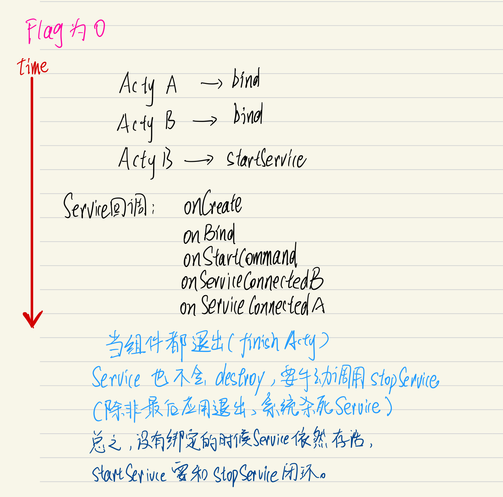
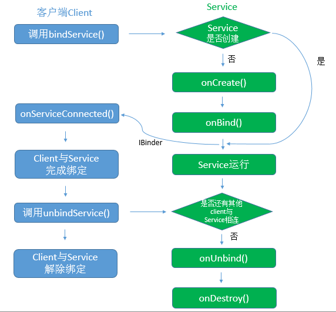

```kotlin
class MyService : Service() {

    override fun onBind(intent: Intent): IBinder? {
        return null
    }

    override fun onCreate() {
        super.onCreate()
        LogUtil.d()
    }

    override fun onStartCommand(intent: Intent?, flags: Int, startId: Int): Int {
        LogUtil.d()
        return super.onStartCommand(intent, flags, startId)
    }

    override fun onRebind(intent: Intent?) {
        super.onRebind(intent)
        LogUtil.d()
    }

    override fun onUnbind(intent: Intent?): Boolean {
        LogUtil.d()
        return super.onUnbind(intent)
    }


    override fun onDestroy() {
        super.onDestroy()
        LogUtil.d()
    }
}
```


上面这个例子，基本把onXX开头的回调都override了，我来看一下到底有什么方法会被回调。（为了不复杂化，onUnbind和onRebind其实不应该被考虑）

# 1：不做绑定

## 1：startService，第一次

```kotlin
startService(Intent(this@MainActivity2, MyService::class.java))
```


```
2022-08-13 22:43:25.085 11054-11054/com.jeckonly.leakdemo D/MyService: ---onCreate---
2022-08-13 22:43:25.085 11054-11054/com.jeckonly.leakdemo D/MyService: ---onStartCommand---
```

## 2：重复start

```
2022-08-13 22:43:25.085 11054-11054/com.jeckonly.leakdemo D/MyService: ---onCreate---
2022-08-13 22:43:25.085 11054-11054/com.jeckonly.leakdemo D/MyService: ---onStartCommand---
//重复按
2022-08-13 22:46:00.036 11054-11054/com.jeckonly.leakdemo D/MyService: ---onStartCommand---
2022-08-13 22:46:01.402 11054-11054/com.jeckonly.leakdemo D/MyService: ---onStartCommand---
```

可以看到，重复按的话只会调用onStartCommand。

## 3：stopService

```kotlin
stopService(Intent(this@MainActivity2, MyService::class.java))// 效果等同于service内调用stopSelf()
```


```
2022-08-13 22:47:12.663 11054-11054/com.jeckonly.leakdemo D/MyService: ---onDestroy---
```

## 4：重复stop

重复stop没有什么用。


# 2：有绑定

```java
// MyService.java

// 给onBind添加内容
override fun onBind(intent: Intent): IBinder? {
        Log.d("Jeck", "onBind")
        LogUtil.d()
        val binder =  MyBinder(this)
        return binder// 利用这个binder访问service的方法
    }
    
 class MyBinder(val service: MyService): Binder() {


 }    
```

架构：

组件比如Activity，和Service的关系为**客户端——服务器、CS**的方式，一个服务器（service）可以有多个客户端（如Activity）与之绑定，而一个客户端（activty）也可以绑定多个服务器（service）。

bindService有一个flag参数，一般两个选择：

1. 0
2.  BIND_AUTO_CREATE，在bindService时服务没创建会创建服务

**onBind方法只会回调一次，返回的都是同一个Binder对象**，第二个client bind的时候**不会回调**这个onBind

## flag为0

如果service还没创建，ActyA绑定Service不会自动创建service，而是往当前service与之绑定的**客户端列表**中添加要与service绑定的组件，即ActyA。要手动调用startService，随后回调各个ServiceConnection的onServiceConnected。



## flag为auto create

service没有启动时，调用bind，回调如下：

```
2022-05-16 20:41:39.018 2726-2726/com.jeckonly.leakdemo D/Jeck: onCreate
2022-05-16 20:41:39.018 2726-2726/com.jeckonly.leakdemo D/Jeck: onBind
2022-05-16 20:41:39.049 2726-2726/com.jeckonly.leakdemo D/Jeck: onServiceConnected
```

退出当前与之绑定的组件：

```
2022-05-16 20:42:39.458 2726-2726/com.jeckonly.leakdemo D/Jeck: onUnBind// 退出的是最后一个与之绑定的才会回调
2022-05-16 20:42:39.458 2726-2726/com.jeckonly.leakdemo D/Jeck: onDestroy// 退出的是最后一个与之绑定的才会回调
```

总之，不需要调用startService，会自动创建service，然后**当没有绑定的组件时，service会销毁。**



> 为了简单起见，不考虑flag为auto create时又调用bind又调用startService来启动service的方式。需要看的话玩demo就行。

## 注：StopService不起作用

Note that if a stopped service still has ServiceConnection objects bound to it with the BIND_AUTO_CREATE set, it will not be destroyed until all of these bindings are removed。


