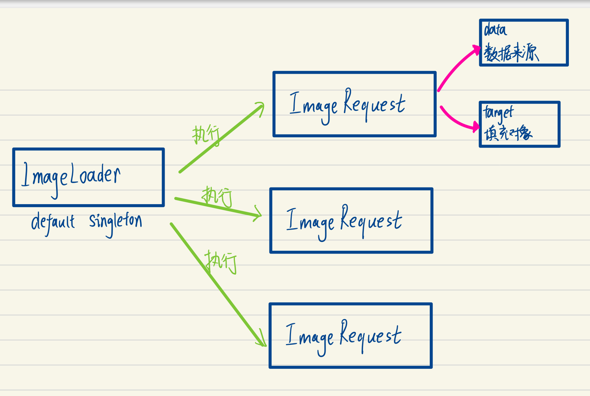

# 一：开始

[get start](https://coil-kt.github.io/coil/getting_started/#getting-started)



## ImageLoader

`ImageLoader`s are [service objects](https://publicobject.com/2019/06/10/value-objects-service-objects-and-glue/) that execute [`ImageRequest`](https://coil-kt.github.io/coil/image_requests/)s. They 

1. handle caching, 图片缓存
2. data fetching, 抓取数据
3. image decoding, 图片解析
4. request management, 请求管理
5. bitmap pooling, 图片池
6. memory management,内存管理 
7. and more

The singleton `ImageLoader` can be accessed using a `Context` extension function:

```
val imageLoader = context.imageLoader
```

`ImageLoader`s are designed to be shareable and are most efficient when you create a single instance and share it throughout your app. 

## ImageRequest

`ImageRequest`s are [value objects](https://publicobject.com/2019/06/10/value-objects-service-objects-and-glue/) that provide all the necessary information for an [ImageLoader](https://coil-kt.github.io/coil/image_loaders/) to load an image.我是给ImageLoader去提供信息，让ImageLoader去进行具体的请求。


# 二：Jetpack Compose使用

