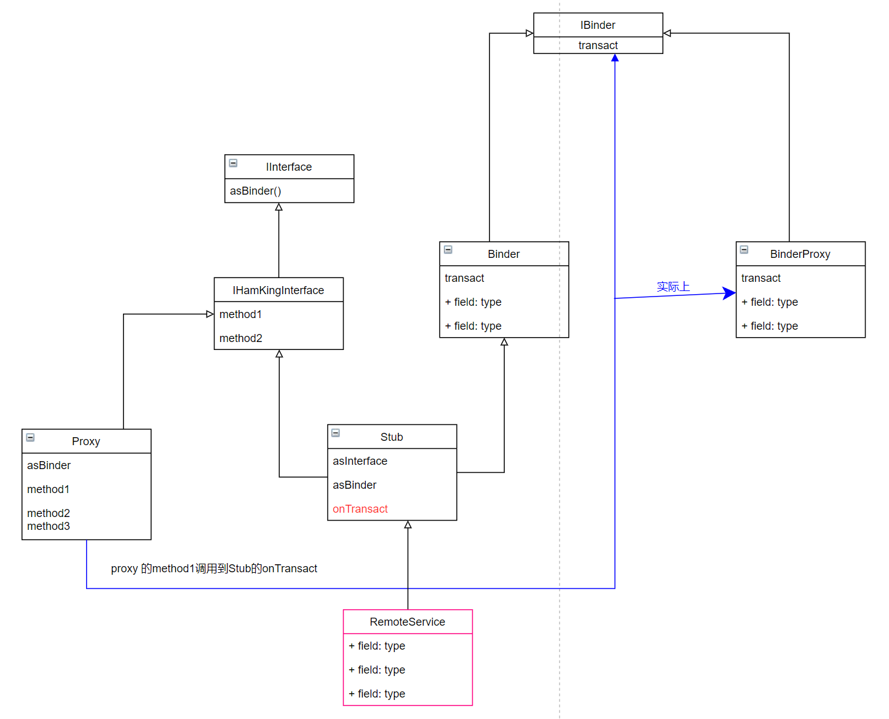
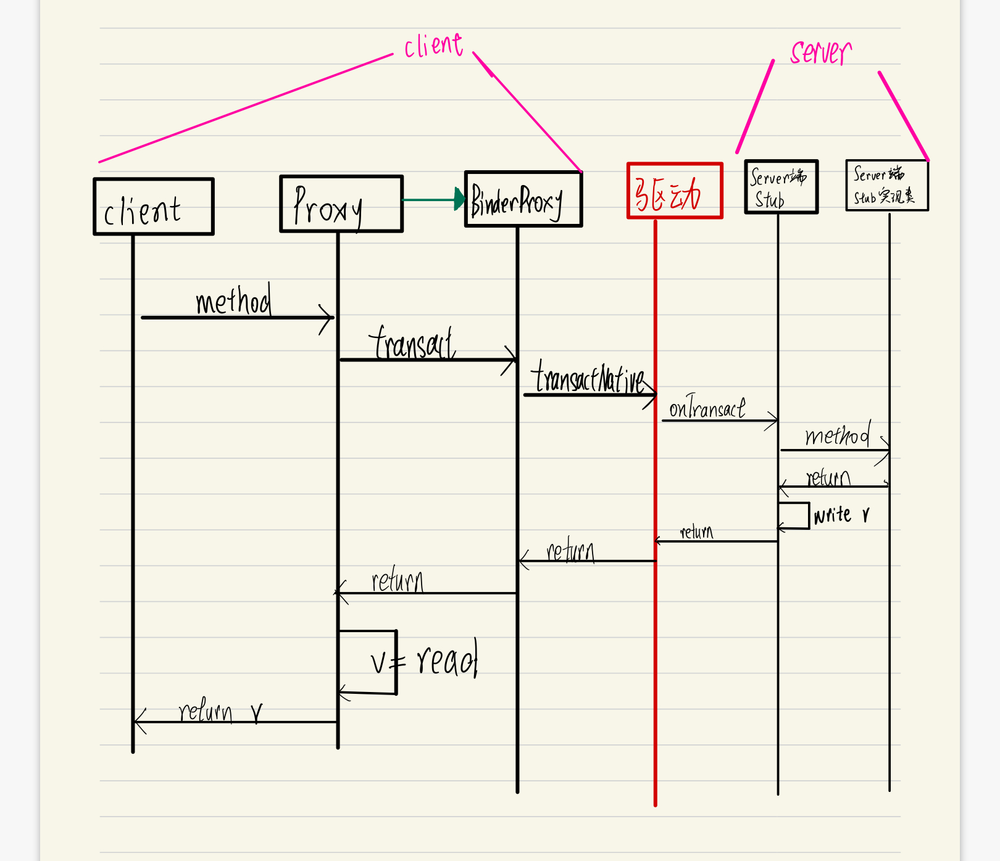

## 1：类图



- 客户端持有的是Proxy，并组合一个IBinder的实现，实际上时BinderProxy实例。
- 服务端持有的是RemoteService，继承于Stub，是具体的业务实现。

Proxy和Stub通信不是通过返回值，而是通过往**Parcel**里写/读数据。


## 2：交互时序图




## 3：读写对称

在client的Proxy端的代理方法之中，创建了两个入口，分别是：

```java
android.os.Parcel _data = android.os.Parcel.obtain();
android.os.Parcel _reply = android.os.Parcel.obtain();
```

1. data 是自己要写一些数据进去，之后server会从里面读数据
2. reply是server端操作完，之后自己读数据出来


在server端的本地Binder——Stub实现之中，看一下它的onTransact函数签名：

```java
public boolean onTransact(int code, android.os.Parcel data, android.os.Parcel reply, int flags)
```

code是方法的代号，data就是上文client写数据的入口，reply是稍后自己要写数据进去的。

在onTransact中根据code执行到具体的方法那一段，首先会从data从读数据，然后执行真正的方法实现，然后把结果写入reply.


综上所述，client的写和读和server的读和写一定是对称的，如下：

```java
// client端的proxy

        com.android1001.hamking.api.IOrderSession _result;
        try {
          _data.writeInterfaceToken(DESCRIPTOR);//1
          if ((client!=null)) {
            _data.writeInt(1);//2
            client.writeToParcel(_data, 0);//3
          }
         
          if ((order!=null)) {
            _data.writeInt(1);//4
            order.writeToParcel(_data, 0);//5
          }
        
          boolean _status = mRemote.transact(Stub.TRANSACTION_requestOrder, _data, _reply, 0);
         
          _reply.readException();//6
          _result = com.android1001.hamking.api.IOrderSession.Stub.asInterface(_reply.readStrongBinder());// NOTE 获得的只是server端的句柄  BinderProxy//7
          if ((0!=_reply.readInt())) {//8
            order.readFromParcel(_reply);// NOTE 把值给更新了，可点进去看（因为Order在aidl中用了out修饰）//9
          }
        }
    
        return _result;
      }
```

```java
// server端的stub
data.enforceInterface(descriptor);//1
 com.android1001.hamking.api.ClientInfo _arg0;
if ((0!=data.readInt())) {//2
      _arg0 = com.android1001.hamking.api.ClientInfo.CREATOR.createFromParcel(data);//3
}
         
com.android1001.hamking.api.OrderInfo _arg1;
if ((0!=data.readInt())) {//4
      _arg1 = com.android1001.hamking.api.OrderInfo.CREATOR.createFromParcel(data);//5
}
        
com.android1001.hamking.api.IOrderSession _result = this.requestOrder(_arg0, _arg1);
reply.writeNoException();//6
reply.writeStrongBinder((((_result!=null))?(_result.asBinder()):(null)));//7
if ((_arg1!=null)) {
    reply.writeInt(1);//8
    _arg1.writeToParcel(reply, android.os.Parcelable.PARCELABLE_WRITE_RETURN_VALUE);//9
}// NOTE 这个reply在写完东西之后并没有传回去，猜想是基于内存映射
```


## 4：Parcel类

具体的说明可以去看这个类的注释。我简明的介绍几点。

Parcel类被设计用于高效IPC传输，是客户端代理Proxy(包装BinderProxy)和服务端Stub进行数据交换的容器，在一端用readXXX方法，另一端就可以使用writeXXX方法读出数据，关键是read和write的顺序和类型都要严格一一对应。

主要传输的数据有以下几种：

### 1：原子类型

最基本的数据函数用于写入和读取原始数据类型：writeByte、readByte、writeDouble、readDouble、writeFloat、readFloat、writeInt、readInt、writeLong、readLong、writeString、readString。大多数其他数据操作都建立在这些之上。使用主机 CPU 的字节序写入和读取给定的数据。

### 2：原子类型的数组

有多种方法可以读取和写入原始对象的原始数组，通常会写入 4 字节长度（数组头），然后是原始数据项。读取方法可以将数据读取到现有数组中，也可以创建并返回一个新数组。这些可用的类型是：

writeBooleanArray(boolean[]), readBooleanArray(boolean[]), createBooleanArray()
writeByteArray(byte[]), writeByteArray(byte[], int, int), readByteArray(byte[]), createByteArray()
writeCharArray(char[]), readCharArray(char[]), createCharArray()
writeDoubleArray(double[]), readDoubleArray(double[]), createDoubleArray()
writeFloatArray(float[]), readFloatArray(float[]), createFloatArray()
writeIntArray(int[]), readIntArray(int[]), createIntArray()
writeLongArray(long[]), readLongArray(long[]), createLongArray()
writeStringArray(String[]), readStringArray(String[]), createStringArray().
writeSparseBooleanArray(SparseBooleanArray), readSparseBooleanArray().

### 3：实现了Parcelables接口的类

Parcelable 协议为对象从 Parcels 中写入和读取自己提供了一个非常有效（但底层）的协议。

可以使用直达的方法 writeParcelable(Parcelable, int) 和 readParcelable(ClassLoader) 或 writeParcelableArray 和 readParcelableArray(ClassLoader) 进行写入或读取。这些方法将类类型及其数据写入 Parcel，从而允许在以后读取时从适当的类加载器重新构建该类。

还有一些方法可以更有效地处理 Parcelables：writeTypedObject、writeTypedArray、writeTypedList、readTypedObject、createTypedArray 和 createTypedArrayList。这些方法不写入原始对象的类信息：相反，读取函数的调用者必须知道期望的类型并传入适当的 Parcelable.Creator 以正确构造新对象并读取其数据。

以上两种选择其实函数内部都是使用writeToParcel和Parcelable.Creator.createFromParcel而已 ，因此也可以直接调用这两个方法来读写Parelables对象。（在AIDL为我们生成的代码中就是这么做的）

```java
// Proxy
android.os.Parcel _data = android.os.Parcel.obtain();
client.writeToParcel(_data, 0);

// Stub
_arg0 = com.android1001.hamking.api.ClientInfo.CREATOR.createFromParcel(data);
```

### 4：Bundle类

一个特殊的类型安全容器，称为 Bundle，可用于异构值的键值映射。这在读取和写入数据时进行了许多优化以提高性能，并且其类型安全的 API 在最终将数据内容编组到 Parcel 时避免了难以调试的类型错误。使用的方法是 writeBundle(Bundle)、readBundle() 和 readBundle(ClassLoader)。

### 5：active object（不知道怎么翻译，活跃对象？）

Parcel 的一个不同寻常的功能是能够读取和写入active objects。对于这些对象，**不会写入对象的实际内容(actual contents)**，而是写入一个特殊标记（special token），这个特殊标记**引用**被写入的对象。从 Parcel 中读回对象时，您不会获得该对象的新实例，而是获得一个句柄（handle），使用该句柄可以对最初写入的那个对象（服务端的对象）进行操作。有两种形式的active object可用：

#### 5.1  实现了IBinder的类

Binder 对象是 Android 通用跨进程通信系统的核心设施。 IBinder 接口为Binder对象描述了一个抽象协议，实现了该接口的类都可以写入 Parcel，并且在read时，您将收到两者其一：

1）实现该接口的原始对象

 2）把行为委托回原始对象的特殊代理实现。

当客户端和服务端在同一进程得到1，不在同一进程得到2。

方法有：

 writeStrongBinder(IBinder), writeStrongInterface(IInterface), readStrongBinder(), writeBinderArray(IBinder[]), readBinderArray(IBinder[]), createBinderArray(), writeBinderList(List), readBinderList(List), createBinderArrayList().

在AIDL中传输Binder对象就是这样：

```java
// IOrderSession.aidl
interface IOrderSession {
    void registerListener(IOrderListener listener);
}

// 服务端IOrderSession具体实现
inner class OrderRecord(
        val mClient: ClientInfo,
        val mOrder: OrderInfo,
        var mOrderReady: Boolean = false
    ) : IOrderSession.Stub() {
    ......
}

// 服务端另一个Binder的具体实现
override fun requestOrder(client: ClientInfo, order: OrderInfo): IOrderSession {
            val orderRecord = OrderRecord(client, order)
            return orderRecord
}

// 服务端另一个Binder的Stub的onTransact
 		 com.android1001.hamking.api.IOrderSession _result = this.requestOrder(_arg0, _arg1);
          reply.writeStrongBinder((((_result!=null))?(_result.asBinder()):(null)));

// 客户端的Proxy
 _result = com.android1001.hamking.api.IOrderSession.Stub.asInterface(_reply.readStrongBinder());// 获得的只是一个包装BinderProxy的Proxy（该Proxy定义在IOrderSession的Stub中）

```

> 实际上，BInder机制使得进程间的通信抽象为简单的对象调用，但服务端并不会真的把对象“传过去”，这个Binder实例只有一份，就是在服务端中。而客户端得到的只是句柄。实例和句柄是1对多的关系。
>
> 在句柄中调用相关方法，然后**陷入内核**，去到服务端由实例执行方法，把结果写入Parcel，在从内核回来，然后客户端从Parcel读出。

#### 5.2 FileDescriptor objects

FileDescriptor objects, representing raw Linux file descriptor identifiers, can be written and ParcelFileDescriptor objects returned to operate on the original file descriptor. The returned file descriptor is a dup of the original file descriptor: the object and fd is different, but operating on the same underlying file stream, with the same position, etc. The methods to use are writeFileDescriptor(FileDescriptor), readFileDescriptor().


### 6：Untyped Containers

A final class of methods are for writing and reading standard Java containers of arbitrary types. These all revolve around the writeValue(Object) and readValue(ClassLoader) methods which define the types of objects allowed. The container methods are writeArray(Object[]), readArray(ClassLoader), writeList(List), readList(List, ClassLoader), readArrayList(ClassLoader), writeMap(Map), readMap(Map, ClassLoader), writeSparseArray(SparseArray), readSparseArray(ClassLoader).


## 5：实例分析

### AMS

```java
// Instrumentation.java
int result = ActivityManager.getService()
                .startActivity(whoThread, who.getBasePackageName(), intent,
                        intent.resolveTypeIfNeeded(who.getContentResolver()),
                        token, target != null ? target.mEmbeddedID : null,
                        requestCode, 0, null, options);
```

getService得到一个代理对象Proxy，利用这个对象可以调用服务端的实例对象，然后在通过Parcel把值传回来。

```java
public static IActivityManager getService() {
        return IActivityManagerSingleton.get();
    }

    private static final Singleton<IActivityManager> IActivityManagerSingleton =
            new Singleton<IActivityManager>() {
                @Override
                protected IActivityManager create() {
                    final IBinder b = ServiceManager.getService(Context.ACTIVITY_SERVICE);// IBinder是BinderProxy实例
                    final IActivityManager am = IActivityManager.Stub.asInterface(b);// 得到Stub.Proxy
                    return am;
                }
            };
```

在网上找到源码，如下：

```java
 private static class Proxy implements android.app.IActivityManager
        {
            private android.os.IBinder mRemote;
            Proxy(android.os.IBinder remote)
            {
                mRemote = remote;
            }
     
     @Override public int startActivity(android.app.IApplicationThread caller, java.lang.String callingPackage, 	android.content.Intent intent, java.lang.String resolvedType, android.os.IBinder resultTo, java.lang.String 		resultWho, int requestCode, int flags, android.app.ProfilerInfo profilerInfo, android.os.Bundle options) 	throws android.os.RemoteException
            {
                android.os.Parcel _data = android.os.Parcel.obtain();
                android.os.Parcel _reply = android.os.Parcel.obtain();
                int _result;
                try {
                    _data.writeInterfaceToken(DESCRIPTOR);
                    _data.writeStrongInterface(caller);// 服务端那边收到的也是客户端Binder的代理
                    _data.writeString(callingPackage);
                    _data.writeTypedObject(intent, 0);
                    _data.writeString(resolvedType);
                    _data.writeStrongBinder(resultTo);
                    _data.writeString(resultWho);
                    _data.writeInt(requestCode);
                    _data.writeInt(flags);
                    _data.writeTypedObject(profilerInfo, 0);
                    _data.writeTypedObject(options, 0);
                    // 调用BInderProxy的方法
                    boolean _status = mRemote.transact(Stub.TRANSACTION_startActivity, _data, _reply, 0);
                    _reply.readException();
                    _result = _reply.readInt();// 从Parcel读出值来
                }
                finally {
                    _reply.recycle();
                    _data.recycle();
                }
                return _result;
            }
}
```

暂时没搞懂的就这一行

```java
final IBinder b = ServiceManager.getService(Context.ACTIVITY_SERVICE);
```

在使用Service来接收服务端代理的时候，IBinder会在ServiceConnected的时候传过来，那这一句的本质是什么呢？

目前了解的信息有，这个ServiceManager不是一个java文件，而是一个C++文件。