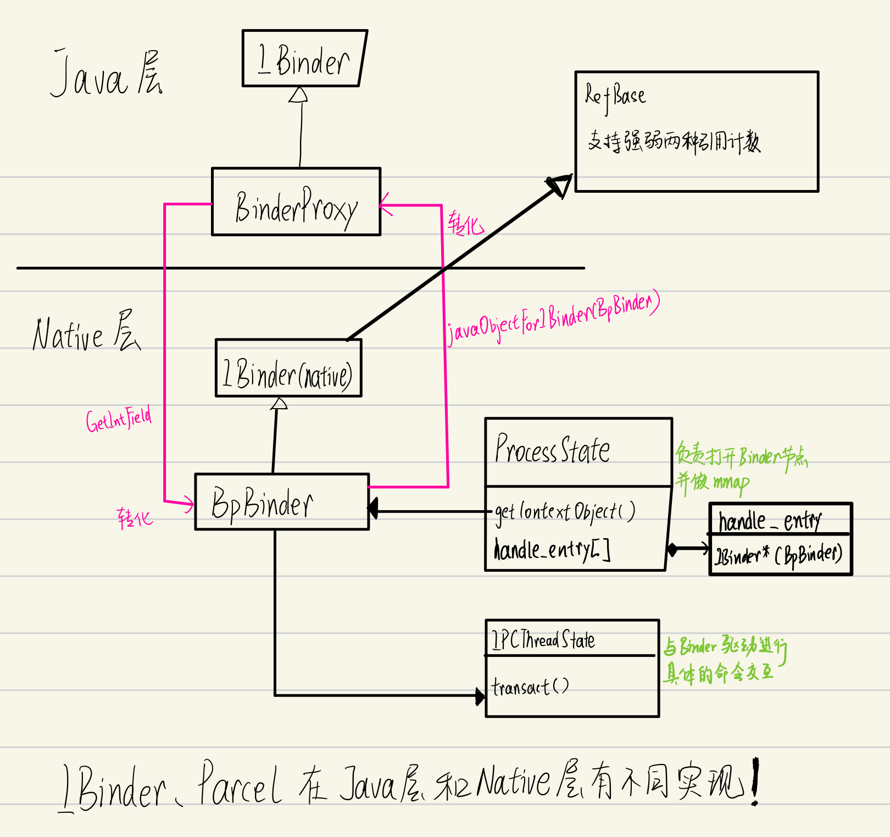

SmartPointer是设计的概念，在Android上的具体实现有sp(强指针)和wp(弱指针).而和SmartPointer实现类似的是sp强指针。

进程间数据传递：由于进程都有各自的虚拟内存，因此跨进程传递的虚拟内存是无效的。


---

Binder驱动已经为用户进程创建了一个它自己的binder_proc实体,之后用户进程对Binder设备的操作将以这个对象为基础。

最后来做一下小结: Binder驱动并没有脱离Linux的典型驱动模型，提供了多个文件操作接口。其中 binder_ioctl这个接口实现了应用进程与 Binder驱动之间的命令交互，可以说承载了Binder驱动中的大部分业务，因而是学习的重中之重。


上层应用使用到的是Binder驱动暴露出来的接口，详细看书。

---

mmap命令的本质


---

Service Manager的功能架构比较简洁——其内部维护着一个svclist链表,用于存储所有Server相关信息（以svcinfo为数据结构)，

```c++
135  struct svcinfo
136  {
137      struct svcinfo *next;
138      uint32_t handle;
139      struct binder_death death;
140      int allow_isolated;
141      uint32_t dumpsys_priority;
142      size_t len;
143      uint16_t name[0];
144  };
```

查询和注册都是基于这个表展开的。

SM会一次从Binder底层读一批消息，处理完这批消息会继续向Binder Driver 发送 BINDER_WRITE_READ 以查询有没有新的消息。如果有的话就处理;否则会进入休眠等待。

SM处理消息


---

正如我们一直强调的，不同进程间的内存空间是没有办法直接相互访问的;反之，如果它们属于同一个进程空间，那么就可以直接将Binder Object 的内存地址传给调用者;否则，调用者就只能通过handle值来与对方通信了。


---




通过ServiceManager在客户端的代理然后去获得Server的代理的过程

应用层使用BinderProxy的transact——>本地层使用BpBinder的transact——>IPCThreadState的transact