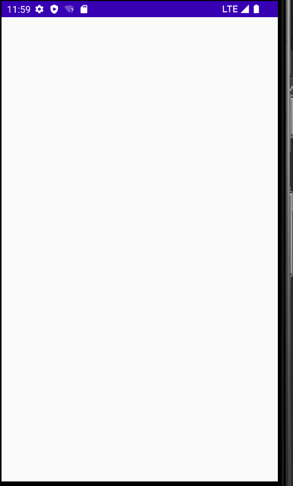

# 引言

说到 `Window` 机制，通常想到的就是`PhoneWindow`、`ViewRootImpl`、`WindowManagerImpl`、子窗口、`DecorView` 等等，网上也有不少博客通过源码分析他们之间的调用关系，可是能说得比较清楚的却不多，或深入源码不可自拔，或越说越复杂概念一大堆。

今天，我们就来好好捋一捋，到底怎么样去理解`Window`机制呢？

先撇开复杂源码与难懂的概念，我们现在谈的`Window`都是单纯地指`Window`这个类，请读者暂时抛开"窗口"、“子窗口”、 ~~“子`Window`”~~ 这些扰乱思路的概念，文章后面也会对这些概念以及应用作出说明和解释，所以先看看`Window`这个类，由简单到复杂。（" ~~子`Window`"~~ 可以视为一个错误的说法，这词在对理解`Window`机制上没什么好处，所以请永远忘记它！！！）

为了有更好的阅读思路，这里先给出几条结论：

1) 每个`Window`都有自己的唯一的一个`WindowManager`，`WindowManager`负责维护它所在的`Window`里面的内容。

 2) 在`Android`平台上`Window`的具体实现是`PhoneWindow`、对应它的`WindowManager`是`WindowManagerImpl`。 

3) `WindowManagerImpl`维护`PhoneWindow`中的什么内容呢? 答案：`DecorView`及其子`View`所组成的`View`树。 

4) 一个`Activity`有且只有一个`PhoneWindow`实例，一个`Dialog`同样有且只有一个`PhoneWindow`实例。

可能聪明的同学就会问了: 怎么没看到你的理解中有`ViewRootImpl`、`WindowManagerGlobal`这些呢？我给张图你就明白了。


如上图：
*一个`Window`都有一个`WindowManager`负责管理它的内容。* `PhoneWindow`的内容则交给`WindowManagerImpl`管理，其中的“内容”指的则是`DecorView`及其子`View`所组成的**View树**。 *当`WindowManagerImpl`决定管理**View树**时，会给这个**View树**分配一个`ViewRootImpl`,`ViewRootImpl`则是负责与**其他服务**联络并指导**View树**的绘制工作。* `Activity`有`PhoneWindow`对象，`Dialog`同样也有自己的`PhoneWindow`对象

> 一个Activity  一个PhoneWindow 一个WindowManagerImpl 一一对应，且互相引用
>
> .PNG)

# Window与WindowManager

虽然在 Android 平台上`PhoneWindow`是`Window`的唯一实现，可是直接跳过`Window`直接看`PhoneWindow`这种做法并不值得提倡。 打开`Window`的源码，会发现它有一个`WindowManager`对象。这个`WindowManager`就负责管理当前`Window`对象的内容。

```java
//: Window.java

public abstract class Window {
    ...
    private WindowManager mWindowManager;
    ...

    public void setWindowManager(WindowManager wm, IBinder appToken, String appName,
            boolean hardwareAccelerated) {
        mAppToken = appToken;
        mAppName = appName;
        mHardwareAccelerated = hardwareAccelerated;
        if (wm == null) {
            wm = (WindowManager)mContext.getSystemService(Context.WINDOW_SERVICE);
        }
        mWindowManager = ((WindowManagerImpl)wm).createLocalWindowManager(this);
    }
}
```

所以，不管`Window`的实现类是不是`PhoneWindow`，它都会有一个它自己的管理者`WindowManager`管理它的内部。


# Activity 与 PhoneWindow

接下来再看看`Window`的唯一实现`PhoneWindow`。在 Android 中脱离 `Activity` 谈`PhoneWindow`都是耍流氓。
所以这里将主要介绍`Actitity`启动过程中，`PhoneWinow`的创建流程、`WindowManagerImpl`的绑定、`DecorView`的创建以及`ViewRootImpl`的分配。


# 引用链完善过程


## 创建PhoneWindow(attach方法)

首先一起看一下`PhoneWindow`是何时创建的。众所周知，`Activity` 启动时 `ActivityThread` 会调用 `performLaunchActivity()`方法创建一个`Activity`实例，紧接着会调用它的 `attach` 方法。

```java
//: ActivityThread.java

    private Activity performLaunchActivity(ActivityClientRecord r, Intent customIntent) {
         Activity activity = null;
         ...
         java.lang.ClassLoader cl = appContext.getClassLoader();
         activity = mInstrumentation.newActivity(cl, component.getClassName(), r.intent);
         Application app = r.packageInfo.makeApplication(false, mInstrumentation);
         ...
         activity.attach(appContext, this, getInstrumentation(), r.token,
                        r.ident, app, r.intent, r.activityInfo, title, r.parent,
                        r.embeddedID, r.lastNonConfigurationInstances, config,
                        r.referrer, r.voiceInteractor, window, r.configCallback,
                        r.assistToken);
    }
```

在 `Activity` 的 `attach` 方法当中，`PhoneWindow`被创建并赋值给 `Activity` 的成员变量`mWindow`，紧接着会为`PhoneWindow`设置一个`WindowManager`。

```java
//: Activity.java

    final void attach(Context context, ActivityThread aThread,
            Instrumentation instr, IBinder token, int ident,
            Application application, Intent intent, ActivityInfo info,
            CharSequence title, Activity parent, String id,
            NonConfigurationInstances lastNonConfigurationInstances,
            Configuration config, String referrer, IVoiceInteractor voiceInteractor,
            Window window, ActivityConfigCallback activityConfigCallback, IBinder assistToken) {
        ...
        //创建PhoneWindow对象
        mWindow = new PhoneWindow(this, window, activityConfigCallback);
        ...
        //为PhoneWindow设置WindowManager
        mWindow.setWindowManager(
                (WindowManager)context.getSystemService(Context.WINDOW_SERVICE),
                mToken, mComponent.flattenToString(),
                (info.flags & ActivityInfo.FLAG_HARDWARE_ACCELERATED) != 0);

        mWindowManager = mWindow.getWindowManager();
    }
//: Window.java

    public void setWindowManager(WindowManager wm, IBinder appToken, String appName,
            boolean hardwareAccelerated) {
        ...
        if (wm == null) {
            wm = (WindowManager)mContext.getSystemService(Context.WINDOW_SERVICE);
        }
        //创建WindowManagerImpl实例，并赋值给Window的成员变量mWindowManager
        mWindowManager = ((WindowManagerImpl)wm).createLocalWindowManager(this);
    }

//: WindowManagerImpl.java

    public WindowManagerImpl createLocalWindowManager(Window parentWindow) {
        return new WindowManagerImpl(mContext, parentWindow);
    }
```

可以看到`Activity`并不是天生就有`PhoneWindow`的，只是在启动过程中`Activity`的`attch()`方法被调用，然后才会给`Activity`创建`PhoneWindow`对象，并在`PhoneWindow`创建后紧接着给它新建一个`WindowManagerImpl`。

`attch()`完成后,`Activity` 就是这个样子了。


> 所以在onCreate回调之中，Activity已经创建好了PhoneWindow和WMImpl。


## 创建DecorView（setContentView/performCreate）

当`PhoneWindow`及其内容管理者`WindowManagerImpl`创建好了以后，就需要关心管理者所管理的`View`树是何时创建了。也就是`DecorView`何时创建，这一点大部分读者都比较熟悉，在 Activity 中调用 `setContentView()`时，`DecorView`会被创建。

```java
//: Activity.java

    public void setContentView(@LayoutRes int layoutResID) {
        getWindow().setContentView(layoutResID);
        initWindowDecorActionBar();
    }
```

上述的 `getWindow().setContentView(layoutResID)`实际调用的就是`PhoneWindow`的`setContentView`方法。其源码如下：

```java
//: PhoneWondow.java

    @Override
    public void setContentView(int layoutResID) {
        // Note: FEATURE_CONTENT_TRANSITIONS may be set in the process of installing the window
        // decor, when theme attributes and the like are crystalized. Do not check the feature
        // before this happens.
        if (mContentParent == null) {
            //创建DecorView
            installDecor();
        } else if (!hasFeature(FEATURE_CONTENT_TRANSITIONS)) {
            mContentParent.removeAllViews();
        }
        ...
    }

    private void installDecor() {
        mForceDecorInstall = false;
        if (mDecor == null) {
            //创建DecorView并赋值给PhoneWindow的成员变量mDecor
            mDecor = generateDecor(-1);
            ...
        }
        ...
    }

    protected DecorView generateDecor(int featureId) {
        // System process doesn't have application context and in that case we need to directly use
        // the context we have. Otherwise we want the application context, so we don't cling to the
        // activity.
        Context context;
        if (mUseDecorContext) {
            Context applicationContext = getContext().getApplicationContext();
            if (applicationContext == null) {
                context = getContext();
            } else {
                context = new DecorContext(applicationContext, this);
                if (mTheme != -1) {
                    context.setTheme(mTheme);
                }
            }
        } else {
            context = getContext();
        }
        //新建DecorView对象，并将PhoneWindow实例传入其中
        return new DecorView(context, featureId, this, getAttributes());
    }
```

完成`setContent`后，`PhoneWindow`也有自己的`DecorView`了。不过到目前为止，虽然`Activity`有`PhoneWindow`，有`PhoneWindow`也有`WindowManagerImpl`和`DecorView`（或`View`树）了，此时的 `Activity`仍然不会在界面上显示任何东西。

要在界面上显示`View`树，必须要通知`WindowManagerServices`才可以,这个通知工作在是在`ViewRootImpl`之中完成，然而目前还未曾创建`ViewRootImpl`。


### installDecor的调用时机

在onCreate中调用setContentView会创建DecorView，但即使不调用setContentView，也会创建。如下所示：

```java
	   // Activity.java performCreate()
	   if (persistentState != null) {
            onCreate(icicle, persistentState);// 回调自己写的onCreate
        } else {
            onCreate(icicle);// 回调自己写的onCreate
        }
        EventLogTags.writeWmOnCreateCalled(mIdent, getComponentName().getClassName(),
                "performCreate");
        mActivityTransitionState.readState(icicle);

        mVisibleFromClient = !mWindow.getWindowStyle().getBoolean(
                com.android.internal.R.styleable.Window_windowNoDisplay, false);
        mFragments.dispatchActivityCreated();
        mActivityTransitionState.setEnterActivityOptions(this, getActivityOptions());// 进去
        dispatchActivityPostCreated(icicle);
        Trace.traceEnd(Trace.TRACE_TAG_WINDOW_MANAGER);
    
```

```java
public void setEnterActivityOptions(Activity activity, ActivityOptions options) {
 window.getDecorView();// 如果DecorView没创建就创建
}

// PhoneWindow.java
public final View getDecorView() {
   if (mDecor == null || mForceDecorInstall) {
      installDecor();
   }
   return mDecor;
}
```

如果不setContentView的话，UI是这样子：



**所以DecorView要么在onCreate中会被安装，要么在onCreate之后自动安装。**


## 创建ViewRootImpl(在handleResumeActy的onResume之后)

上面讲到在`View`树显示到界面之前，需要有一个`ViewRootImpl`负责指导它的绘制显示工作。那这个`ViewRootImpl`是何时创建并与`View`树关联的呢？

一句话简要概况：当`WindowManagerImpl`决定管理`View`树时，会给它关联一个`ViewRootImpl`实例。

那啥时候“决定管理”呢？从代码层面来说就是`WindowManagerImpl`调用`addView`方法将`View`树添加到`View`列表中时。
先看一下`WindowManagerImpl`的`addView`方法：

```java
//: WindowManagerImpl.java

    //单例 WindowManagerGlobal
    private final WindowManagerGlobal mGlobal = WindowManagerGlobal.getInstance();

    @Override
    public void addView(@NonNull View view, @NonNull ViewGroup.LayoutParams params) {
        applyDefaultToken(params);
        mGlobal.addView(view, params, mContext.getDisplay(), mParentWindow);// view参数是DecorView(或者说整个View Tree)
    }
```

可以看到**所有的`WindowManagerImpl`对`View`的管理**都是交给一个唯一的`WindowManagerGlobal`了。所以，我们需要再看看`WindowManagerGlobal`的`addView`方法：

```java
//: WindowManagerGlobal.java
    private static IWindowSession sWindowSession;

    private final ArrayList<View> mViews = new ArrayList<View>();
    @UnsupportedAppUsage
    private final ArrayList<ViewRootImpl> mRoots = new ArrayList<ViewRootImpl>();
    @UnsupportedAppUsage
    private final ArrayList<WindowManager.LayoutParams> mParams =
            new ArrayList<WindowManager.LayoutParams>();

    public void addView(View view, ViewGroup.LayoutParams params,
            Display display, Window parentWindow) {
        ...
        final WindowManager.LayoutParams wparams = (WindowManager.LayoutParams) params;
        ...
        ViewRootImpl root;
        View panelParentView = null;// 引用当前add的view要依附的窗口，比如PopUpWindow，这个字段就不为null

        synchronized (mLock) {
            ...
            // If this is a panel window, then find the window it is being
            // attached to for future reference.
            // 确定是否有依附窗口，根据传进来的params确定
            // 添加Activity的布局这种View，不会进去
            if (wparams.type >= WindowManager.LayoutParams.FIRST_SUB_WINDOW &&
                    wparams.type <= WindowManager.LayoutParams.LAST_SUB_WINDOW) {
                final int count = mViews.size();
                for (int i = 0; i < count; i++) {
                    if (mRoots.get(i).mWindow.asBinder() == wparams.token) {
                        panelParentView = mViews.get(i);
                    }
                }
            }    
            // 创建ViewRootImpl实例
            root = new ViewRootImpl(view.getContext(), display);
            // 给View设置属性
            view.setLayoutParams(wparams);

            mViews.add(view);// 
            mRoots.add(root);// 
            mParams.add(wparams);
            ...
            //将ViewRootImp和View进行绑定！！重要
            root.setView(view, wparams, panelParentView);
            ...
        }
    }
```

可以看到当`WindowManagerGlobal`的`addView`方法被调用时，`ViewRootImpl`被创建并将其与`View`树进行绑定。`ViewRootImpl`与`View`树进行绑定后，`Activity`看起来就是这个样子了。


看到这里又有同学要举手提问了，这个Activity何时会让`WindowManagerImpl`执行`addView`操作呢？
为了解决这个问题？我们需要再回到`Activity`的启动流程，观察`ActivityThread`的`handleResumeActivity`方法：

```java
//: ActivityThread.java

    public void handleResumeActivity(IBinder token, boolean finalStateRequest, boolean isForward,
            String reason) {
        ...
        // TODO Push resumeArgs into the activity for consideration
        //内部会调用Activity的onResume方法
        final ActivityClientRecord r = performResumeActivity(token, finalStateRequest, reason);
        // 以下的操作都是onResume完成之后！！！！！！！

        final Activity a = r.activity;

        final int forwardBit = isForward
                ? WindowManager.LayoutParams.SOFT_INPUT_IS_FORWARD_NAVIGATION : 0;

        // If the window hasn't yet been added to the window manager,
        // and this guy didn't finish itself or start another activity,
        // then go ahead and add the window.
        boolean willBeVisible = !a.mStartedActivity;
        if (!willBeVisible) {
            try {
                willBeVisible = ActivityTaskManager.getService().willActivityBeVisible(
                        a.getActivityToken());
            } catch (RemoteException e) {
                throw e.rethrowFromSystemServer();
            }
        }
        //从willBeVisible的注释中可以了解到当窗口没有被添加到WindowManager中时willBeVisible为true
        if (r.window == null && !a.mFinished && willBeVisible) {
            r.window = r.activity.getWindow();
            View decor = r.window.getDecorView();
            decor.setVisibility(View.INVISIBLE);
            ViewManager wm = a.getWindowManager();
            WindowManager.LayoutParams l = r.window.getAttributes();
            a.mDecor = decor;
            //窗口类型设置
            l.type = WindowManager.LayoutParams.TYPE_BASE_APPLICATION;

            if (a.mVisibleFromClient) {
                if (!a.mWindowAdded) {
                    a.mWindowAdded = true;
                    //WindowManagerImpl将View添加到自己的管理队列中
                    wm.addView(decor, l);
                } else {
                    a.onWindowAttributesChanged(l);
                }
            }

        }
    }
```

阅读完`handleResumeActivity`方法后，`WindowManagerImpl`的`addView`方法正式在此方法中完成的。

流程有点长，先小结一下之前的内容： 

1.  第一步：在`Activity`的启动过程中，`ActivityThread`会创建一个`Activity`实例。
2.  第二步：在`Activity`实例创建完成后，紧接着执行`Activity#attach()`方法。 
3.  第三步：在`Activity#attach()`方法之内`PhoneWindow`被创建，并同时创建一个`WindowManagerImpl`负责维护`PhoneWindow`内的内容。 
4. 第四步：在`Activity#onCreate()`中调用`setContent()`方法，这个方法内部创建一个`DecorView`实例作为`PhoneWindow`的内容，并把自己的布局文件解析，再和DecorView绑定，一棵View Tree完成。 
5. 第五步：在`ActivityThread#handleResumeActivity()`方法中， **onResume完成之后**，`WindowManagerImpl#addView`被调用，`WindowManagerImpl`决定管理`DecorView`（把任务委托给WMGlobal），并创建一个`ViewRootImpl`实例,将`ViewRootImpl`与`View`树进行关联，这样`ViewRootImpl`就可以指挥`View`树的具体**工作**。

通过后面的学习可以了解到,`ViewRootImpl`指挥`View`树的这些**工作**包含：`View`树的显示、测量绘制、同步刷新以及事件分发。

惊不惊喜，意不意外？？？`ViewRootImpl`原来这么重要，传说的众`View`之父呀！
仔细想一下，就知道其实没什么意外的~~~


# ViewRootImpl与View

刚刚我们交代了`ViewRootImpl`的创建时机，同时也讲到`View`树的显示、测量绘制、同步刷新以及事件分发这些工作与`ViewRootImpl`联系紧密。

`ViewRootImpl`再看看它的具体实现：

```java
//: ViewRootImpl.java

    final IWindowSession mWindowSession;
    final W mWindow;
    Choreographer mChoreographer;

    WindowInputEventReceiver mInputEventReceiver;

    public ViewRootImpl(Context context, Display display) {
        ...
        mWindowSession = WindowManagerGlobal.getWindowSession();
        mWindow = new W(this);
        mChoreographer = Choreographer.getInstance();
        ...
    }
    public void setView(View view, WindowManager.LayoutParams attrs, View panelParentView) {
    synchronized (this) {
            if (mView == null) {
                mView = view;
                ......
                // Schedule the first layout -before- adding to the window
                // manager, to make sure we do the relayout before receiving
                // any other events from the system.
                // 安排三大流程！！！异步你懂的
                requestLayout();
                //通过mWindowSession通知WMS添加并显示窗口
                res = mWindowSession.addToDisplay(mWindow, mSeq, mWindowAttributes,
                            getHostVisibility(), mDisplay.getDisplayId(), mTmpFrame,
                            mAttachInfo.mContentInsets, mAttachInfo.mStableInsets,
                            mAttachInfo.mOutsets, mAttachInfo.mDisplayCutout, mInputChannel,
                            mTempInsets);
              ......
              //初始化事件接收器，
              mInputEventReceiver = new WindowInputEventReceiver(mInputChannel,
                            Looper.myLooper());
              //将当前ViewRootImpl实例赋值给DecorView的mParent变量
              //众View之父，由此而来
              view.assignParent(this);
  }
```

`ViewRootImpl`中有`mIWindowSession`、`mWindow`、`mChoreographer`、`mInputEventReceiver`三个比较重要的变量。

> VIewRootImpl并没有继承View，严格来说不能纳入ViewTree的一部分，有一些图，看到把ViewToorImpl套在DecorView的外层，我觉得是不对的。
>
> ViewRootImpl虽然没有继承VIew，但它却实现了VIewParent这个接口，因此具有了一些父view的行为。（就像ViewGroup也实现了ViewParent这个接口）
>
> ViewRootImpl的注释是：The top of a view hierarchy, implementing the needed **protocol** between **View and the WindowManager**. This is for the most part an internal implementation detail of WindowManagerGlobal.

# ViewRootImpl的字段

## mIWindowSession与mWindow

`mIWindowSession`、`mWindow`为`Binder`对象，用于APP端与`WMS`之间的相互通信。细心的读者可能会发现，在`ViewRootImpl`对象创建后紧接着有一个`ViewRootImpl`的`setView`操作。不难发现，在`ViewRootImpl#setView`中使用了`IWindowSession.addToDisplay`来通知`WMS`添加并显示窗口。对`WMS`添加窗口细节感兴趣的读者可以参看[《WindowManagerService窗口管理之Window添加流程》](https://link.zhihu.com/?target=https%3A//cloud.tencent.com/developer/article/1154104)


> 关于APP端使用`mIWindowSession`与`mWindow`与WMS通讯细节的问题，可以参考[文章](https://link.zhihu.com/?target=https%3A//blog.csdn.net/yangwen123/article/details/18733631)。

## mChoreographer

对于部分同学来说`Choreographer`可能并不陌生，我们通常叫做“编舞者”。无论是系统同步刷新、`View`的`requestLayout`还是界面帧率监控，都能看到`Choreographer`的身影。 `Choreographer`要是展开讲的话，内容太长。希望读者可以去看看袁辉辉大佬的[《Choreographer原理》](https://link.zhihu.com/?target=http%3A//gityuan.com/2017/02/25/choreographer/)，或者也可以看看这篇[《Android 怎么就不卡了呢之Choreographer》](https://link.zhihu.com/?target=https%3A//juejin.cn/post/6844903818044375053%23heading-16)或者[《你真的了解16.6ms刷新机制吗？》](https://link.zhihu.com/?target=https%3A//juejin.cn/post/6844903849833005069)

## mInputEventReceiver

最后一点要讲的就是`WindowInputEventReceiver`在事件分发事件中的作用。可能一谈到事件分发，部分同学就会想到`View`的事件分发，可是`View`的事件是谁传给它的呢？由于笔者水平有限，强烈推荐袁辉辉大佬的[《Input系统—事件处理全过程》](https://link.zhihu.com/?target=http%3A//gityuan.com/2016/12/31/input-ipc/)，如果觉得难度太大的话可以先看看[《原来Android触控机制竟是这样的？》](https://link.zhihu.com/?target=https%3A//www.jianshu.com/p/b7cef3b3e703)。

# 子窗口

一说到`Window`机制，不少同学就喜欢聊子窗口，可是我却不喜欢聊它。为啥？在我看来这个概念太务虚了，就像去了解“茴香豆”的“茴”字有几种写法是一个道理，咬文嚼字不值得提倡。另外一点，它干扰了我们理解`Window`机制。

首先，什么是窗口？警告：一个窗口本质上是一个`View`树，就像`Activity`中`DecorView`及其子`View`组成的一颗`View`树，就可以视作是`Activity`内的一个窗口，注意它并不是`Window`对象。

之前我们讲到`Activity`启动过程中，会创建一个`PhoneWindow`与对应的`WindowManagerImpl`对象，然后在`setContent`的时候会给`PhoneWindow`创建一个`DecorView`，最终在`WindowManagerImpl#addView`中给`DecorView`分配一个`ViewRootImpl`对象负责指导`DecorView`的工作。这个`DecorView`及其子`View`组成的`View`树就是一个窗口。它的窗口类型为`WindowManager.LayoutParams.TYPE_BASE_APPLICATION`(在`ActivityThread#handleResumeActivity()`方法中被设置的),所以我们把它叫做应用窗口。

那什么是子窗口？

在`PhoneWindow`与`WindowManagerImpl`创建好了以后，我们自己也可以调用`WindowManagerImpl#addView`来添加一个`View`树，也叫添加窗口。

当它的窗口类型处于`WindowManager.LayoutParams.FIRST_SUB_WINDOW`与`WindowManager.LayoutParams.LAST_SUB_WINDOW`之间时，我们称这个直接添加的窗口为子窗口。

> 当然，也有的同学把直接调用`WindowManagerImpl#addView`创建的窗口都叫做子窗口。本文并未采取这种方式定义子窗口这一概念。

那这些直接通过`WindowManagerImpl#addView`创建的窗口公用同一个`PhoneWindow`以及`WindowManagerImpl`对象，窗口类型不同决定了它们在`WMS`上的一个**`z-order`顺序**。

## PopupWindow

接下来让我们看看子窗口是如何添加的，以`PopupWindow`为例：

```java
//: PopupWindow.java

private int mWindowLayoutType = WindowManager.LayoutParams.TYPE_APPLICATION_PANEL;

    public void showAtLocation(View parent, int gravity, int x, int y) {
        mParentRootView = new WeakReference<>(parent.getRootView());
        //这个getWindowToken返回的就是ViewRootImpl里的mWindow对象
        showAtLocation(parent.getWindowToken(), gravity, x, y);
    }

        public void showAtLocation(IBinder token, int gravity, int x, int y) {
        if (isShowing() || mContentView == null) {
            return;
        }

        detachFromAnchor();

        mIsShowing = true;
        mIsDropdown = false;
        mGravity = gravity;
        //创建窗口属性，配置窗口类型
        final WindowManager.LayoutParams p = createPopupLayoutParams(token);
        preparePopup(p);

        p.x = x;
        p.y = y;

        invokePopup(p);
    }

    protected final WindowManager.LayoutParams createPopupLayoutParams(IBinder token) {
        final WindowManager.LayoutParams p = new WindowManager.LayoutParams();
        p.gravity = computeGravity();
        p.flags = computeFlags(p.flags);
        p.type = mWindowLayoutType;
        p.token = token;
        p.softInputMode = mSoftInputMode;
        p.windowAnimations = computeAnimationResource();

        return p;
    }
    //添加窗口
    private void invokePopup(WindowManager.LayoutParams p) {
        if (mContext != null) {
            p.packageName = mContext.getPackageName();
        }

        final PopupDecorView decorView = mDecorView;
        decorView.setFitsSystemWindows(mLayoutInsetDecor);

        setLayoutDirectionFromAnchor();
        //添加窗口
        mWindowManager.addView(decorView, p);

        if (mEnterTransition != null) {
            decorView.requestEnterTransition(mEnterTransition);
        }
    }
```

可以看到`PopupWindow`通过`WindowManagerImpl`直接添加了一个类型为`WindowManager.LayoutParams.TYPE_APPLICATION_PANEL`类型的窗口。

这个`mWindowManager`就是`Activity`的`WindowManager`,也就是`Activity`内`PhoneWindow`的`WindowManagerImpl`，所以，这个窗口要依附于`Activity`。`Application`没有`WindowManager`所以不能被依附。

另一方面,这个窗口类型恰好是一个`FIRST_SUB_WINDOW`类型，所以`PopupWindow`是一个真正的子窗口。

```java
//: WindowManager.java
public static final int TYPE_APPLICATION_PANEL = FIRST_SUB_WINDOW;
```

## Dialog

看完了`PopupWindow`再来看看`Dialog`有何不同？

```java
//: Dialog.java

    Dialog(@NonNull Context context, @StyleRes int themeResId, boolean createContextThemeWrapper) {
        // The top-level window manager，得到最上层的WindowManagerImpl
        mWindowManager = (WindowManager) context.getSystemService(Context.WINDOW_SERVICE);
        //创建PhoneWindow
        final Window w = new PhoneWindow(mContext);
        mWindow = w;
        w.setCallback(this);
        w.setOnWindowDismissedCallback(this);
        w.setOnWindowSwipeDismissedCallback(() -> {
            if (mCancelable) {
                cancel();
            }
        });
        // 进去为PhoneWindow创建一个WMImpl
        w.setWindowManager(mWindowManager, null, null);
        w.setGravity(Gravity.CENTER);

        mListenersHandler = new ListenersHandler(this);
    }

    public void show() {
        if (mShowing) {
            if (mDecor != null) {
                if (mWindow.hasFeature(Window.FEATURE_ACTION_BAR)) {
                    mWindow.invalidatePanelMenu(Window.FEATURE_ACTION_BAR);
                }
                mDecor.setVisibility(View.VISIBLE);
            }
            return;
        }
        ......
        onStart();
        mDecor = mWindow.getDecorView();

        WindowManager.LayoutParams l = mWindow.getAttributes();
        //添加窗口
        mWindowManager.addView(mDecor, l);
    }
```

可以看到，`Dialog`与`PopupWindow`不同，它有自己的`PhoneWindow`对象，同时`Dialog`的窗口类型为`TYPE_APPLICATION`，所以不能视为一个子窗口。

# 总结

文章篇幅较长，最后我们再总结一下。

无论是`Activity`还是`PopupWindow`，又或者`Dialog`。这些对象需要显示到界面，都是通过调用`WindowManagerImpl#addView`来间接完成，它们所显示的内容实际就是`View`树，这个`View`树我们称之为“窗口”。`addView`时，会生成一个`ViewRootImpl`与`View`树进行关联，`ViewRootImpl`内部则通过`WindowSession`来与`WMS`进行通讯最终完成显示。另一方面，`WMS`通过一个`ViewRootImpl$W`实例（`mWindow`）代理，将`WMS`端的事件传递到`ViewRootImpl`，最终交给`View`树。

# 参考

[Choreographer原理](https://link.zhihu.com/?target=http%3A//gityuan.com/2017/02/25/choreographer/)

[原来Android触控机制竟是这样的？](https://link.zhihu.com/?target=https%3A//www.jianshu.com/p/b7cef3b3e703)

[Input系统—事件处理全过程](https://link.zhihu.com/?target=http%3A//gityuan.com/2016/12/31/input-ipc/)

[Android 怎么就不卡了呢之Choreographer](https://link.zhihu.com/?target=https%3A//juejin.cn/post/6844903818044375053%23heading-16)

[Android 应用程序建立与WMS服务之间的通信过程](https://link.zhihu.com/?target=https%3A//blog.csdn.net/yangwen123/article/details/18733631)

[Android事件分发机制前篇——事件如何传递到Activity中](https://link.zhihu.com/?target=https%3A//www.jianshu.com/p/faedef1910fe)

[你真的了解16.6ms刷新机制吗？](https://link.zhihu.com/?target=https%3A//juejin.cn/post/6844903849833005069)