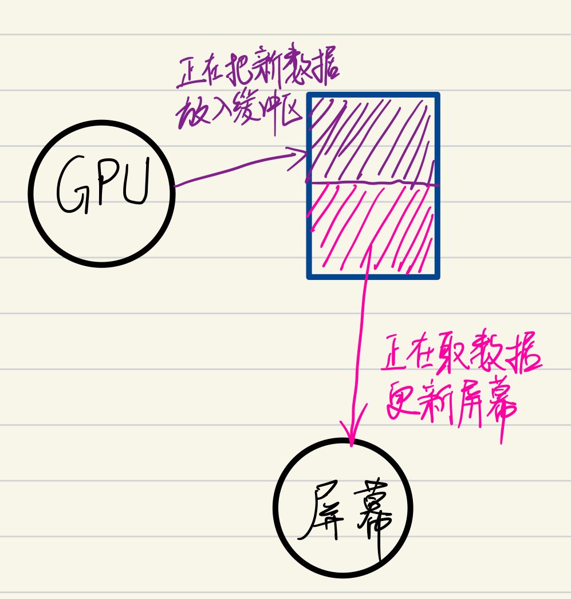
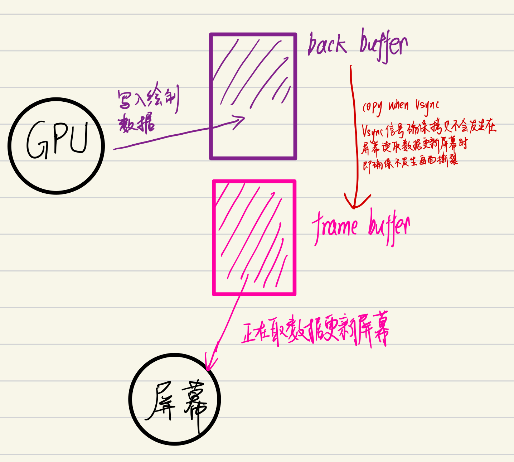

# Android的Vsync是什么

refresh rate 屏幕每秒更新多少次显示，基于硬件，是个**恒定**的数值。比如60hz就是屏幕每秒更新60次。

frame rate GPU每秒绘制多少次

[Youtube Google视频](https://www.youtube.com/watch?v=1iaHxmfZGGc&list=UU_x5XG1OV2P6uZZ5FSM9Ttw&t=112s&ab_channel=GoogleDevelopers)

## 画面撕裂

由于只有一个缓冲区，数据出现不一致的情况，导致画面撕裂。解决办法是使用两个缓冲区。

## 双缓冲区

使用Vsync信号来同步数据拷贝的时机，避免画面撕裂。

> 卡顿的本质就是GPU要处理的数据过多，时间过长，帧速率下降，本来GPU和屏幕协作的好好的，屏幕想更新数据时back buffer中都有新数据，但因为这一次GPU处理数据时间过长，屏幕想更新时，没有数据可以拷贝，导致屏幕取的是旧数据，所以画面就感觉到本来很平滑的突然卡顿一下。
>
> 简而言之，GPU帧速率的突然下降导致感觉到画面卡顿。

注：back buffer和frame buffer的数据拷贝只是指针的交换而已。

## 评论区的意见

I'd like to point out an error: the video claims the solution to tearing is "double buffering", but it isn't. Regardless of vsync, applications almost always use double buffering and draw into back buffer anyway (otherwise you see triangles being drawn by the GPU as it happens). The tearing happens NOT because the GPU is only using a single buffer as the video claims, but because the back buffer is swapped with front buffer while the monitor is still in the middle presenting the front buffer. So the real solution is to **synchronize** the presentation of back buffer so that it happens during vertical blank interval (**ie when the monitor is finished drawing the last scanline and preparing to draw the first scanline for the next frame, which happens every 60th of second on typical PC and mobile displays**). AKA vsync. Vsync with double buffering (which was norm prior to Jelly Bean) has a nasty problem of halving your framerate when you miss your target frequency. 

JB introduced triple buffering (which uses 2 back buffers and presents whichever one is ready, and the GPU draws into whichever one isn't presented yet) and it solves that nasty problem. However it introduces more input lag as the buffers struggle to catch up, and when it finally does, it manifests as microstutter or "jank." Unless you're able to hit 1/60 sec target all the time, you'll never be able to solve either of these issues. Here's hoping freesync (nvidia's gsync equivalent) comes to Android in the future.

它的意思是，画面撕裂的根源不是使用单缓冲，而是使用双缓冲但没有做好从back buffer写入frame buffer的同步问题，导致数据不一致。

而Vsync信号的出现就是为了同步这两个缓冲区的拷贝时机，来避免画面撕裂。

另外，即使使用三缓冲，画面滞后（卡顿）也不会得到完美解决，完美解决需要GPU在每次屏幕想取数据时都处理好数据，卡顿有时因为代码而无法避免。

> 个人感觉这位老哥说的更好，即画面撕裂的根因是拷贝时机没同步好。

[参考资料，这篇讲得不错](https://cloud.tencent.com/developer/article/1586225)

# Choreographer

> Choreographer控制Vsync信号的发送，以及Vsync信号到来时执行doTraversal去执行performTraversal来进行测量布局绘制工作。

具体看Handler机制那篇文章。

