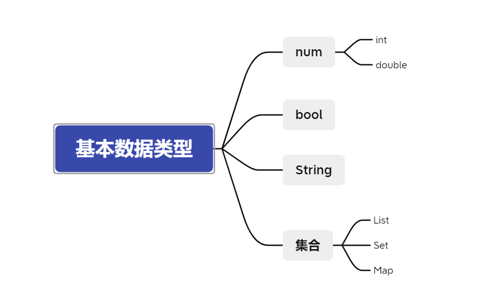

# Dart

## 理论基础

### 1：AOT vs JIT

JIT：Just In Time
AOT：Ahead of Time

目前，程序主要有两种运行方式：静态编译与动态解释。
静态编译的程序在执行前全部被翻译为机器码，通常将这种类型称为AOT （Ahead of time compiler）即 “提前编译”；如C、C++。**判断标准是：程序执行前是否需要编译。**而解释执行的则是一句一句边翻译边运行，通常将这种类型称为JIT（Just-in-time）即“即时编译”。如JavaScript、Python。程序运行的方式和具体的语言没有强制关系，比如Python，既可以JIT，也可以AOT。

Dart中的JIT和AOT：

1. Dart在开发过程中使用JIT，因此每次改都不需要再编译成字节码。节省了大量时间。
2. 在部署中使用AOT生成高效的ARM代码以保证高效的性能。

Dart 是少数同时支持 JIT（Just In Time，即时编译）和 AOT（Ahead of Time，运行前编译）的语言之一。

JIT 在运行时即时编译，在开发周期中使用，可以动态下发和执行代码，开发测试效率高，但运行速度和执行性能则会因为运行时即时编译受到影响。

总结来讲，在开发期使用 JIT 编译，可以缩短产品的开发周期。Flutter 最受欢迎的功能之一热重载，正是基于此特 性。而在发布期使用 AOT，就不需要像 React Native 那样在跨平台 JavaScript 代码和原生 Android、iOS 代码之间建立低效的方法调用映射关系。所以说，Dart 具有运行速 度快、执行性能好的特点。

## 基础语法

### 1：定义变量

```dart
String result = '';

var str = 0;// type int
```

既可以显示指定类型，也可以使用类型推断

### 2：定义注释

```dart
void main() {

  /**
   * block comment
   * 
   */
  int a = 1;// In-line comment用于局部注释

}

/// document comment 文档注释，用在函数或类的上面
void printSomething() {
  print('Something');
}
```


## 数据结构

### 1：基本数据类型




这些基本类型是在dart:core这个包里面的，这个包是自动导入的，不需要显示import。


## 类的抽象

### 1：mixin

*Mixins are a way of reusing a class’s code in multiple class hierarchies.* ——[**dartlang.org**](https://www.dartlang.org/guides/language/language-tour#adding-features-to-a-class-mixins)

https://medium.com/flutter-community/dart-what-are-mixins-3a72344011f3


