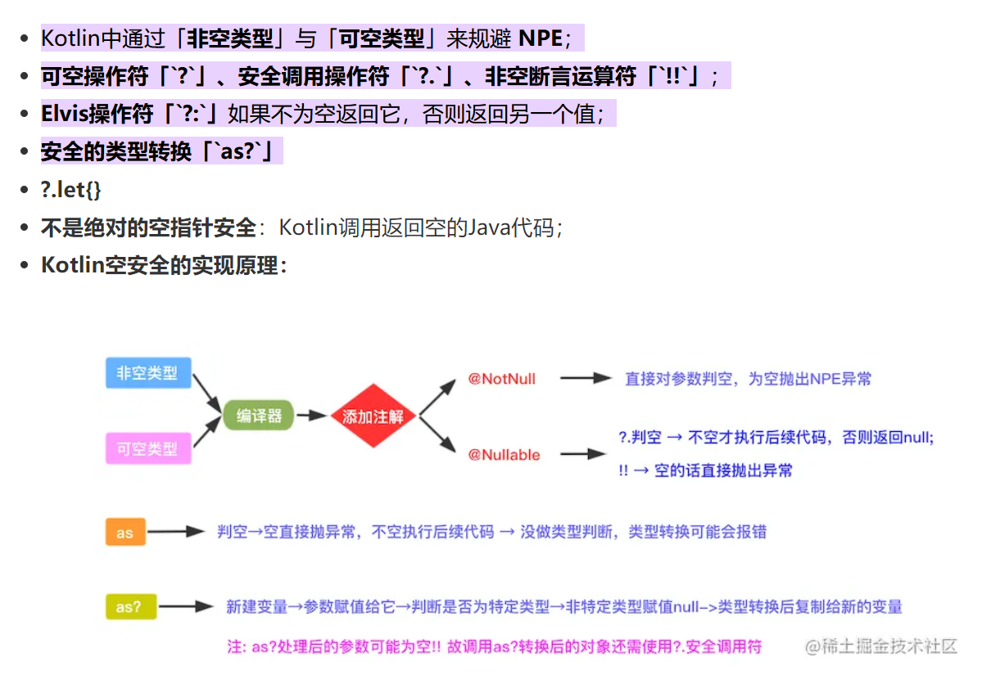
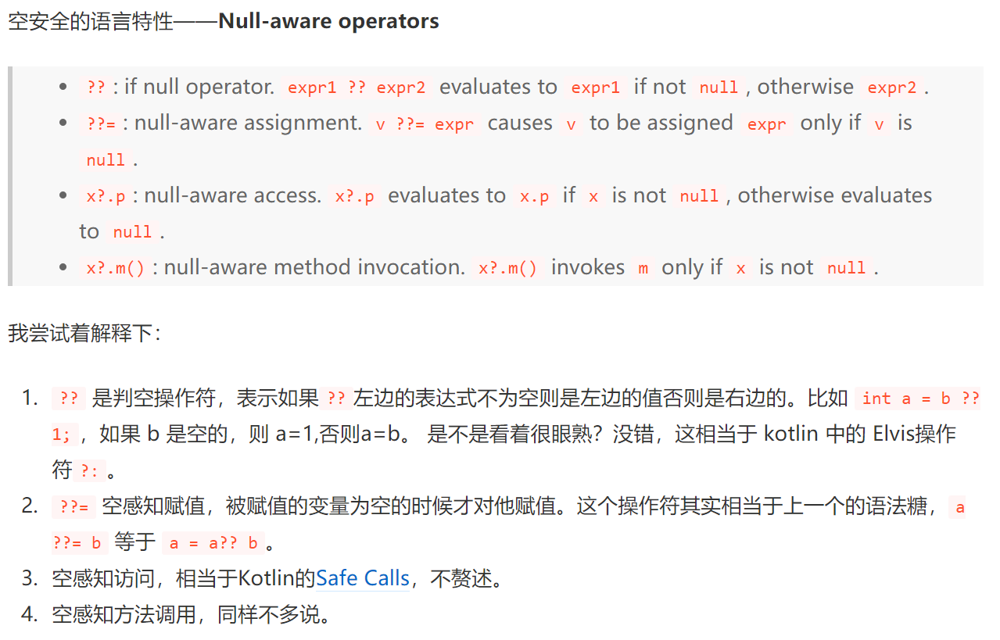

# Dart

## 理论基础

### 1：AOT vs JIT

JIT：Just In Time
AOT：Ahead of Time

目前，程序主要有两种运行方式：静态编译与动态解释。
静态编译的程序在执行前全部被翻译为机器码，通常将这种类型称为AOT （Ahead of time compiler）即 “提前编译”；如C、C++。**判断标准是：程序执行前是否需要编译。**而解释执行的则是一句一句边翻译边运行，通常将这种类型称为JIT（Just-in-time）即“即时编译”。如JavaScript、Python。程序运行的方式和具体的语言没有强制关系，比如Python，既可以JIT，也可以AOT。

Dart中的JIT和AOT：

1. Dart在开发过程中使用JIT，因此每次改都不需要再编译成字节码。节省了大量时间。
2. 在部署中使用AOT生成高效的ARM代码以保证高效的性能。

Dart 是少数同时支持 JIT（Just In Time，即时编译）和 AOT（Ahead of Time，运行前编译）的语言之一。

JIT 在运行时即时编译，在开发周期中使用，可以动态下发和执行代码，开发测试效率高，但运行速度和执行性能则会因为运行时即时编译受到影响。

总结来讲，在开发期使用 JIT 编译，可以缩短产品的开发周期。Flutter 最受欢迎的功能之一热重载，正是基于此特 性。而在发布期使用 AOT，就不需要像 React Native 那样在跨平台 JavaScript 代码和原生 Android、iOS 代码之间建立低效的方法调用映射关系。所以说，Dart 具有运行速 度快、执行性能好的特点。

## 基础语法

### 1：定义变量

```dart
String result = '';

var str = 0;// type int

dynamic b = 1;
  print('${b.runtimeType}');
  b = "dfdf";
  print('${b.runtimeType}');
  b = [0,1,2];
  print('${b.runtimeType}');
```

既可以显示指定类型，也可以使用类型推断，用dynamic可以指定变量类型为动态类型，在运行期间这个变量的类型可以改变，编译器就不会进行静态类型检查。

**dart一切皆对象**，不像Java区分基本数据类型和引用数据类型，如果一个variable没有显示赋值，默认为null。null也是一个对象，它的type为Null。

```dart
null is Null// true
```

#### 1.1 var关键字

在使用var声明变量的时候，需要注意的是: **如果var声明的变量开始不初始化，不仅值可以改变，它的类型也是可以被修改的，但是一旦在初始化时赋值后，它的类型就确定了，后续不能被改变。**

```dart
main() {
  var color; // 仅有声明未赋值的时候，这里的color的类型是dynamic,所以它的类型是可以变的 
  color = 'red';
  print(color is String); //true 
  color = 0xffff0000;
  print(color is int); //true 

  var colorValue = 0xffff0000; //声明时并赋值，这里colorValue类型已经推导出为int,并且确定了类型 
  colorValue = 'red'; //错误，这里会抛出编译异常，String类型的值不能赋值给int类型 
  print(colorValue is int); //true
}
```


### 2：定义注释

```dart
void main() {

  /**
   * block comment
   * 
   */
  int a = 1;// In-line comment用于局部注释

}

/// document comment 文档注释，用在函数或类的上面
void printSomething() {
  print('Something');
}
```


### 3：操作符

#### 3.1 空安全符

那些例如+=，&&这些操作符和其他语言类似。这里着重介绍**空感知操作符**——Null aware operator。

和kotlin对比一波：

kotlin



dart



可以发现还是有很多相似的地方。

```kotlin
// kotlin

val a: Int? = null
val b = a?.hashCode() ?: 7
println(b)

// dart
 int? a;
 var b = a?.hashCode ?? 7;
 print(b);
```


#### 3.2 三元运算符

kotlin中没有这个。

dart的写法和Java差不多。

```dart
var result = a > 2 ? 4 : 5;
```


#### 3.3 类型判断

```dart
int? a = null;
if (a is Null) {
  print('a is Null');
}
a = 8;
if (a is Null) {
  print('a is Null');
}
if (a is num) {
  print('a is num');
}
```

#### 3.4 算术运算符

| 名称 | 运算符 | 例子                                    |
| ---- | ------ | --------------------------------------- |
| 加   | +      | var result = 1 + 1;                     |
| 减   | -      | var result = 5 - 1;                     |
| 乘   | *      | var result = 3 * 5;                     |
| 除   | /      | var result = 3 / 5; [//0.6](http://0.6) |
| 整除 | ~/     | var result = 3 ~/ 5; //0                |
| 取余 | %      | var result = 5 % 3; //2                 |

#### 3.5 条件运算符

| 名称     | 运算符 | 例子   |
| -------- | ------ | ------ |
| 大于     | >      | 2 > 1  |
| 小于     | <      | 1 < 2  |
| 等于     | ==     | 1 == 1 |
| 不等于   | !=     | 3 != 4 |
| 大于等于 | >=     | 5 >= 4 |
| 小于等于 | <=     | 4 <= 5 |

#### 3.6 逻辑运算符

| 名称 | 运算符 | 例子             |
| ---- | ------ | ---------------- |
| 或   | \|\|   | 2 > 1 \|\| 3 < 1 |
| 与   | &&     | 2 > 1 && 3 < 1   |
| 非   | ！     | !(2 > 1)         |

#### 3.7 位运算符

| 名称 | 运算符 |
| ---- | ------ |
| 位与 | &      |
| 位或 | \|     |
| 位非 | ~      |
| 异或 | ^      |
| 左移 | <<     |
| 右移 | >>     |

#### 3.8 级联操作符(..)

级联操作符是 `..`, 可以让你对一个对象中字段进行链式调用操作，类似Kotlin中的apply或run标准库函数的使用。

```dart
question
    ..id = '10001'
    ..stem = '第一题: xxxxxx'
    ..choices = <String> ['A','B','C','D']
    ..hint = '听音频做题';
```

Kotlin中的run函数实现对比

```kotlin
question.run {
    id = '10001'
    stem = '第一题: xxxxxx'
    choices = listOf('A','B','C','D')
    hint = '听音频做题'    
}
```


### 4 ：流程控制

#### 4.1 循环

```dart
var numbers = [0, 1, 2];
// 标准循环
for(int i = 0; i < numbers.length; i++) {
  print(numbers[i]);
}

// for-in
for (int i in numbers) {
  print(numbers[i]);
}

// for-each 高阶函数
numbers.forEach((element) {
  var temp = element+1;
  print(temp);
});


// while
while ( condition ) {
  // do something
}

// do-while
do {
  continue;
  break;
}while ( condition )
```

#### 4.2 switch-case语句

```dart
Color getColor(String colorName) {
  Color currentColor = Colors.blue;
  switch (colorName) {
    case "read":
      currentColor = Colors.red;
      break;
    case "blue":
      currentColor = Colors.blue;
      break;
    case "yellow":
      currentColor = Colors.yellow;
      break;
  }
  return currentColor;
}
```


#### 4.3 assert断言

在dart中如果条件表达式结果不满足条件，则可以使用 `assert` 语句中断代码的执行。特别是在Flutter源码中随处可见都是assert断言的使用。注意:  **断言只在检查模式下运行有效，如果在生产模式运行，则断言不会执行。**

```dart
assert(text != null);//text为null,就会中断后续代码执行
assert(urlString.startsWith('https'));
```


### 5: 异常

dart中的异常捕获方法和Java,Kotlin类似，使用的也是**try-catch-finally**; 对特定异常的捕获使用**on**关键字. dart中的常见异常有: **NoSuchMethodError**(当在一个对象上调用一个该对象没有 实现的函数会抛出该错误)、**ArgumentError** (调用函数的参数不合法会抛出这个错误)

```dart
main() {
  int num = 18;
  int result = 0;
  try {
    result = num ~/ 0;
  } catch (e) {//捕获到IntegerDivisionByZeroException
    print(e.toString());
  } finally {
    print('$result');
  }
}

//使用on关键字捕获特定的异常
main() {
  int num = 18;
  int result = 0;
  try {
    result = num ~/ 0;
  } on UnsupportedError catch (e) {//捕获特定异常
    print(e.toString());
  } on ArgumentError catch (e) {
    print(e.toString());
  }finally {
    print('$result');
  }
}
```


## 数据结构

### 1：基本数据类型


这些基本类型是在dart:core这个包里面的，这个包是自动导入的，不需要显示import。

#### 1.1 String

```dart
  var s1 = '一个字符串';
  var s2 = "一个字符串";
  var s3 = '一个字符串和转义\'巴拉';
  var s4 = "一个字符串和转义'";
  var s5 = r"一个raw字符串\n\n\n";
  var s6 = "一个字符串插入表达式${Null}";
  var s7 =
  '''
  一个
     多行字符串
  ''';
  var s8 =
  """
  一个
    多行字符串
  """;
  print(s1);
  print(s2);
  print(s3);
  print(s4);
  print(s5);
  print(s6);
  print(s7);
  print(s8);
```

多行字符串前面会带有空格。

#### 1.2  List

在dart中的List和Kotlin还是很大的区别，换句话说Dart整个集合类型系统的划分都和Kotlin都不一样，比如Dart中集合就没有严格区分成可变集合(Kotlin中MutableList)和不变集合(Kotlin中的List)，在使用方式上你会感觉它更像数组，但是它是可以随意对元素增删改成的。

- List初始化方式

  ```dart
  main() {
      List<String> colorList = ['red', 'yellow', 'blue', 'green'];//直接使用[]形式初始化
      var colorList = <String> ['red', 'yellow', 'blue', 'green'];
  }
  ```

- List常用的函数

  ```dart
  main() {
      List<String> colorList = ['red', 'yellow', 'blue', 'green'];
      colorList.add('white');//和Kotlin类似通过add添加一个新的元素
      print(colorList[2]);//可以类似Kotlin一样，直接使用数组下标形式访问元素
      print(colorList.length);//获取集合的长度，这个Kotlin不一样，Kotlin中使用的是size
      colorList.insert(1, 'black');//在集合指定index位置插入指定的元素
      colorList.removeAt(2);//移除集合指定的index=2的元素，第3个元素
      colorList.clear();//清除所有元素
      print(colorList.sublist(1,3));//截取子集合
      print(colorList.getRange(1, 3));//获取集合中某个范围元素
      print(colorList.join('<--->'));//类似Kotlin中的joinToString方法，输出: red<--->yellow<--->blue<--->green
      print(colorList.isEmpty);
      print(colorList.contains('green'));    
  }
  ```

- List的遍历方式

  ```dart
  main() {
      List<String> colorList = ['red', 'yellow', 'blue', 'green'];
      //for-i遍历
      for(var i = 0; i < colorList.length; i++) {//可以使用var或int
          print(colorList[i]);        
      }
      //forEach遍历
      colorList.forEach((color) => print(color));//forEach的参数为Function. =>使用了箭头函数
      //for-in遍历
      for(var color in colorList) {
          print(color);
      }
      //while+iterator迭代器遍历，类似Java中的iteator
      while(colorList.iterator.moveNext()) {
          print(colorList.iterator.current);
      }
  }
  ```


#### 1.3 Set

集合Set和列表List的区别在于 **集合中的元素是不能重复** 的。所以添加重复的元素时会返回false,表示添加不成功.

- Set初始化方式

  ```dart
  main() {
      Set<String> colorSet= {'red', 'yellow', 'blue', 'green'};//直接使用{}形式初始化
      var colorList = <String> {'red', 'yellow', 'blue', 'green'};
  }
  ```

- 集合中的交、并、补集，在Kotlin并没有直接给到计算集合交、并、补的API

  ```dart
  main() {
      var colorSet1 = {'red', 'yellow', 'blue', 'green'};
      var colorSet2 = {'black', 'yellow', 'blue', 'green', 'white'};
      print(colorSet1.intersection(colorSet2));//交集-->输出: {'yellow', 'blue', 'green'}
      print(colorSet1.union(colorSet2));//并集--->输出: {'black', 'red', 'yellow', 'blue', 'green', 'white'}
      print(colorSet1.difference(colorSet2));//补集--->输出: {'red'}
  }
  ```

- Set的遍历方式(和List一样)

  ```dart
    main() {
      Set<String> colorSet = {'red', 'yellow', 'blue', 'green'};
      //for-i遍历
      for (var i = 0; i < colorSet.length; i++) {
        //可以使用var或int
        print(colorSet[i]);
      }
      //forEach遍历
      colorSet.forEach((color) => print(color)); //forEach的参数为Function. =>使用了箭头函数
      //for-in遍历
      for (var color in colorSet) {
        print(color);
      }
      //while+iterator迭代器遍历，类似Java中的iteator
      while (colorSet.iterator.moveNext()) {
        print(colorSet.iterator.current);
      }
    }
  ```

#### 1.4 Map

集合Map和Kotlin类似，key-value形式存储，并且 **Map对象的中key是不能重复的**

- Map初始化方式

  ```dart
  main() {
      Map<String, int> colorMap = {'white': 0xffffffff, 'black':0xff000000};//使用{key:value}形式初始化
   var colorMap = <String, int>{'white': 0xffffffff, 'black':0xff000000};
  }
  ```

- Map中常用的函数

  ```dart
  main() {
      Map<String, int> colorMap = {'white': 0xffffffff, 'black':0xff000000};
      print(colorMap.containsKey('green'));//false
      print(colorMap.containsValue(0xff000000));//true
      print(colorMap.keys.toList());//['white','black']
      print(colorMap.values.toList());//[0xffffffff, 0xff000000]
      colorMap['white'] = 0xfffff000;//修改指定key的元素
      colorMap.remove('black');//移除指定key的元素
  }
  ```

- Map的遍历方式

  ```dart
  main() {
      Map<String, int> colorMap = {'white': 0xffffffff, 'black':0xff000000};
      //for-each key-value
      colorMap.forEach((key, value) => print('color is $key, color value is $value'));
  }
  ```

- Map.fromIterables将List集合转化成Map

  ```dart
  main() {
      List<String> colorKeys = ['white', 'black'];
      List<int> colorValues = [0xffffffff, 0xff000000];
      Map<String, int> colorMap = Map.fromIterables(colorKeys, colorValues);
  }
  ```

#### 1.5 集合常用操作符

dart对于集合操作的也非常符合现代语言的特点，含有丰富的集合操作符API，可以让你处理结构化的数据更加简单。

```dart
main() {
  List<String> colorList = ['red', 'yellow', 'blue', 'green'];
  //forEach箭头函数遍历
  colorList.forEach((color) => {print(color)});
  colorList.forEach((color) => print(color)); //箭头函数遍历，如果箭头函数内部只有一个表达式可以省略大括号

  //map函数的使用
  print(colorList.map((color) => '${color}_font').join(","));

  //every函数的使用，判断里面的元素是否都满足条件，返回值为true/false
  print(colorList.every((color) => color == 'red'));

  //sort函数的使用
  List<int> numbers = [0, 3, 1, 2, 7, 12, 2, 4];
  numbers.sort((num1, num2) => num1 - num2); //升序排序
  numbers.sort((num1, num2) => num2 - num1); //降序排序
  print(numbers);

  //where函数使用，相当于Kotlin中的filter操作符，返回符合条件元素的集合
  print(numbers.where((num) => num > 6));

  //firstWhere函数的使用，相当于Kotlin中的find操作符，返回符合条件的第一个元素，如果没找到返回null
  print(numbers.firstWhere((num) => num == 5, orElse: () => -1)); //注意: 如果没有找到，执行orElse代码块，可返回一个指定的默认值

  //singleWhere函数的使用，返回符合条件的第一个元素，如果没找到返回null，但是前提是集合中只有一个符合条件的元素, 否则就会抛出异常
  print(numbers.singleWhere((num) => num == 4, orElse: () => -1)); //注意: 如果没有找到，执行orElse代码块，可返回一个指定的默认值

  //take(n)、skip(n)函数的使用，take(n)表示取当前集合前n个元素, skip(n)表示跳过前n个元素，然后取剩余所有的元素
  print(numbers.take(5).skip(2));

  //List.from函数的使用，从给定集合中创建一个新的集合,相当于clone一个集合
  print(List.from(numbers));

  //expand函数的使用, 将集合一个元素扩展成多个元素或者将多个元素组成二维数组展开成平铺一个一位数组
  var pair = [
    [1, 2],
    [3, 4]
  ];
  print('flatten list: ${pair.expand((pair) => pair)}');

  var inputs = [1, 2, 3];
  print('duplicated list: ${inputs.expand((number) =>[
    number,
    number,
    number
  ])}');
}
```


### 2：Object类型

在Dart中所有东西都是对象，都继承于Object, 所以可以使用Object可以定义任何的变量，而且赋值后，类型也可以更改。

```dart
main() {
    Object color = 'black';
    color = 0xff000000;//运行正常，0xff000000类型是int, int也继承于Object   
}
```


### 3：dynamic类型

在Dart中还有一个和Object类型非常类似的类型那就是dynamic类型，下面讲到的var声明的变量未赋值的时候就是dynamic类型， 它可以像Object一样可以改变类型。dynamic类型一般用于无法确定具体类型, 注意: **建议不要滥用dynamic，一般尽量使用Object**, 如果你对Flutter和Native原生通信PlatformChannel代码熟悉的话，你会发现里面大量使用了dynamic, 因为可能native数据类型无法对应dart中的数据类型,此时dart接收一般就会使用dynamic.

Object和dynamic区别在于:  Object会在**编译阶段**检查类型，而dynamic不会在**编译阶段**检查类型。

```dart
main() {
    dynamic color = 'black';
    color = 0xff000000;//运行正常，0xff000000类型是int, int也继承于Object
}
```


## 函数

在dart中函数的地位一点都不亚于对象，支持闭包和高阶函数，而且dart中的函数也会比Java要灵活的多，而且Kotlin中的一些函数特性，它也支持甚至比Kotlin支持的更全面。比如支持默认值参数、可选参数、命名参数等.

### 1：传参规则

```dart
// 个数，顺序都要固定
add1(num a, num b, num c, num d) {
  print(a + b + c + d);
}

//个数不固定，顺序固定
add2([num a = 0, num b = 0, num c = 0, num d = 0]) {
  print(a + b + c + d);
}

//个数不固定，顺序不固定，支持命名参数,也叫可选参数，是dart中的一大特性，这就是为啥Flutter代码那么多可选属性，大量使用可选参数
add3({num a = 0, num b = 0, num c = 0, num d = 0}) {
  print(a + b + c + d);
}

//a,b 个数固定，顺序固定，c,d个数，顺序都不固定
add4(num a, num b, {num c = 0, num d = 0}) {
  print(a + b + c + d);
}

// a, b 个数固定，顺序固定，c,d个数不固定，顺序固定
add5(num a, num b, [num c = 0, num d = 0]) {
  print(a + b + c + d);
}

main() {
  add1(100, 100, 100, 100);
  add2(100, 100);
  add3(
      b: 200,
      a: 200,
      c: 100,
      d: 100);
  add4(100, 100, d: 100, c: 100);
  add5(100, 200, 100, 100);
}
```

总而言之：

- 无[]和{}包裹的部分：个数，顺序都要固定
- []包裹：个数不固定，顺序固定
- {}包裹：个数不固定，顺序不固定
- 顺序固定的都不支持 **命名参数**

### 2：函数默认参数和可选参数(以及与Kotlin对比）

dart中函数的默认值参数和可选参数和Kotlin中默认值参数和命名参数一致，只是写法上不同而已

```dart
add3({num a, num b, num c, num d = 100}) {//d就是默认值参数，给的默认值是100
   print(a + b + c + d);
}

main() {
    add3(b: 200, a: 100, c: 800);
}
```

与Kotlin对比

```kotlin
fun add3(a: Int, b: Int, c: Int, d: Int = 100) {
    println(a + b + c + d)
}

fun main(args: Array<String>) {
    add3(b = 200, a = 100, c = 800)
}
```


## 类的抽象

### 1：mixin

*Mixins are a way of reusing a class’s code in multiple class hierarchies.* ——[**dartlang.org**](https://www.dartlang.org/guides/language/language-tour#adding-features-to-a-class-mixins)

https://medium.com/flutter-community/dart-what-are-mixins-3a72344011f3


