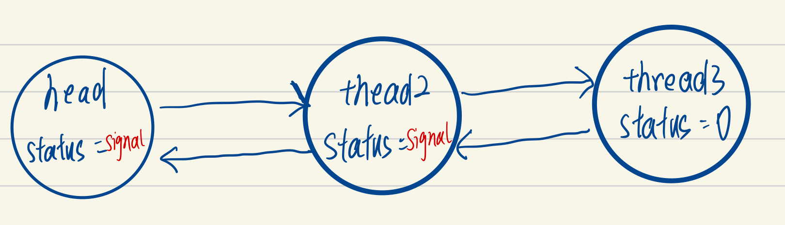

以ReentrantLock，非公平锁为例。

# AQS框架

`AQS`中 维护了一个`volatile int state`（代表共享资源）和一个`FIFO`线程等待队列（多线程争用资源被阻塞时会进入此队列）。

这里`volatile`能够保证多线程下state的可见性，当`state=1`则代表当前对象锁已经被占有，其他线程来加锁时则会失败，加锁失败的线程会被放入一个`FIFO`的等待队列中，比列会被`UNSAFE.park()`操作挂起，等待其他获取锁的线程释放锁才能够被唤醒。

另外`state`的操作**都是通过**`CAS`来保证其并发修改的安全性。

> 不仅是state的操作，Node节点的很多状态位的变化都是CAS操作。

具体原理我们可以用一张图来简单概括：

.PNG)

head头节点起一个占位的作用而已。


# Node节点

```java
volatile int waitStatus;

      
volatile Node prev;

       
volatile Node next;

    
volatile Thread thread;

```

先关注这么几个字段。

waitStatus主要是用于表示节点的状态。默认是0，如果是SIGNAL，则表示**后一个节点**需要park（阻塞）。

> 还有其他的状态，先不管。

# 1：顺利lock的流程

```java
	   final void lock() {
            if (compareAndSetState(0, 1))//进去
                setExclusiveOwnerThread(Thread.currentThread());//进去
            else
                acquire(1);//阻塞才进去
        }
```


## 

抢到执行权的线程，不会创建节点进入阻塞队列。

> 这里提一嘴，很多网上的图都画错了，阻塞队列有正在执行的线程的节点。

# 2：被阻塞的线程

## 2.1：第一个被阻塞的线程

```java
public final void acquire(int arg) {
        if (!tryAcquire(arg) &&
            acquireQueued(addWaiter(Node.EXCLUSIVE), arg))
            selfInterrupt();
    }

// tryAcquire具体实现
final boolean nonfairTryAcquire(int acquires) {
            final Thread current = Thread.currentThread();
            int c = getState();
    		// 1：上一个占有的线程在来到这里时已经退出，现在没有线程占有锁，尝试竞争
            if (c == 0) {
                if (compareAndSetState(0, acquires)) {
                    setExclusiveOwnerThread(current);
                    return true;// 拿到锁直接返回
                }
            }
           // 2：可重入锁，当前线程已持有锁，再次重入，把state++
            else if (current == getExclusiveOwnerThread()) {
                int nextc = c + acquires;
                if (nextc < 0) // overflow
                    throw new Error("Maximum lock count exceeded");
                setState(nextc);
                return true;
            }
            return false;
        }


// 1：因为是第一个阻塞的线程，还没有头节点，先创建头节点
// 2：创建头节点后把自己插在头节点后面
private Node addWaiter(Node mode) {
        Node node = new Node(mode);

        for (;;) {
            Node oldTail = tail;
            if (oldTail != null) {
                U.putObject(node, Node.PREV, oldTail);
                if (compareAndSetTail(oldTail, node)) {
                    oldTail.next = node;
                    return node;
                }
            } else {
                initializeSyncQueue();
            }
        }
    }
```

执行完addWaiter后链表如下：


再执行acquireQueued.

```java

// 1：更改当前节点的前一个节点标志位为SIGNAL
// 2：阻塞当前线程
final boolean acquireQueued(final Node node, int arg) {
        try {
            boolean interrupted = false;
            for (;;) {// 这个循环一般都遍历两次，因为前驱节点的status是0
                final Node p = node.predecessor();// 拿到前驱节点，这里为头节点
                if (p == head && tryAcquire(arg)) {// 这里p==head为true，就尝试获取
                    setHead(node);
                    p.next = null; // help GC
                    return interrupted;
                }
                if (shouldParkAfterFailedAcquire(p, node) &&
                    parkAndCheckInterrupt())// 第二次执行shouldParkAfterFailedAcquire后才进去parkAndCheckInterrupt
                    interrupted = true;
            }
        } catch (Throwable t) {
            cancelAcquire(node);
            throw t;
        }
    }

// 一共会进来两次
// 第一次head的status为0，先把status置为SIGNAL
// 第二次head为SIGNAL了，返回true
private static boolean shouldParkAfterFailedAcquire(Node pred, Node node) {
        int ws = pred.waitStatus;
        if (ws == Node.SIGNAL)
           
            return true;
        if (ws > 0) {
           
            do {
                node.prev = pred = pred.prev;
            } while (pred.waitStatus > 0);
            pred.next = node;
        } else {
           
            pred.compareAndSetWaitStatus(ws, Node.SIGNAL);
        }
        return false;
    }

// 阻塞当前线程
 private final boolean parkAndCheckInterrupt() {
        LockSupport.park(this);
        return Thread.interrupted();
    }
```

执行完acquireQueued后，链表如图：


## 2.2 ：第二个及以后被阻塞的线程

```java
public final void acquire(int arg) {
        if (!tryAcquire(arg) &&
            acquireQueued(addWaiter(Node.EXCLUSIVE), arg))
            selfInterrupt();
    }

// tryAcquire具体实现
final boolean nonfairTryAcquire(int acquires) {
            final Thread current = Thread.currentThread();
            int c = getState();
    		// 1：上一个占有的线程在来到这里时已经退出，现在没有线程占有锁，尝试竞争
    		// 可以看出来，非公平锁是后面来的线程也会尝试去抢锁！！！！！！！！！！！！！！！！！！！！！！！！！！！！
            if (c == 0) {
                if (compareAndSetState(0, acquires)) {
                    setExclusiveOwnerThread(current);
                    return true;// 拿到锁直接返回
                }
            }
           // 2：可重入锁，当前线程已持有锁，再次重入，把state++
            else if (current == getExclusiveOwnerThread()) {
                int nextc = c + acquires;
                if (nextc < 0) // overflow
                    throw new Error("Maximum lock count exceeded");
                setState(nextc);
                return true;
            }
            return false;
        }


// 1：不是第一个阻塞的线程，直接插入尾部
private Node addWaiter(Node mode) {
        Node node = new Node(mode);

        for (;;) {
            Node oldTail = tail;
            if (oldTail != null) {
                U.putObject(node, Node.PREV, oldTail);
                if (compareAndSetTail(oldTail, node)) {
                    oldTail.next = node;
                    return node;
                }
            } else {
                initializeSyncQueue();
            }
        }
    }
```

执行完addWaiter后链表如下：


再执行acquireQueued.

```java
// 1：更改当前节点的前一个节点标志位为SIGNAL
// 2：阻塞当前线程
final boolean acquireQueued(final Node node, int arg) {
        try {
            boolean interrupted = false;
            for (;;) {// 这个循环一般都遍历两次，因为前驱节点的status是0
                final Node p = node.predecessor();// 拿到前驱节点
                if (p == head && tryAcquire(arg)) {// 这里p==head为false
                    setHead(node);
                    p.next = null; // help GC
                    return interrupted;
                }
                if (shouldParkAfterFailedAcquire(p, node) &&
                    parkAndCheckInterrupt())// 第二次执行shouldParkAfterFailedAcquire后才进去parkAndCheckInterrupt
                    interrupted = true;
            }
        } catch (Throwable t) {
            cancelAcquire(node);
            throw t;
        }
    }

// 一共会进来两次
// 第一次前驱节点的status为0，先把status置为SIGNAL
// 第二次前驱节点为SIGNAL了，返回true
private static boolean shouldParkAfterFailedAcquire(Node pred, Node node) {
        int ws = pred.waitStatus;
        if (ws == Node.SIGNAL)
           
            return true;
        if (ws > 0) {
           
            do {
                node.prev = pred = pred.prev;
            } while (pred.waitStatus > 0);
            pred.next = node;
        } else {
           
            pred.compareAndSetWaitStatus(ws, Node.SIGNAL);
        }
        return false;
    }

// 阻塞当前线程
 private final boolean parkAndCheckInterrupt() {
        LockSupport.park(this);
        return Thread.interrupted();
    }
```

执行完acquireQueued后，链表如图：




# 3：释放锁

unlock进去

```java
public final boolean release(int arg) {
        if (tryRelease(arg)) {
            // 释放成功才进入
            Node h = head;
            if (h != null && h.waitStatus != 0)
                unparkSuccessor(h);
            return true;
        }
        return false;
    }

// state值-1
// 如果state降为0，就释放锁
// 否则，代表之前当前占有锁的线程多次重入，那就只是把state-1
protected final boolean tryRelease(int releases) {
            int c = getState() - releases;
            if (Thread.currentThread() != getExclusiveOwnerThread())// 如果当前线程不占有锁又调用释放，就报错
                throw new IllegalMonitorStateException();
            boolean free = false;
            if (c == 0) {
                free = true;
                setExclusiveOwnerThread(null);
            }
            setState(c);
            return free;
        }

private void unparkSuccessor(Node node) {
        
        int ws = node.waitStatus;
        if (ws < 0)
            node.compareAndSetWaitStatus(ws, 0);

        Node s = node.next;// s这时候为head的下一个节点
        // 正常流程不会进入
        if (s == null || s.waitStatus > 0) {
            s = null;
            // 从tail往前遍历取一个可用的节点
            for (Node p = tail; p != node && p != null; p = p.prev)
                if (p.waitStatus <= 0)
                    s = p;
        }
        // 正常流程是唤醒head的下一个节点
        if (s != null)
            LockSupport.unpark(s.thread);
    }
```

unpark之后会从当时park的地方出来继续执行。

```java
// 顺利的话head的下一个节点代表的线程抢到锁
final boolean acquireQueued(final Node node, int arg) {
        try {
            boolean interrupted = false;
            for (;;) {// 出来之后进入循环
                final Node p = node.predecessor();
                if (p == head && tryAcquire(arg)) {// 抢到锁，把当前节点设为头节点
                    setHead(node);
                    p.next = null; // help GC，头节点没有被引用了，可以被GC
                    return interrupted;
                }
                if (shouldParkAfterFailedAcquire(p, node) &&
                    parkAndCheckInterrupt())// 出来
                    interrupted = true;
            }
        } catch (Throwable t) {
            cancelAcquire(node);
            throw t;
        }
    }

private void setHead(Node node) {
        head = node;
        node.thread = null;
        node.prev = null;// help GC
    }
```

