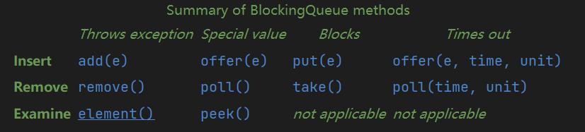

BlockingQueue是一个接口，继承了Queue，BlockingQueue是这样一个队列：

1：支持在队列空时，想取元素时，等待

2：支持在队列满时，想放元素时，等待

BlockingQueue 方法有四种形式，用不同的方式处理**不能立即满足，但可能在未来某个时间点满足**的操作：

一种抛出异常，第二种返回特殊值（null 或 false，取决于操作），第三个无限期地阻塞当前线程，直到操作成功，第四个阻塞，只有达到给定的最大时间限制才放弃。下表总结了这些方法：

注意事项：

1：不接收null，因为null用作poll操作失败的标记

2：BlockingQueue 可能是容量受限的。在任何给定时间，它都可能有一个剩余容量，超出该容量就得在**阻塞**的情况下放置其他元素。没有任何内在容量限制的 BlockingQueue 总是报告 Integer.MAX_VALUE 的剩余容量。

3：BlockingQueue 实现是**线程安全**的。所有queueing method都使用**内部锁或其他形式的并发控制**以**原子方式**实现其效果。但是，批量收集操作 addAll、containAll、retainAll 和 removeAll 不一定以原子方式执行，除非在实现中另外指定。因此，例如，addAll(c) 在仅添加 c 中的一些元素后可能会失败（抛出异常）。

# 一：ArrayBlockingQueue

特点：

1. 内部以数组形式实现，创建时指定一个容量大小，之后不能再更改
2. 当队列空或满时，执行取或放，会阻塞线程
3. 可以指定一个布尔参数指示“线程公平访问”，即线程access的顺序按FIFO，可以避免饥饿，但会降低吞吐量。

# 二：LinkedBlockingDeque

特点：

1. 基于链表，节点在插入时动态创建
2. 指定容量大小是可选的，不指定的话容量是 Integer.MAX_VALUE，即2^31-1

# 三：TransferQueue接口

这是一个接口，继承自BlockingQueue，那它提供了什么特性呢？

**生产者在放元素进去时，如果没有消费者在等待取元素，（生产者）可以阻塞**

即它拓展了这样一个功能：**放元素的线程**如果在放元素时**没有**正在等待取元素的线程就**阻塞**，直到有取元素的线程来。

注：不阻塞的放操作也有，阻塞这个行为是可选的。

# 四：LinkedTransferQueue

TransferQueue的一个基于链表的实现。

# 五：SynchronousQueue

概念和TransferQueue差不多，但因为SynchronousQueue的**容量为0**，所以——所有放元素的线程都阻塞，除非有一个对应的取元素的线程来取，反之亦然。

> A blocking queue in which each insert operation must wait for a corresponding remove operation by another thread, and vice versa.

