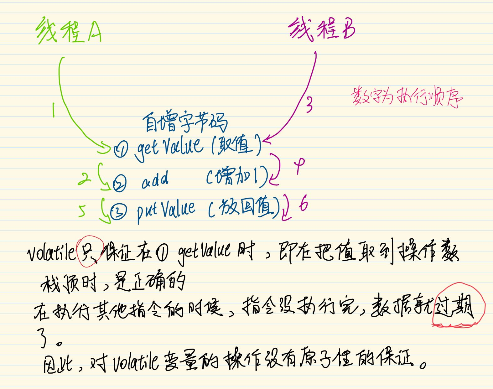
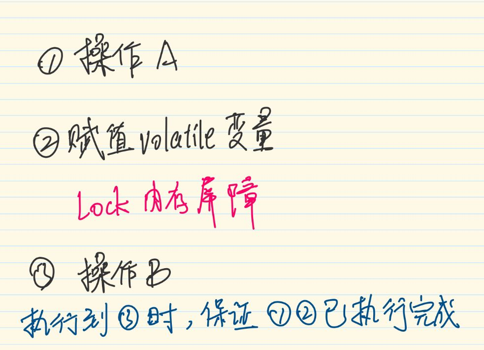
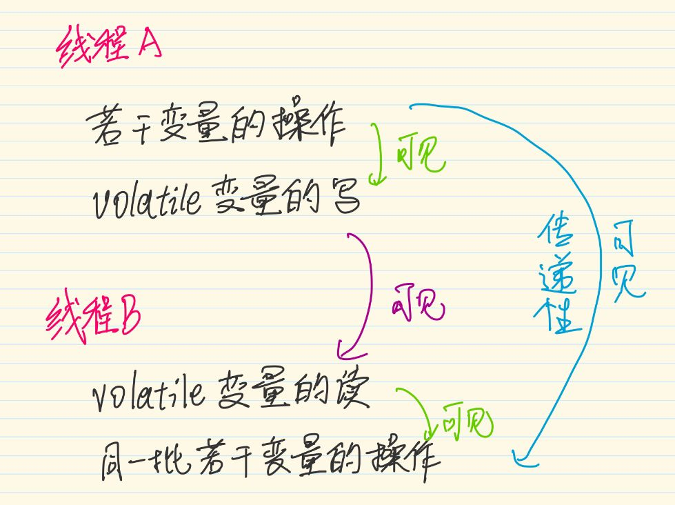

---

---

# Volatile的语义

JDK5之前：保证可见性，不保证有序性，原子性

JDK5之后：保证可见性，有序性，不保证原子性

## 1：可见性的保证

保证此变量对**所有线程**的可见性，这里的“可见性”是指当一条线程修改了这个变量的值，新值对于其他线程来说是可以**立即得知**的。而普通变量并不能做到这一点。

普通变量的值在线程间传递时均需要**通过主内存**来完成。比如，线程A修改一个普通变量的值，然后向主内存进行回写，另外一条线程B在线程A回写完成了之后再对主内存进行读取操作，新变量值才会对线程B可见。而在一般情况下，只会从工作内存中读，写也只写到工作内存，因此可见性不能保证。

但volatile变量写时保证写到工作内存后又写到主内存，读时保证从主内存中读到工作内存再从工作内存读取。

因此：volatile变量在各个线程的**工作内存**中是**不存在一致性**问题的

## 2：为什么不保证原子性

由于Java中的很多操作都不是原子操作，即使有可见性的保证，也不能保证原子性，举个例子，两个线程同时执行对一个变量的自增操作：

## 3：如何保证有序性

在volatile变量的赋值语句的**字节码**后面加上**lock字节码指令**，表示内存屏障，作用是

1. 重排序时不能把后面的指令重排序到内存屏障之前的位置。
2. 把这个CPU的工作内存写入了主内存，该写入动作也会引起别的cpu(或内核)无效化（Invalidate）其缓存，这种操作相当于对缓存中的变量做了一次“store和write”操作 。可让前面volatile变量的修改对其他处理器立即可见。

注：由于有序性的语义在JDK5之后才修复，因此JDK5之前用双锁检测来实现单例是不正确的，因为赋值语句不是原子操作，内部的字节码会重排。

## 4：使用场景

适用场景，结合happen-before原则中关于volatile的那一条：

> volatile变量规则（Volatile Variable Rule）：对一个volatile变量的写操作先行发生于后面对这个变量
> 的读操作，这里的“后面”同样是指时间上的先后。

所以得出volatile适用于一个线程写，多个线程读的情况。

## 5：延申

结合happen-before的另外两条原则：

> 程序次序规则（Program Order Rule）：在一个线程内，按照控制流顺序，书写在前面的操作先行
> 发生于书写在后面的操作。注意，这里说的是控制流顺序而不是程序代码顺序，因为要考虑分支、循
> 环等结构。

> 传递性（Transitivity）：如果操作A先行发生于操作B，操作B先行发生于操作C，那就可以得出
> 操作A先行发生于操作C的结论。

所以：

也就是说在volatile变量写之前的变量都会写回主内存，在volatile变量读之后的内存都会从主内存中读最新的值。