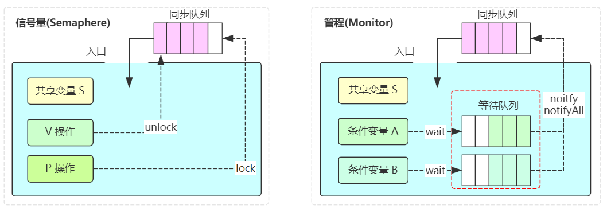

synchronized基于管程模型，管程模型一般包含一个同步队列和一个条件队列（等待队列）。



当持有某个锁对象的线程调用了这个锁对象的wait，自己就进入了这个等待队列中，然后让出锁的持有权。

当持有某个锁对象的线程调用了这个锁对象的notifyAll，就把等待队列中的**所有线程**放入同步队列之中；调用notify，就只是把等待队列中的**一个线程**放入同步队列之中。

而关键点是，只有同步队列中的线程才有竞争锁的资格。

如果调用notify()的话，并且又有多个线程在条件队列之中，调用一次够吗？只会把一个，放到同步队列里。要是后面忘记再调用notify()，那剩下的线程就永远阻塞了。


代码示例：

```java
public class TestConcurrent {


    static volatile int data = 0;


    static Object o = new Object();

    public static void main(String[] args){
        Runnable r1 = () -> {
            synchronized (o) {
                System.out.println("1 开始运行");
                while (data == 0) {
                    try {
                        System.out.println("1  wait");
                        o.wait();
                    } catch (InterruptedException e) {
                        e.printStackTrace();
                    }
                }
                System.out.println("1 结束运行");
            }
        };

        Runnable r2 = () -> {
            synchronized (o) {
                System.out.println("2 开始运行");
                while (data == 0) {
                    try {
                        System.out.println("2  wait");
                        o.wait();
                    } catch (InterruptedException e) {
                        e.printStackTrace();
                    }
                }
                System.out.println("2 结束运行");
            }
        };


        Runnable r3 = () -> {
            synchronized (o) {
                System.out.println("3 开始运行");
                data++;
                System.out.println("3  notify");//
                o.notify();// 等下换成notifyAll()
                System.out.println("3 结束运行");
            }
        };


        Thread a = new Thread(r1);
        Thread b = new Thread(r2);
        Thread c = new Thread(r3);

        a.start();
        b.start();
        // 保证a,b已阻塞住才开始c
        try {
            Thread.sleep(1000);
        } catch (InterruptedException e) {
            e.printStackTrace();
        }
        c.start();

        // 避免主线程结束
        try {
            Thread.sleep(100000);
        } catch (InterruptedException e) {
            e.printStackTrace();
        }
    }
}
```

如果是线程c执行的是notify()，看看输出：

```java
1 开始运行
1  wait
2 开始运行
2  wait
3 开始运行
3  notify
3 结束运行
1 结束运行
```

结论是，c调用的notify()只把a移出条件队列，而c和a都结束之后，没人唤醒b。


换成notifyAll看看，

```java
1 开始运行
1  wait
2 开始运行
2  wait
3 开始运行
3  notifyAll
3 结束运行
2 结束运行
1 结束运行
```

结论是，a和b都被移出条件队列进入同步队列，c结束运行时，a和b竞争锁，然后b抢到，b结束后c拿到锁继续执行。


贴上notifyAll和notify的注释

```
// notifyAll
1: Wakes up all threads that are waiting on this object's monitor. (A thread waits on an object's monitor by calling one of the wait methods.)

2: The awakened threads will not be able to proceed until the current thread relinquishes the lock on this object. 

3: The awakened threads will compete in the usual manner with any other threads that might be actively competing to synchronize on this object; for example, the awakened threads enjoy no reliable privilege or disadvantage in being the next thread to lock this object.

4: This method should only be called by a thread that is the owner of this object's monitor. See the notify method for a description of the ways in which a thread can become the owner of a monitor.

// notify
1: Wakes up a single thread that is waiting on this object's monitor. If any threads are waiting on this object, one of them is chosen to be awakened. 

2: The choice is arbitrary and occurs at the discretion of the implementation. A thread waits on an object's monitor by calling one of the wait methods.

3: The awakened thread will not be able to proceed until the current thread relinquishes the lock on this object. The awakened thread will compete in the usual manner with any other threads that might be actively competing to synchronize on this object; for example, the awakened thread enjoys no reliable privilege or disadvantage in being the next thread to lock this object.

4: This method should only be called by a thread that is the owner of this object's monitor. A thread becomes the owner of the object's monitor in one of three ways:
```

差别主要是第一行的**Wakes up all threads**和**Wakes up a single thread**。