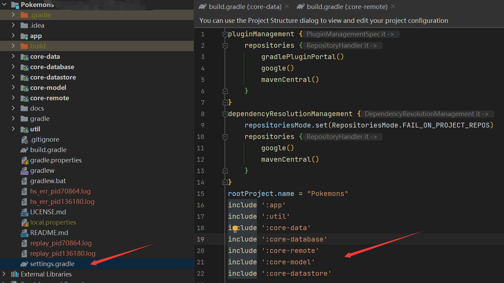
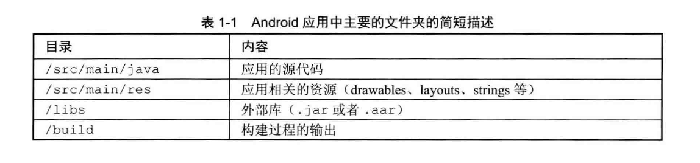

## 项目和任务

在Gradle中，最重要的两个概念是**项目和任务**。每一次构建都包括至少一个项目，每一个项目又包括一个或多个任务。

**每个build.gradle文件都代表着一个项目**，任务定义在构建脚本里。当初始化构建过程时，Gradle会基于build 文件组装项目和任务对象。一个任务对象包含一系列动作对象，这些动作对象之后会按顺序执行。一个单独的动作对象就是一个待执行的代码块，它和 Java中的方法类似。

## 构建生命周期

执行一个Gradle构建的最简单的形式是，只执行任务中的动作，而这些任务又依赖于其他任务。为了简化构建过程，构建工具会新建一个动态的模型流，叫作 Directed AcyclicGraph(DAG)。这意味着所有的任务都会被一个接一个地执行，**循环是不可能的**。一旦一个任务被执行，其就不会被再次执行。那些没有依赖的任务通常会被优先执行。在构建的配置阶段会生成依赖关系图。一个Gradle的构建通常有如下三个阶段。

1. 初始化:项目实例会在该阶段被创建。如果一个项目有多个模块，并且每一个模块都有其对应的build.gradle文件，那么就会创建多个项目实例。
2. 配置:在该阶段，构建脚本会被执行，并为每个项目实例创建和配置任务。
3. 执行:在该阶段，Gradle将决定哪个任务会被执行。哪些任务被执行取决于开始该次构建的参数配置和该Gradle文件的当前目录。

## 项目结构

Gradle项目通常会在根目录下创建一个gradle脚本文件，这使得其在后续阶段**新增模块**变得更加简单。

所有的应用源代码都在app文件夹下。该文件夹名称默认情况下也是模块的名称.但是其不必被命名为app。例如，当你使用Android Studio创建一个手机应用和一个Android智能可穿戴手表应用项目时，默认情况下模块会被叫作 application和 wearable。

