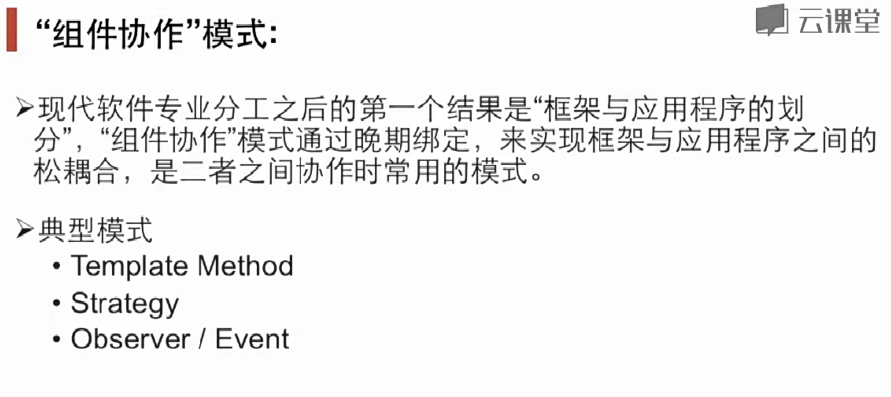
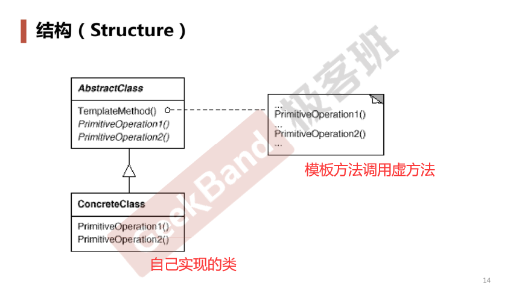
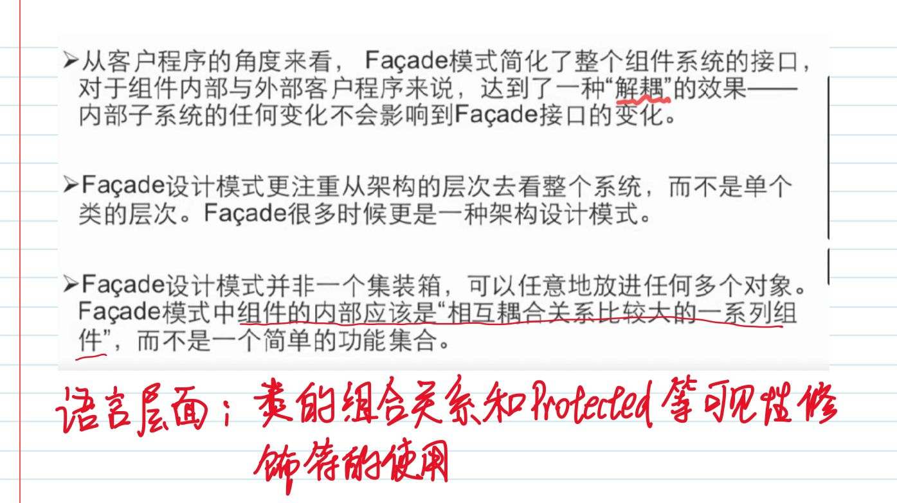
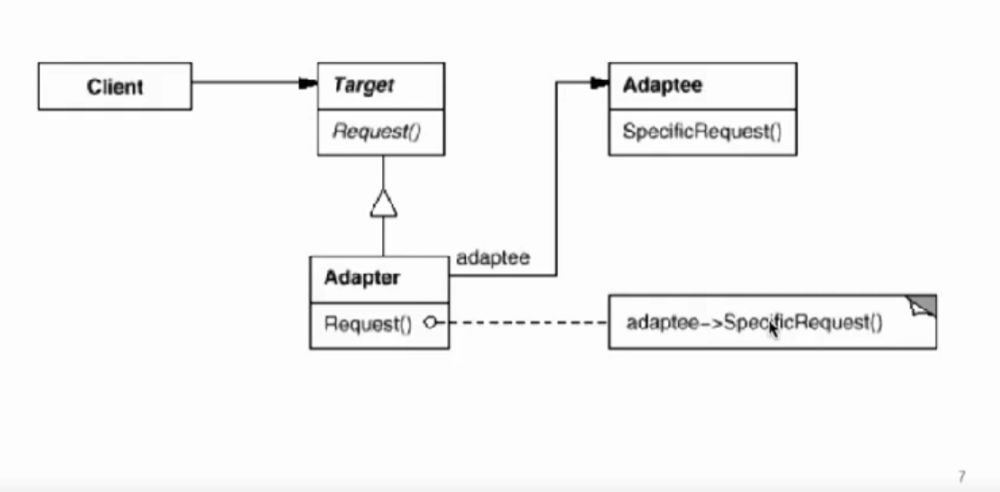

# 设计模式 

[TOC]


## 一：前言

### 使用设计模式的目的

设计模式的目的：

1. 使代码**可复用**。不能以算法的思想去学。所有的设计模式都是以复用性为基础，然后再来寻求**面向对象的抽象设计方案**。有可能我们在使用面向对象的语言，仍然使用着结构化的思维，所以要培养面向对象的思维。
2. 基本上都是在寻求低耦合度的代码写法。

### 应用设计模式的时机


有时候第一次写这段代码时没有用设计模式，这个很正常，因为写这段代码时还没有感受到变化。应用设计模式可以在需求变更时更好的组织代码和提高代码的可维护性。

### 重构时要关注的点


如果代码中由左边的情况，尽量使用设计模式转到右边。

解耦的要诀：


### 面向对象设计原则

面向对象的特征：

1. 封装：隐藏内部实现
2. 继承：复用现有代码
3. 多态：改写对象行为

原则：

1）


依赖倒置原则使我想到一个例子，在仓库模式之中，ViewModel是高层模块，Repository是低层模块，然后我之前的一个错误做法就是用依赖注入给ViewModel注入具体实现，比如说：

```
class MyViewModel(val realRepository: RealRepository){...}
```

但低层模块是会变化的，当我想测试时，我想提供一个假数据的repository比如说FakeRepository，那么这个时候我就要更改ViewModel的实现，转而依赖FakeRepository。

但假如我应用**二者都应该依赖抽象**，我创建一个抽象的Repository类，里面定义抽象方法，然后ViewModel依赖这个抽象的类，我可以随意创建子类来实现repository类，然后我需要什么，就更改传进ViewModel里面的具体实现就行了。

这样软件的稳定性就得到了提高。

其实这里还使用了第6点和8点。


2）


一个设计良好的类，利用各种修饰符，protected, abstract...天然就是符合开放封闭原则的。


3）


这个其实挺难应用的，有时候一个类只承担一个职责，当代码很简单的时候，却要写多个类，会在早期过度设计。


4）


5）


6）


其实这些原则要结合在一起看的，如果组合的类之间只暴露必要的接口（第五条），那么组合可以使得代码之间更清晰，耦合度低。


7）


8）


### 为什么面向对象

变化是复用的天敌！面向对象设计模式的最大优势在于——**抵御变化**，


## 二：设计模式的分类


因为设计模式出现的比较早，而Java等语言的某一些特性更新更便捷，所以一些设计模式已过时（标灰色）。

## 三：组件协作模式



### 1：Template Method

在Android中的Activity的构建流程之中，有各种handleLaunchActivity以及handleResumeActivity这些方法（稳定），这些其实就是template method——模板方法，在这些方法里面，会调用onCreate，onResume等（变化），这些方法是可以被我们应用程序重写的。这样——就在一个固定的流程之中，通过我们override某些方法，来使流程之中的操作产生了变化。

Android的这个Activity设计就用到了**模板方法**的设计模式。在Android中以on...开头的方法**大多数都是模板方法的应用**。

结构化程序流程应用模板方法的重构


模板方法的类图：



模板方法的思想：

> Template Method模式是一种非常基础性的设计模式，在面向对象系统中有着大量的应用。它用最简洁的机制（虚函数的多态性）为很多应用程序框架提供了灵活的扩展点，是代码复用方面的基本实现结构。
>
> 除了可以灵活应对子步骤的变化外，**“不要调用我，让我来调用你”的反向控制结构**是Template Method的典型应用。
>
> 在具体实现方面，被Template Method调用的虚方法可以具有实现，也可以没有任何实现(抽象方法、纯虚方法），但一般推荐将它们设置为protected方法。

### 2：策略模式

比如说，java中Array类的sort方法，要提供一个Compartor，其实就是策略模式的应用，如果不用策略模式，那在sort里面此不是要写很多if else来判断类型？而且也不支持拓展了。

另外还有一个例子就是Android中的那个动画，在Compose的那个动画中，可以设置弹簧动画也可以设置Tween动画，也是策略模式的应用——根据指定的不同策略来表现不同的动画效果。

```kotlin
if (signupScreenState.value.isLoading) {
            // 可以提供不同策略
//            rotateDegree.animateTo(360f, infiniteRepeatable(
//                TweenSpec(300)
//            ))
            rotateDegree.animateTo(360f, SpringSpec())
        }
```


### 3：Observer/Event，观察者模式

例子1：TextField的onTextChangedListener

例子2：LiveData，带上生命周期的观察者模式

其他带有addXXXListener的方法......

## 四：单一职责模式

### 1：装饰模式

例子：Java的IO库的InputStream和OutputStream。

> 在某些情况下我们可能会“过度地使用继承来扩展对象的功能”由于继承为类型引入的静态特质，使得这种扩展方式缺乏灵活性;并且随着子类的增多（扩展功能的增多)，各种子类的组合（扩展功能的组合）会导致更多子类的膨胀。

错误的例子：

```java
//业务操作
abstract class Stream {
    public abstract char read(int number);

    public abstract void seek(int position);

    public abstract void write(char data);

}

//主体类
class FileStream extends Stream {
    //读文件流
    @Override
    public  char read(int number){
        //***********
    }

    //定位文件流
    @Override
    public  void seek(int position){
        //***********
    }

    //写文件流
    @Override
    public  void write(char data){
        //***********
    }

}

class NetworkStream extends Stream {
    //读文件流
    @Override
    public  char read(int number){
        //###########
    }

    //定位文件流
    @Override
    public  void seek(int position){
        //###########
    }

    //写文件流
    @Override
    public  void write(char data){
        //###########
    }
}


class MemoryStream extends Stream {
    //读文件流
    @Override
    public  char read(int number){
        //@@@@@@@@@@@

    }

    //定位文件流
    @Override
    public  void seek(int position){
        //@@@@@@@@@@@
    }

    //写文件流
    @Override
    public  void write(char data){
        //@@@@@@@@@@@
    }
}


//扩展操作
class CryptoFileStream extends FileStream {

    @Override
    public char read(int number) {
        //额外的加密操作...

        //读文件流
        super.read(number);

    }

    @Override
    public void seek(int position) {
        //额外的加密操作...

        //定位文件流
        super.seek(position);

        //额外的加密操作...

    }

    //写内存流
    @Override
    public void write(char data) {
        //额外的加密操作...

        //写文件流
        super.write(data);

        //额外的加密操作...
    }
}

class CryptoNetworkStream extends NetworkStream {


    @Override
    public char read(int number) {
        //额外的加密操作...

        //读网络流
        super.read(number);
    }

    @Override
    public void seek(int position) {
        //额外的加密操作...

        //定位网络流
        super.seek(position);

        //额外的加密操作...
    }


    @Override
    public void write(char data) {
        //额外的加密操作...

        //写网络流
        super.write(data);

        //额外的加密操作...
    }
}


class CryptoMemoryStream extends MemoryStream {


    @Override
    public char read(int number) {
        //额外的加密操作...

        //读内存流
        super.read(number);
    }

    @Override
    public void seek(int position) {
        //额外的加密操作...

        //定位内存流
        super.seek(position);

        //额外的加密操作...
    }

    //写内存流
    @Override
    public void write(char data) {
        //额外的加密操作...

        //写内存流
        super.write(data);

        //额外的加密操作...
    }
}


class BufferedFileStream extends FileStream {

}

class BufferedNetworkStream extends NetworkStream {

}

class BufferedMemoryStream extends MemoryStream {

}

class CryptoBufferedFileStream extends FileStream {


    @Override
    public char read(int number) {
        //额外的加密操作...
        //额外的缓冲操作...

        //读文件流
        super.read(number);

        //额外的加密操作...
        //额外的缓冲操作...

    }

    @Override
    public void seek(int position) {
        //额外的加密操作...
        //额外的缓冲操作...
        //定位文件流

        super.seek(position);

        //额外的加密操作...
        //额外的缓冲操作...
    }

    @Override
    public void write(char data) {
        //额外的加密操作...
        //额外的缓冲操作...

        //写文件流
        super.write(data);
        
        //额外的加密操作...
        //额外的缓冲操作...
    }
}


class Client {

    public static void main(String args[]) {

        //编译时装配
        CryptoFileStream fs1 = new CryptoFileStream();

        BufferedFileStream fs2 = new BufferedFileStream();

        CryptoBufferedFileStream fs3 = new CryptoBufferedFileStream();

    }
}
```

缺点

1. 这个继承关系使得有很多的代码没有复用，比如说那些加密/缓冲操作，其实都是相同的。
2. 类的数量急剧上升


重构：

> 如何使“对象功能的扩展”能够根据需要来动态地实现?同时避免“扩展功能的增多”带来的子类膨胀问题?从而使得任何“功能扩展变化”所导致的影响将为最低?

根据重构技法，我们要朝着：编译时依赖——> 运行时依赖，静态——> 动态 的目标前进，在继承时，调用super.func()属于编译时依赖，因为super的类型是确定的，不够灵活，所以我们要**继承转组合**，在拓展类中加一个Stream类型的字段，然后为了**满足接口调用的统一**，拓展类再继承Stream类。

```java
//业务操作
abstract class Stream {
    public abstract char read(int number);

    public abstract void seek(int position);

    public abstract void write(char data);

}

//主体类
class FileStream extends Stream {
    //读文件流
    @Override
    public  char read(int number){
        //***********
    }

    //定位文件流
    @Override
    public  void seek(int position){
        //***********
    }

    //写文件流
    @Override
    public  void write(char data){
        //***********
    }

}

class NetworkStream extends Stream {
    //读文件流
    @Override
    public  char read(int number){
        //###########
    }

    //定位文件流
    @Override
    public  void seek(int position){
        //###########
    }

    //写文件流
    @Override
    public  void write(char data){
        //###########
    }
}


class MemoryStream extends Stream {
    //读文件流
    @Override
    public  char read(int number){
        //@@@@@@@@@@@

    }

    //定位文件流
    @Override
    public  void seek(int position){
        //@@@@@@@@@@@
    }

    //写文件流
    @Override
    public  void write(char data){
        //@@@@@@@@@@@
    }
}


//继承：接口协议
class CryptoStream extends Stream  {

    //组合：复用实现
    Stream s;// s=new FileStream(); s=new NetworkStream(); s=new MemoryStream();

    public CryptoStream(Stream s)
    {
        this.s=s;
    }

    @Override
    public char read(int number) {
        //额外的加密操作...

        //读文件流
        s.read(number);

    }

    @Override
    public void seek(int position) {
        //额外的加密操作...

        //定位文件流
        s.seek(position);

        //额外的加密操作...

    }

    //写内存流
    @Override
    public void write(char data) {
        //额外的加密操作...

        //写文件流
        s.write(data);

        //额外的加密操作...
    }
}


class BufferedStream extends Stream {
    Stream s;

    public BufferedStream(Stream s)
    {
        this.s=s;
    }

}


class Client {

    public static void main(String args[]) {

        //运行时装配

        Stream s1=new CryptoStream( new FileStream());

        Stream fs2 = new BufferedStream(new FileStream());

        Stream fs3 = new CryptoStream(new BufferedStream(new FileStream()));


    }
}
```

优点：

1. 复用拓展类的代码
2. 类的数量大大减少


进一步，在拓展类中都有一个Stream类型的字段，我们再把这个**既组合父类也继承父类**的特性抽象出来，成为一个Decorator类。

```java
//业务操作
abstract class Stream {


    public abstract char read(int number);

    public abstract void seek(int position);

    public abstract void write(char data);

}

//主体类
class FileStream extends Stream {
    //读文件流
    @Override
    public  char read(int number){
        //***********
    }

    //定位文件流
    @Override
    public  void seek(int position){
        //***********
    }

    //写文件流
    @Override
    public  void write(char data){
        //***********
    }

}

class NetworkStream extends Stream {
    //读文件流
    @Override
    public  char read(int number){
        //###########
    }

    //定位文件流
    @Override
    public  void seek(int position){
        //###########
    }

    //写文件流
    @Override
    public  void write(char data){
        //###########
    }
}


class MemoryStream extends Stream {
    //读文件流
    @Override
    public  char read(int number){
        //@@@@@@@@@@@

    }

    //定位文件流
    @Override
    public  void seek(int position){
        //@@@@@@@@@@@
    }

    //写文件流
    @Override
    public  void write(char data){
        //@@@@@@@@@@@
    }
}

//继承：接口协议
abstract  DecoratorStream extends Stream{
    //组合：复用实现
    protected Stream s;// s=new FileStream(); s=new NetworkStream(); s=new MemoryStream();

    protected DecoratorStream(Stream s){
        this.s=s;
    }
}


class CryptoStream extends DecoratorStream  {


    public CryptoStream(Stream s)
    {
        super(s);
    }

    @Override
    public char read(int number) {
        //额外的加密操作...

        //读文件流
        s.read(number);

    }

    @Override
    public void seek(int position) {
        //额外的加密操作...

        //定位文件流
        s.seek(position);

        //额外的加密操作...

    }

    //写内存流
    @Override
    public void write(char data) {
        //额外的加密操作...

        //写文件流
        s.write(data);

        //额外的加密操作...
    }
}


class BufferedStream extends DecoratorStream {
    Stream s;

    public BufferedStream(Stream s)
    {
        super(s);
    }

    //....
}


class Client {

    public static void main(String args[]) {

        //运行时装配

        FileStream fs=new FileStream();

        Stream s1=new CryptoStream( new FileStream());

        Stream s2 = new BufferedStream(new FileStream());

        Stream s3 = new CryptoStream(new BufferedStream(new FileStream()));


    }
}
```


红色是不变的，蓝色是变化点。

应用装饰模式可以方便地复用拓展代码。


### 2：桥模式

首先来看一份错误的代码

```java

abstract class Messager {

    public abstract void login(String username, String password);

    public abstract void sendMessage(String message);

    public abstract void sendPicture(Image image);


    public abstract void playSound();

    public abstract void drawShape();

    public abstract void writeText();

    public abstract void connect();

}


//1+n+n*m =1+5+5*5= 31

//平台实现
abstract class PCMessagerBase extends Messager {


    @Override
    public void playSound() {
        //**********
    }

    @Override
    public void drawShape() {
        //**********
    }

    @Override
    public void writeText() {
        //**********
    }

    @Override
    public void connect() {
        //**********
    }

}


abstract class MobileMessagerBase extends Messager {


    @Override
    public void playSound() {
        //==========
    }

    @Override
    public void drawShape() {
        //==========
    }

    @Override
    public void writeText() {
        //==========
    }

    @Override
    public void connect() {
        //==========
    }

}


//业务抽象
class PCMessagerLite extends PCMessagerBase {
    @Override
    public void login(String username, String password) {
        super.connect();
        //........
    }

    @Override
    public void sendMessage(String message) {
        super.writeText();
        //........
    }

    @Override
    public void sendPicture(Image image) {
        super.drawShape();
        //........
    }
}


class PCMessagerPerfect extends PCMessagerBase {
    @Override
    public void login(String username, String password) {
        super.playSound();
        //********
        super.connect();
        //........
    }

    @Override
    public void sendMessage(String message) {
        super.playSound();
        //********
        super.writeText();
        //........
    }

    @Override
    public void sendPicture(Image image) {
        super.playSound();
        //********
        super.drawShape();
        //........
    }
}


class MobileMessagerLite extends MobileMessagerBase {
    @Override
    public void login(String username, String password) {
        super.connect();
        //........
    }

    @Override
    public void sendMessage(String message) {
        super.writeText();
        //........
    }

    @Override
    public void sendPicture(Image image) {
        super.drawShape();
        //........
    }
}


class MobileMessagerPerfect extends MobileMessagerBase {
    @Override
    public void login(String username, String password) {
        super.playSound();
        //********
        super.connect();
        //........
    }

    @Override
    public void sendMessage(String message) {
        super.sendMessage(message);
        //********
        super.writeText();
        //........
    }

    @Override
    public void sendPicture(Image image) {
        super.playSound();
        //********
        super.drawShape();
        //........
    }
}


class Client {

    public static void main(String args[]) {

        //编译时装配
        Messager m = new MobileMessagerPerfect();
    }
}

```

上面代码的类图如下所示：


缺点：

1. 职责划分不清晰，Messager同时含有两个维度的功能，老师称一个维度的功能为**业务部分**，一个为**实现部分**。这两个部分应该拆开分成两个类的，但在这里却集成到一个类中，违背了单一职责原则。
2. 类的数量急剧膨胀。


改良之后的代码：

```java

abstract class Messager {


    protected MessagerImp msgImp;


    protected  Messager(MessagerImp msgImp){
        this.msgImp=msgImp;
    }

    public abstract void login(String username, String password);
    public abstract void sendMessage(String message);
    public abstract void sendPicture(Image image);

}

abstract class MessagerImp{

    public abstract void playSound();
    public abstract void drawShape();
    public abstract void writeText();
    public abstract void connect();
}


//1+1+n+m =1+1+5+5= 12

//平台实现
class PCMessagerImp extends MessagerImp {


    @Override
    public void playSound() {
        //**********
    }

    @Override
    public void drawShape() {
        //**********
    }

    @Override
    public void writeText() {
        //**********
    }

    @Override
    public void connect() {
        //**********
    }

}


class MobileMessagerImp extends MessagerImp {


    @Override
    public void playSound() {
        //==========
    }

    @Override
    public void drawShape() {
        //==========
    }

    @Override
    public void writeText() {
        //==========
    }

    @Override
    public void connect() {
        //==========
    }

}


//业务抽象
class MessagerLite extends Messager  {


    @Override
    public void login(String username, String password) {
        msgImp.connect();
        //........
    }

    @Override
    public void sendMessage(String message) {
        msgImp.writeText();
        //........
    }

    @Override
    public void sendPicture(Image image) {
        msgImp.drawShape();
        //........
    }
}


class MessagerPerfect extends Messager {


    @Override
    public void login(String username, String password) {
        msgImp.playSound();
        //********
        msgImp.connect();
        //........
    }

    @Override
    public void sendMessage(String message) {
        msgImp.playSound();
        //********
        msgImp.writeText();
        //........
    }

    @Override
    public void sendPicture(Image image) {
        msgImp.playSound();
        //********
        msgImp.drawShape();
        //........
    }
}


class Client {

    public static void main(String args[]) {

        //运行时装配
        Messager m = new MessagerPerfect( new PCMessagerImp());
    }
}

```


桥接模式在Android中应用相当广泛，但一般而言都是作用于大范围的，我们可以在源码中找到很多桥接模式的应用。比如在View的视图层级中，CheckBox、CompoundButton、Button、TextView和View之间构成一个继承关系的视图层级，每一层视图都仅仅是对一种类型控件的描述，其定义了该控件所拥有的基本属性和行为，但是将它们真正绘制到屏幕的部分是由与View相关的功能实现类DisplayList、HardwareLayer和Canvas负责。这两部分之间的关系可以看做是对桥接模式的应用。

在framework层面，有没有对桥接模式比较经典的应用呢？答案是肯定的。

比较典型的就是Window与WindowManager之间的关系

 


Window和PhoneWindow可以理解为一个维度——业务部分，WindowManager可以理解为另一个维度——某个功能的实现部分。

## 五：对象创建模式

> 通过“对象创建”模式绕开new，来避免对象创建(new）过程中所导致的紧耦合（依赖具体类），从而支持对象创建的稳定。它是接口抽象之后的第一步工作。

### 1：工厂方法

### 2：抽象工厂

看一段代码：

```java

public class EmployeeDAO {

    public Vector<EmployeeDO> getEmployeeDOs() {
        MySqlConnection connection=new MySqlConnection();
        connection.setConnectionString("...");

        MySqlCommand command=new MySqlCommand();
        command.setCommandText("...");
        command.setConnection(connection);

        MySqlDataReader reader=command.executeReader();
        while (reader.read()){

        }

        return employeeDOs;
    }

}
```

在进行数据库操作时，往往要new一些对象，但我们说这个对象其实是静态依赖的，和主要的业务代码紧耦合。

> 在软件系统中，经常面临着创建对象的工作;由于需求的变化，需要创建的对象的具体类型经常变化。
>
> 如何应对这种变化?如何绕过常规的对象创建方法(new)，提供一种“封装机制”来避免客户程序和这种“具体对象创建工作”的紧耦合?

这个时候可以使用**工厂方法**：

> 定义一个用于创建对象的接口，让子类决定实例化哪一个类。Factory Method使得一个类的实例化延迟（目的:解耦，手段:虚函数）到子类（具体的Factory）。

```java
//数据库访问有关的基类
abstract class IDBConnection {

}

abstract class IDBConnectionFactory {
    public abstract IDBConnection createDBConnection();
}


abstract class IDBCommand {
}

abstract class IDBCommandFactory {
    public abstract IDBCommand createDBCommand();
}


abstract class IDataReader {

}

abstract class IDataReaderFactory {
    public abstract IDataReader createDataReader();
}


//支持My SQL
class MySqlConnection extends IDBConnection {

}
class MySqlCommand extends IDBCommand {

}
class MySqlDataReader extends IDataReader {

}

class MySqlConnectionFactory extends IDBConnectionFactory {

    @Override
    public IDBConnection createDBConnection() {
        return new MySqlConnection();
    }
};

class MySqlCommandFactory extends IDBCommandFactory {

    @Override
    public IDBCommand createDBCommand() {
        return new MySqlCommand();
    }
}

class MySqlDataReaderFactory extends IDataReaderFactory {

    @Override
    public IDataReader createDataReader() {
        return new MySqlDataReader();
    }
}


//支持Oracle
class OracleConnection extends IDBConnection {

}
class OracleCommand extends IDBCommand {

}
class OracleDataReader extends IDataReader {

}

class OracleConnectionFactory extends IDBConnectionFactory {

}

class OracleCommandFactory extends IDBCommandFactory {

}

class OracleDataReaderFactory extends IDataReaderFactory {

}


class EmployeeDAO {
    IDBConnectionFactory dbConnectionFactory;
    IDBCommandFactory dbCommandFactory;
    IDataReaderFactory dataReaderFactory;

    public Vector<EmployeeDO> getEmployees() {

        IDBConnection connection = dbConnectionFactory.createDBConnection();
        connection.setConnectionString("...");

        IDBCommand command = dbCommandFactory.createDBCommand();
        command.setCommandText("...");
        command.setConnection(connection);//关联性

        IDBDataReader reader = command.executeReader();//关联性
        while (reader.read()) {

        }

        return employeeDOs;
    }

}
```

缺点：

工厂方法解决**单个对象**的需求变化，在上面那个例子中，connection,command,datareader这三个其实是互相依赖很密切的对象，所以我们可以进一步优化。

这个时候可以使用**抽象工厂**：

> 在软件系统中，经常面临着“一系列相互依赖的对象”的创建工作;同时，由于需求的变化，往往存在更多系列对象的创建工作。
>
> 如何应对这种变化?如何绕过常规的对象创建方法(new)，提供一种“封装机制”来避免客户程序和这种“多系列具体对象创建工作”的紧耦合?

```java

//数据库访问有关的基类
class IDBConnection{

}

class IDBCommand{

}

class IDataReader{

}


abstract class IDBFactory{
    public abstract IDBConnection createDBConnection();
    public abstract IDBCommand createDBCommand();
    public abstract IDataReader createDataReader();
    

}

//支持My SQL
class MySqlConnection extends IDBConnection{

}
class MySqlCommand extends IDBCommand{

 }
class MySqlDataReader extends IDataReader{

}


class MySqlDBFactory extends IDBFactory{

    @Override
    public IDBConnection createDBConnection() {
        return new MySqlConnection();
    }

    @Override
    public IDBCommand createDBCommand() {
        return new MySqlCommand();
    }

    @Override
    public IDataReader createDataReader() {
        return new MySqlDataReader();
    }


 }

//支持Oracle
class OracleConnection extends IDBConnection{

}

class OracleCommand extends IDBCommand{

}

class OracleDataReader extends IDataReader{

}

class OracleDBFactory extends IDBFactory{

    @Override
    public IDBConnection createDBConnection() {
        return new OracleConnection();
    }

    @Override
    public IDBCommand createDBCommand() {
        return new OracleCommand();
    }

    @Override
    public IDataReader createDataReader() {
        return new OracleDataReader();
    }
}


class EmployeeDAO{
    IDBFactory dbFactory;
    public Vector<EmployeeDO> getEmployees(){
        IDBConnection connection = dbConnectionFactory.createDBConnection();
        connection.setConnectionString("...");

        IDBCommand command = dbCommandFactory.createDBCommand();
        command.setCommandText("...");
        command.setConnection(connection);//关联性

        IDBDataReader reader = command.executeReader();//关联性
        while (reader.read()) {


        }

        return employeeDOs;
    }
}
```

抽象工厂的类图是：


在实例代码中，分为支持Mysql和oracle的两个系列

1. 如果没有应对“多系列对象构建”的需求变化，则没有必要使用Abstract Factory模式，这时候使用简单的工厂完全可以。
2. “系列对象”指的是在某一特定系列下的对象之间有相互依赖、或作用的关系。不同系列的对象之间不能相互依赖。
3. Abstract Factory模式主要在于应对“新系列”的需求变动。其缺点在于难以应对“新对象”的需求变动。也就是说，可以随意创建IDBFactory的子类，但IDBFactory本身应该是相对稳定的。

### 3：原型模式

略

## 六：对象性能模式

> 中心思想是共享对象来提高性能

### 1：单例模式

[Java中实现单例模式](https://www.cnblogs.com/--here--gold--you--want/p/15779594.html)

### 2：FlyWeight享元模式

> 运用共享技术有效地支持大量细粒度的对象。

1. 面向对象很好地解决了抽象性的问题，但是作为一个运行在机器中的程序实体，我们需要考虑对象的代价问题。Flyweight主要解决面向对象的**代价问题**，一般不触及面向对象的抽象性问题。
2. Flyweight采用**对象共享**的做法来降低系统中对象的个数，从而降低细粒度对象给系统带来的内存压力。在具体实现方面，要注意对象状态的处理。
3. 对象的数量太大从而导致对象内存开销加大——什么样的数量才算大?这需要我们仔细的根据具体应用情况进行评估，而不能凭空臆断。

这个模式的难点不在于实现，而在于要不要做，假如共享对象而使用某些数据结构（list, map）的开销反而大于创建对象的开销，就没必要使用。

看一个例子：

```java

public class Font {

    private String key;

    private String name;
    private String decorator;
    private boolean isBold;
    private int size;

    public Font(String key){
        //...
    }
}

public class FontFactory{

    private Map<String, Font> fonts = new ConcurrentHashMap<String, Font>();

    public Font getFont(String key) {

        if (!fonts.containsKey(key)) {
            fonts.put(key, new Font(key));
        }

        return fonts.get(key);
    }

}
```

采用共享对象的做法，减少了Font的开销。

享元模式在Java中的应用例子：

```java
class Client{
    public static void main(String[] args) {

        String s1="Hello,World";
        String s2="Hello,World";

        String s3=getString();
        s3=s3.intern();
    }

    public static String getString()
    {
        //...

        return "";
    }
}
```

编译器应用享元模式，减少字符串字面量的创建开销，使用字符串常量池共享。

还有Message.obtain在handler机制上的复用，以及Okhttp连接池的复用以及线程池的线程复用都算是。

#### 计算对象大小的方法

对于64位HotSpot虚拟机

**对象大小 = 对象头 + 实例数据 + 对齐填充**

1）对象头

对象头在64位系统占 16B

2）实例数据

原生类型(primitive type)的内存占用如下：

| Primitive Type | Memory Required(bytes)                               |
| -------------- | ---------------------------------------------------- |
| boolean        | 在数组中占1个字节，单独使用时占4个字节（虚拟机规范） |
| byte           | 1                                                    |
| short          | 2                                                    |
| char           | 2                                                    |
| int            | 4                                                    |
| float          | 4                                                    |
| long           | 8                                                    |
| double         | 8                                                    |

reference类型在64位系统上每个占用8B。

3）对齐填充

8字节对齐


若开启**指针压缩**：

1）对象头：16B ——> 12B

2) reference类型：8B ——>4B


注：记得加上继承下来的字段


## 七：接口隔离模式

> 在组件构建过程中，某些接口之间直接的依赖常常会带来很多问题、甚至根本无法实现。采用添加一层间接（稳定）接口，来隔离本来互相紧密关联的接口是一种常见的解决方案。


### 1：门面模式


> 内部**高内聚**，对外松耦合
>



### 2：代理模式

可以查看retrofit那个markdown

### 3：适配器模式

**利用封装的思想，来使旧代码或无关代码符合新接口（或者某一个框架要求的接口）要求**



例子：

RecyclerView adapter

## 八：状态变化模式

### 1：状态模式

> 在软件构建过程中，某些对象的状态如果改变，其行为也会随之而发生变化，比如文档处于只读状态，其支持的行为和读写状态支持的行为就可能完全不同。
>
> 如何在运行时根据对象的状态来透明地更改对象的行为?而不会为对象操作和状态转化之间引入紧耦合?

[状态模式讲解](https://m.yisu.com/zixun/69591.html)

感觉类的数量提升有点多啊这个模式


## 九：数据结构模式

### 1：组合模式

> 将对象组合成树形结构以表示“部分-整体”的层次结构。Composite使得用户对单个对象和组合对象的使用具有一致性（稳定）。

**意图：**将对象组合成树形结构以表示"部分-整体"的层次结构。组合模式使得用户对单个对象和组合对象的使用具有一致性。

**主要解决：**它在我们树型结构的问题中，模糊了简单元素和复杂元素的概念，客户程序可以像处理简单元素一样来处理复杂元素，从而使得客户程序与复杂元素的内部结构解耦。

**何时使用：** 1、您想表示对象的部分-整体层次结构（树形结构）。 2、您希望用户忽略组合对象与单个对象的不同，用户将统一地使用组合结构中的所有对象。

**如何解决：**树枝和叶子实现统一接口，树枝内部组合该接口。

**关键代码：**树枝内部组合该接口，并且含有内部属性 List，里面放 Component。

外部通过调用一个接口的方法a，这个接口的实际类型可能是一个组合对象（view group），也可能是单个对象。但外部不需要管，由多态机制来保证，如果是一个组合对象，就执行自己的action，然后遍历自己包含的对象来执行a，如果是单个对象，就直接执行a。


```java
package javacode.testcomposite;

import java.util.Vector;

 abstract class Component {

    public abstract void process();

}

//树节点
 class Composite extends Component {

    String name;
    Vector<Component> elements = new Vector<>();

    public Composite(String s) {
        name = s;
    }

    public void add(Component element) {
        elements.add(element);
    }

    public void remove(Component element) {
        elements.remove(element);
    }

    @Override
    public void process() {
        //1. process current node
        System.out.println(name);

        //2. process leaf nodes
        for (Component e : elements) {
            e.process();//多态调用
        }
    }
}

//叶子节点
 class Leaf extends Component {
    String name;

    public Leaf(String s) {
        name = s;
    }

    @Override
    public void process() {
        //process current node
        System.out.println(name);
    }
}


public class  ClientApp{

    public static void invoke(Component c){
        //...
        c.process();
        //...
    }


    public static void main(String args[]) {

        Composite root=new Composite("root");
        Composite treeNode1=new Composite("treeNode1");
        Composite treeNode2=new Composite("treeNode2");
        Composite treeNode3=new Composite("treeNode3");
        Composite treeNode4=new Composite("treeNode4");
        Leaf leaf1=new Leaf("left1");
        Leaf leaf2=new Leaf("left2");

        root.add(treeNode1);
        treeNode1.add(treeNode2);
        treeNode2.add(leaf1);

        root.add(treeNode3);
        treeNode3.add(treeNode4);
        treeNode4.add(leaf2);

        invoke(root);
//        invoke(leaf2);
//        invoke(treeNode3);
    }

}
```

在Android中的例子有View和ViewGroup的关系，调用一个View的layout，如果它只是一个单纯的view，就放置自己就行，但如果是view group，还会**多做点工作**——遍历子view调用他们的layout来摆放，但这里的上层调用其实**不知道自己调用的是view还是view group**，但就算不知道，这样一层层递归调用下去，就把整个view tree摆放好了。


当然在这里，View既充当Component的角色，也充当leaf单体型对象。

如果不这样实现的话（集合也是单个元素），就得加if else判断对象类型，是view group就执行view group的方法，是view就执行view的方法。。。


### 2：迭代器模式

> 提供一种方法顺序访问一个聚合对象中的各个元素，而又不暴露该对象（稳定）的内部表示。（封装的思想）

实现：Java集合类的Iterator实现。


## 十：行为变化模式

### 1：行为模式

在Java中，实践时表现为：可以把一个行为（某个方法所代表），封装成一个对象，使得行为可以被参数化，使得行为可以派对或撤销等。

```java

public interface Command {
    void execute();
}


public class CutCommand implements Command {
    String arg;

    public CutCommand(String arg) {
        this.arg = arg;
    }


    @Override
    public void execute() {

        System.out.print("#cut process..." + arg + "\n");
    }
}


public class CopyCommand implements Command {
    String arg;

    public CopyCommand(String arg) {
        this.arg = arg;
    }

    @Override
    public void execute() {
        System.out.print("#copy process..." + arg + "\n");
    }
}

public class PasteCommand implements Command {
    String arg;

    public PasteCommand(String arg) {
        this.arg = arg;
    }

    @Override
    public void execute() {
        System.out.print("#paste process..." + arg + "\n");
    }
}

public class DeleteCommand implements Command {
    String arg;

    public DeleteCommand(String arg) {
        this.arg = arg;
    }

    @Override
    public void execute() {
        System.out.print("#delete process..." + arg + "\n");
    }
}


public class MacroCommand implements Command {

    Vector<Command> commands=new Vector<Command>();

    public void addCommand(Command c) {
        commands.add(c);
    }

    @Override
    public void execute() {

        for (Command c : commands) {
            c.execute();
        }
    }
}

public class ClientApp{

    public static void main(String args[]) {

        CutCommand command1=new CutCommand("Arg ###");
        CopyCommand command2=new CopyCommand("Arg $$$");

        MacroCommand macro=new MacroCommand();
        macro.addCommand(command1);
        macro.addCommand(command2);

        macro.execute();

    }
}
```

比如说，有一个编辑器软件，当执行一个粘贴操作时，往已执行的操作队列中插入一个**粘贴对象**，当执行一个删除操作时，插入一个**删除对象**，然后撤销的时候，就把相应的对象从队列中弹出就行。


### 2：Visitor设计模式

缺点比较大


## 十一：领域问题

### 1：解析器

不想写了


## 十二：总结

多比较，多思考


## 附：

1：责任链模式

顾名思义，责任链模式（Chain of Responsibility Pattern）为请求创建了一个接收者对象的链。这种模式给予请求的类型，对请求的发送者和接收者进行解耦。这种类型的设计模式属于行为型模式。


在这种模式中，通常每个接收者都包含对另一个接收者的引用。如果一个对象不能处理该请求，那么它会把相同的请求传给下一个接收者，依此类推。

## 介绍

**意图：**避免请求发送者与接收者**耦合**在一起，让多个对象都有可能接收请求，将这些对象连接成一条链，并且沿着这条链传递请求，直到**有对象处理它为止**。

**主要解决：**职责链上的处理者负责处理请求，客户只需要将请求发送到职责链上即可，**无须关心请求的处理细节和请求的传递**，所以职责链将请求的发送者和请求的处理者**解耦**了。

**何时使用：**在处理消息的时候以过滤很多道。

**如何解决：**拦截的类都实现统一接口。

**优点：** 1、降低耦合度。它将请求的发送者和接收者解耦。 2、简化了对象。使得对象不需要知道链的结构。 3、增强给对象指派职责的灵活性。通过改变链内的成员或者调动它们的次序，允许动态地新增或者删除责任。 4、增加新的请求处理类很方便。

**缺点：** 1、不能保证请求一定被接收。 2、系统性能将受到一定影响，而且在进行代码调试时不太方便，可能会造成循环调用。 3、可能不容易观察运行时的特征，有碍于除错。

比如说Okhttp的链式调用，以及View体系的事件分发机制。